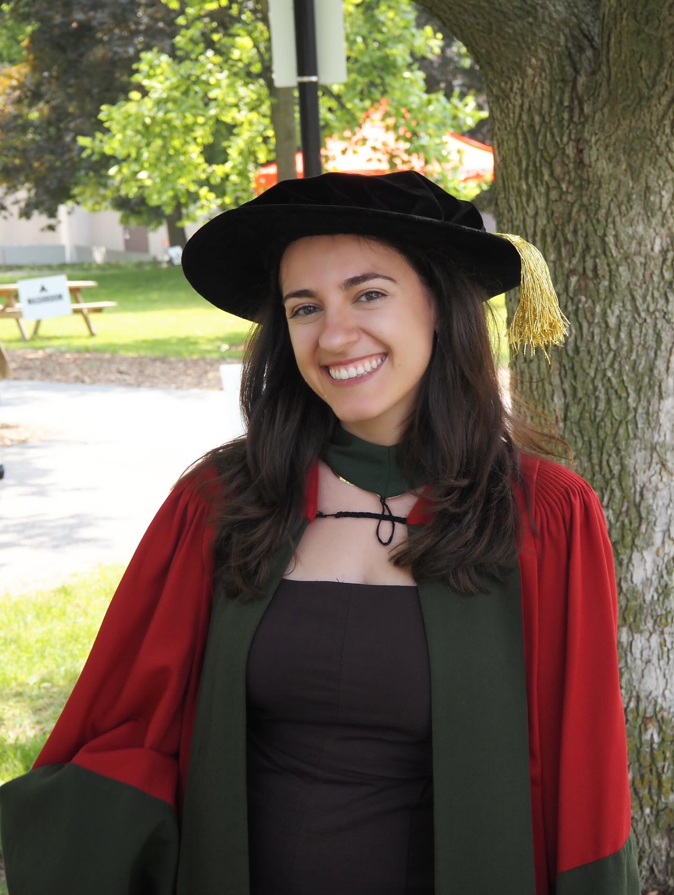



## About Me

:::::::: columns
::::: {.column width="60%"}
**Tatiana Krikella (she/her)**

-   Assistant Professor, Teaching Stream

::: fragment
[Education]{.underline}

-   **Undergrad**: University of Windsor
-   **Masters**: University of Windsor
-   **PhD**: University of Waterloo
:::

::: fragment
[About me]{.underline}

-   I like to travel
-   I like to bake
-   My Goodreads book challenge this year is 45
-   I started running this summer
:::
:::::

:::: {.column width="40%"}

::: text-center
My PhD graduation, 2024.
:::
::::
::::::::

## About you

Now it's time for me to get to know you!

Go to: mathmatize.com/polls

Access Code: TBDO

## About This Course

-   This course is a broad introduction to machine learning from a statistical perspective
-   We put emphasis on intuition and basic mathematical derivati0ons of how and why popular machine learning methods work
-   We will focus on understanding methodology rather than implementing complicated machine learning algorithms/delving into deep theory
-   You will learn examples of applying popular machine learning methods to real datasets in R
-   The textbook we are using also has examples in Python if you would like to practice applying these methods in a different language

## About This Course

We will cover two types of learning problems:

**Supervised Learning (80%)**

-   Regression
-   Classification

::: fragment
**Unsupervised Learning (20%)**

-   Dimension reduction
-   Clustering
-   Matrix Factorization
:::

## Course Motivation

[“I’ve heard that neural networks solve everything, can we just learn those?”]{style="color: maroon;"}

 

-   There's a whole world of problems where neural networks don't work

-   The techniques in this course are still the first things to try for a wide range of problems

    -   E.g., try logistic regression before building a deep neural net!
    -   It is important to accurately assess the performance of a method, to know how well or how badly it works or will work. (Easier for simple methods)
    -   How confident are we to claim the effectiveness of a newly designed vaccine?

## Course Motivation

[“I’ve heard that neural networks solve everything, can we just learn those?”]{style="color: maroon;"}

 

-   The principles you learn in this course will be essential to understand and apply neural nets.

    -   It is important to understand the ideas behind the various techniques, in order to know how and when to use them.
    -   Advanced algorithms are built on the simpler ones.

-   Statistical learning is a fundamental ingredient in the training of a modern data scientist / quantitative analyst

    -   science (biology, neuroscience, medicine)
    -   industry (tech company, transportation)
    -   finance (quant, trading, bank)
    -   ...

## Do I Have the Appropriate Background?

**Linear Algebra**: vector/matrix operations such as eigenvalues and eigenvectors, eigen and singular value decompositions, inverse, trace, norms.

 

::: fragment
**Calculus**: partial derivatives/gradient.
:::

 

::: fragment
**Probability & Statistics**: expectation, variance, covariance; Bayes’ theorem; common distributions; maximum likelihood estimation, simple linear regression, point and interval estimation, hypothesis testing, p-values.
:::

 

::: fragment
**Programming Language**: We are using R in this course
:::

## Course Materials & Important Links

**Textbook**: We will mainly be using the following textbook: \[ISL\] Gareth James, Daniela Witten, Trevor Hastie, and Robert Tibshirani. *An Introduction to Statistical Learning*. https://www.statlearning.com

 

**Course Webpage**: Main source of information -- Check regularly!

 

**Quercus**: Announcements and non-public materials (i.e. solutions)

 

**Piazza**: Main place for discussions.

 

**Crowdmark**: We will use Crowdmark for assignment submission on Quercus.

## Delivery Details

Unless otherwise specified, lectures and tutorials will be held in-person.

::: small
| Section | Category | Time | Location |
|:--------------:|:-----------------|:---------------------|:---------------|
| LEC0101 | Lectures | Mon (10–11am) Wed (11am–1pm) | PB B250 SF 1105 |
|  | Instructor's Office Hours | Mon (1–2pm) | Online, see Quercus for link |
|  | Tutorials (101–104) | Mon (11am–12pm) | See ACORN |
:::

 

::: fragment
Tutorials are highly recommended as they contain supplementary materials to the lectures. Some weeks might not have tutorials.
:::

## Tentative Course Schedule {.scrollable}

::: smaller
| Week | Topics | Assessments | Suggested Reading \[ISL\] |
|:----------:|:-----------|:----------:|:-----------|:-----------|:-----------|
| 1 | Introduction to Statistical Learning; Supervised Learning; Model Assessment | — | Ch. 2 |
| 2 | K-Nearest Neighbours; Linear Regression + Model Assessment and Selection | \- | Ch. 3, 5 |
| 3 | Shrinkage and Regularization | Assignment 1 Released, Sept. 23rd | Ch. 6 |
| 4 | Classification: Bayes Classifier, \(k\)-NN, and Logistic Regression | \- | Ch. 4 |
| 5 | Classification: Multiclass Logistic Regression and Discriminant Analysis | Assignment 1 Due, Oct. 7 | Ch. 4 |
| 6 | Moving Beyond Linearity | \- | Ch. 7 |
| 7 | Tree Based Methods: Decision Trees | \- | Ch. 8 |
| 8 | **Reading Week** | \- | \- |
| 9 | Tree Based Methods: Bagging, Random Forests, and Boosting | Midterm, Nov. 4 | Ch. 8 |
| 10 | Support Vector Machines | \- | Ch. 9 |
| 11 | Unsupervised Learning: PCA and Clustering | Assignment 2 Released, Nov. 18 | Ch. 12 |
| 12 | Gradient Descent and Neural Networks| \- | Ch. 10 |
| 13 | Neural Networks, Generative AI, and Course Review | Assignment 2 Due, Dec 2nd | Ch. 10 |
:::

## Email Policy

**Course Email**: sta314\@course.utoronto.ca

-   Instructor and TAs will not respond to emails sent to individual accounts
-   *Response Time*: It will take 24 – 48 hours to respond to emails. I will only respond during working hours (Monday – Friday, 9am – 5pm).

 

::: fragment
For questions

-   If it is about course material such as lectures / tutorials, or clarification question, post it to Piazza so that other students will benefit.
-   If it is related with solving practical problem sets, use the office hours
:::

## Course Grading Scheme

::: small
| Assessment   | Standard Scheme | Flexible Scheme |
|:-------------|:---------------:|:---------------:|
| Assignment 1 |       10%       |       10%       |
| Assignment 2 |       10%       |       10%       |
| Midterm Test |       30%       |       15%       |
| Final Exam   |       50%       |       65%       |
:::

## Important Dates

**Midterm**: November 4th, 11am -- 1pm

 

**Thanksgiving**: October 12th (no classes, no office hours)

 

**Reading Week**: October 26th -- 30th (no classes, no tutorials, no office hours)

 

**Drop Date**: November 17th

 

**Last Day of Class**: December 8th

 

**Final Exam Period**: December 10th -- 22nd

## AI Policy - Can I Use AI for...

   **General Questions**: Yes -- but keep in mind AI can make mistakes.

 

**Assignments**: No, assignments are designed to help you learn.

 

**Tests**: No.

## Resources

  

**Accomodations**: https://studentlife.utoronto.ca/as

 

**Learning Skills**: https://www.studentlife.utoronto.ca/department/centre-for-learning-strategy-support/

 

**Health & Wellness**: https://www.studentlife.utoronto.ca/department/health-wellness/

## Final Note

   All information is in the syllabus on the course website.

 

::: {style="text-align: center; font-size: 1em;"}
If you remember just one thing:

**Check the course website regularly.**
:::
