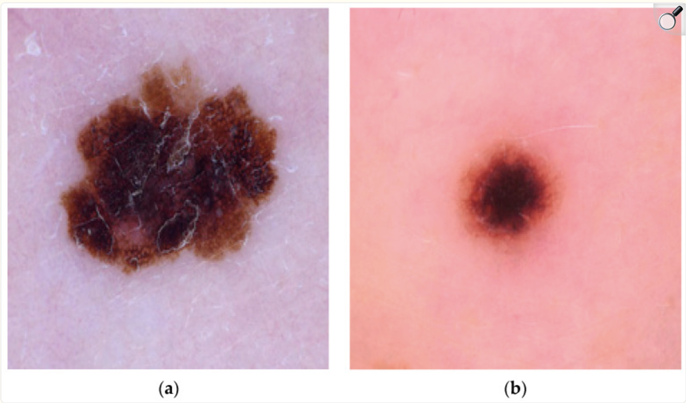
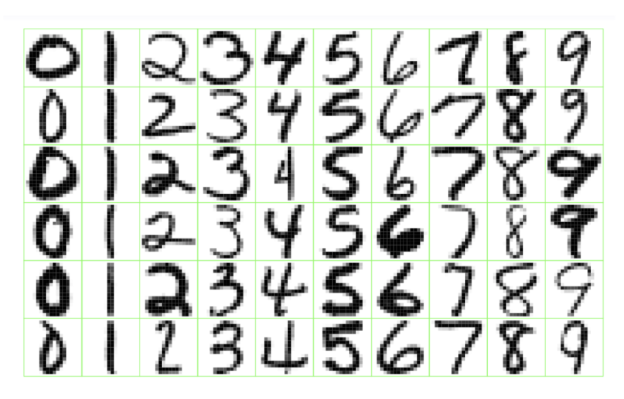



# Welcome to Statistical Machine Learning

## What is machine learning?

[Machine learning is the science of learning patterns from data]{style="color: maroon;"}

The goal is to use data to:

-   understand relationships between variables
-   make predictions for new observations
-   discover hidden structures in data

\vspace{1em}

Examples:

-   Predict whether a patient will respond to a treatment
-   Predict house prices from characteristics
-   Identify spam emails
-   Group customers based on purchasing behaviour

## Types of Machine Learning Problems

**Supervised Learning**: Machine is given data and examples of what to predict.

\vspace{1em}

**Unsupervised Learning**: Machine is given data, but not what to predict.

\vspace{1em}

**Reinforcement Learning**: Machine gets data by interacting with an environment and tries to minimize cost.

## The Basics of Supervised Learning

We have an outcome measurement, $Y$ (also called the dependent variable, response, or target).

We have a vector of $p$ predictor measurements, $X$ (also called the inputs, regressors, covariates, features, or independent variables).

We have training data $(x_1, y_1), (x_2, y_2), ..., (x_n, y_n)$ which are observations (also called instances or realizations) of the measurement $(X,Y)$.

In [regression]{style="color: maroon;"} problems, $Y$ is quantitative (e.g. price, blood pressure).

In [classification]{style="color: maroon;"} problems, $Y$ takes values in a finite, unordered set (survived/died, digit 0-9, cancer class of tissue sample)

## Main Tasks in Supervised Learning

On the basis of the training data, we would like to:

::: incremental
-   **Prediction**: accurately predict future outcomes ($Y$).
-   **Estimation**: understand how features ($X$) affect the outcome ($Y$).
-   **Model Selection**: find the best model for predicting the outcome ($Y$), or which features ($X$) affect the outcome ($Y$).
-   **Inference**: assess the quality of our prediction, estimation, and model selection.
:::

## Examples of Supervised Learning

[Spam Emails Detection]{style="color: maroon;"}

Consider a dataset consisting of 4600 emails sent to an individual.

-   Each is labeled as **spam** or **email**

The goal is to build a customized spam filter.

We use the relative frequency of 57 words and punctuation marks in the email as **features**.

::: small
| Type  | Tatiana | you  | UofT | free |  !   | edu  | remove |
|:------|:-------:|:----:|:-----|:----:|:----:|:----:|:------:|
| Spam  |    0    | 2.26 | 0.02 | 0.54 | 0.51 | 0.01 |  0.28  |
| Email |  1.27   | 1.27 | 0.90 | 0.07 | 0.11 | 0.29 |  0.01  |
:::

## Examples of Supervised Learning

[Detecting Skin Cancer from Images]{style="color: maroon;"}

Traditionally, melanoma (skin cancer) has been detected through painful and time-consuming biopsies.

Recently new methods have emerged which use computer-aided detection for early melanoma diagnosis.

The machine learning models were trained using image data.

## Examples of Supervised Learning

[Detect Numbers in a Handwritten Postal Code]{style="color: maroon;"}

## Examples of Supervised Learning

[Recommender Systems]{style="color: maroon;"}

## Examples of Supervised Learning

[Speech-to-Text, Personal Assistants, Speech Identification]{style="color: maroon;"}

## The Basics of Unsupervised Learning

We have a set of features, $X$, measured on a sample.

We do [not]{style="color: maroon;"} have an outcome variable, $Y$.

The objective is more ambiguous

-   find groups of samples that behave similarly
-   find features that behave similarly
-   find linear combinations of features with the most variation

It is difficult to assess the quality of the model

Different from supervised learning, but can be useful as a pre-processing step for supervised learning

## Examples of Unsupervised Learning

[Image Segmentation]{style="color: maroon;"}

## Examples of Unsupervised Learning

[Clustering]{style="color: maroon;"}

## Examples of Unsupervised Learning

[Natural Language Processing]{style="color: maroon;"}

# Introduction to Supervised Learning

## A common goal

Both statistics and machine learning ask:

> How can we use data to learn about the world?

The difference is often one of emphasis:

| Statistics                 | Machine Learning       |
|----------------------------|------------------------|
| Explanation                | Prediction             |
| Inference                  | Generalization         |
| Parameter estimates        | Flexible models        |
| Uncertainty quantification | Predictive performance |

\vspace{1em}

In practice, modern data science combines both perspectives.

# The Statistical Learning Problem

Suppose we observe:

$$
(X_1,Y_1), (X_2,Y_2),\ldots,(X_n,Y_n)
$$

where:

-   $X$ = input variables (features, predictors)
-   $Y$ = outcome variable (response)

We assume:

$$
Y = f(X) + \epsilon
$$

where:

-   $f$ is the unknown relationship we want to learn
-   $\epsilon$ represents random error

# What are we trying to learn?

The goal is to estimate:

$$
\hat{f}(X)
$$

which gives predictions:

$$
\hat{Y} = \hat{f}(X)
$$

The challenge:

> We do not know the true function $f$.

We only observe data generated from this unknown process.

# Why estimate $f$?

There are two main reasons.

## 1. Prediction

Given new values of $X$:

$$
X_{new}
$$

we want to predict:

$$
Y_{new}
$$

Example:

Predict a patient's risk of disease based on their characteristics.

## 2. Inference

We want to understand relationships.

Examples:

-   Which variables are important?
-   How does changing $X$ affect $Y$?
-   What is the strength of association?

# Two Types of Learning

## Supervised Learning

We observe both:

$$
(X_i,Y_i)
$$

The goal is to learn a relationship between predictors and an outcome.

Examples:

-   Predicting blood pressure from age and BMI
-   Classifying images as cats or dogs

## Unsupervised Learning

We only observe:

$$
X_i
$$

There is no outcome variable.

The goal is to discover structure.

Examples:

-   Grouping customers
-   Finding patterns in gene expression
-   Reducing dimensions of data

# Supervised Learning

## Two major tasks

### Regression

The response is quantitative.

Examples:

$$
Y = \text{blood pressure}
$$

$$
Y = \text{house price}
$$

### Classification

The response is categorical.

Examples:

$$
Y =
\begin{cases}
0 & \text{no disease}\\
1 & \text{disease}
\end{cases}
$$

or:

$$
Y \in \{\text{spam},\text{not spam}\}
$$

# Regression vs Classification

## Regression

Predict a number:

\[ \hat{Y}=72.5 \]

Example:

> What is the expected survival time?

## Classification

Predict a class:

\[ \hat{Y}= \text{high risk} \]

Example:

> Does this patient have cancer?

# How do we know if a model is good?

A model can fit the data we have...

but we really care about:

> How well does it perform on new data?

# Training Data vs Test Data

## Training data

Used to fit the model.

$$
\{(X_1,Y_1),...,(X_n,Y_n)\}
$$

The model learns patterns from these observations.

## Test data

Used to evaluate performance.

New observations:

$$
(X_{new},Y_{new})
$$

The goal:

\[ \text{Good performance on unseen data} \]

# Training Error

The error on the data used to fit the model:

$$
\frac{1}{n}
\sum_{i=1}^{n}
(Y_i-\hat{Y}_i)^2
$$

A flexible model can often make:

$$
\text{Training error} \approx 0
$$

But is this always good?

# Example: Learning Too Much From Data

A model that perfectly remembers the training data may fail on new data.

This is called:

[Overfitting]{style="color: maroon;"}

The model learns:

-   real patterns
-   random noise

# First Learning Algorithm

# k-Nearest Neighbours (kNN)

Idea:

> To predict a new observation, look at the most similar observations in the training data.

# kNN Regression

For a new observation:

$$
x_0
$$

Find the $k$ closest observations.

Predict:

$$
\hat{f}(x_0)=
\frac{1}{k}
\sum_{i\in N_0}y_i
$$

where:

-   $N_0$ = nearest neighbours
-   $k$ = number of neighbours

# kNN Example

Suppose we want to predict house price.

A new house has:

-   3 bedrooms
-   2 bathrooms
-   1500 square feet

Find similar houses:

Prediction:

$$
\hat{Y}=\frac{450+470+430}{3}
=450
$$

# Choosing $k$

Small $k$:

-   very flexible model
-   follows the data closely
-   may overfit

Large $k$:

-   smoother predictions
-   may miss important patterns

# The Bias-Variance Tradeoff

We will explore this next week.

The key idea:

> Flexible models can capture complex patterns, but may learn noise.

> Simple models may miss patterns, but generalize better.

# Summary

Today we learned:

1.  Statistical learning aims to learn relationships from data.
2.  Supervised learning predicts an outcome.
3.  Regression predicts numbers; classification predicts categories.
4.  We evaluate models based on their ability to generalize.
5.  kNN provides a simple example of learning from data.

# Next Time

## Model Evaluation

We will discuss:

-   training vs test error
-   cross-validation
-   bootstrap
-   bias-variance tradeoff
-   choosing model complexity
