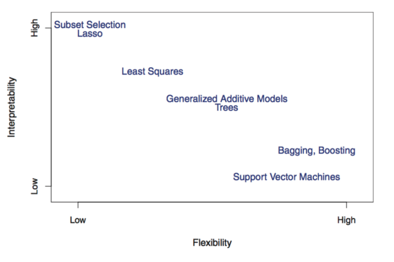
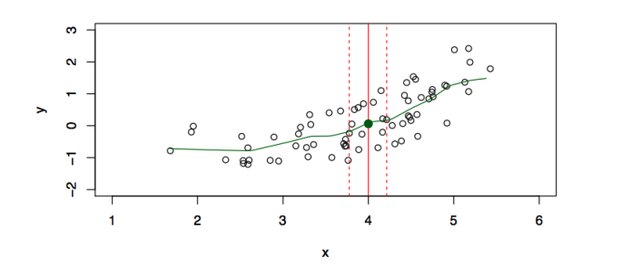
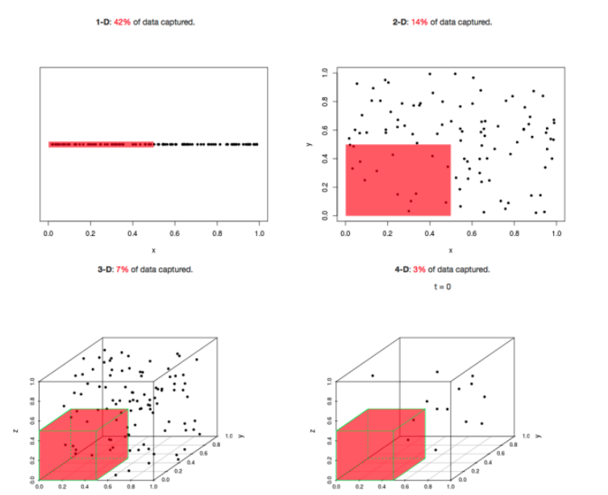
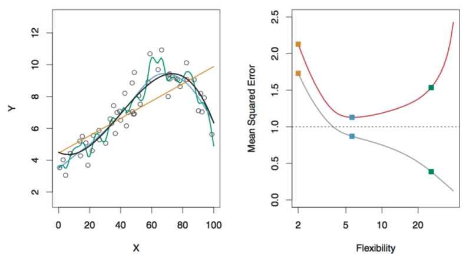



# Welcome to Statistical Machine Learning

## What is machine learning?

[Machine learning is the science of learning patterns from data.]{style="color: maroon;"}

::: fragment
The goal is to use data to:

-   understand relationships between variables
-   make predictions for new observations
-   discover hidden structures in data
:::

\vspace{1em}

::: fragment
**Examples:**

-   Predict whether a patient will respond to a treatment
-   Predict house prices from characteristics
-   Identify spam emails
-   Group customers based on purchasing behaviour
:::

## Types of Machine Learning Problems

**Supervised Learning**: Machine is given data and examples of what to predict.

<br>

::: fragment
**Unsupervised Learning**: Machine is given data, but not what to predict.
:::
<br>

::: fragment
**Reinforcement Learning**: Machine gets data by interacting with an environment and tries to minimize cost.
::: 

## The Basics of Supervised Learning

We have an outcome measurement, $Y$ (also called the dependent variable, response, or target).

::: fragment
We have a vector of $p$ predictor measurements, $X$ (also called the inputs, regressors, covariates, features, or independent variables).
:::

::: fragment
We have training data $(x_1, y_1), (x_2, y_2), ..., (x_n, y_n)$ which are observations (also called instances or realizations) of the measurement $(X,Y)$.
::: 

::: fragment
In [regression]{style="color: maroon;"} problems, $Y$ is quantitative (e.g. price, blood pressure).

In [classification]{style="color: maroon;"} problems, $Y$ takes values in a finite, unordered set (survived/died, digit 0-9, cancer class of tissue sample)
:::

## Main Tasks in Supervised Learning

On the basis of the training data, we would like to:

::: incremental
-   **Prediction**: accurately predict future outcomes ($Y$).
-   **Estimation**: understand how features ($X$) affect the outcome ($Y$).
-   **Model Selection**: find the best model for predicting the outcome ($Y$), or which features ($X$) affect the outcome ($Y$).
-   **Inference**: assess the quality of our prediction, estimation, and model selection.
:::

## Examples of Supervised Learning

[Spam Emails Detection]{style="color: maroon;"}

Consider a dataset consisting of 4600 emails sent to an individual.

-   Each is labeled as **spam** or **email**

The goal is to build a customized spam filter.

::: fragment
We use the relative frequency of 57 words and punctuation marks in the email as **features**.

::: small
| Type  | Tatiana | you  | UofT | free |  !   | edu  | remove |
|:------|:-------:|:----:|:-----|:----:|:----:|:----:|:------:|
| Spam  |    0    | 2.26 | 0.02 | 0.54 | 0.51 | 0.01 |  0.28  |
| Email |  1.27   | 1.27 | 0.90 | 0.07 | 0.11 | 0.29 |  0.01  |
:::

:::

## Examples of Supervised Learning

[Detecting Skin Cancer from Images]{style="color: maroon;"}

Traditionally, melanoma (skin cancer) has been detected through painful and time-consuming biopsies.

Recently new methods have emerged which use computer-aided detection for early melanoma diagnosis.

The machine learning models were trained using image data.

{width="40%" fig-align="center"}

:::{.citation} 
Gouda, W., Sama, N. U., Al-Waakid, G., Humayun, M., & Jhanjhi, N. Z. (2022). Detection of skin cancer based on skin lesion images using deep learning. Healthcare, 10(7), 1183. https://doi.org/10.3390/healthcare10071183  
::: 

## Examples of Supervised Learning

[Detect Numbers in a Handwritten Postal Code]{style="color: maroon;"}


## Examples of Supervised Learning

[Recommender Systems]{style="color: maroon;"}


## Examples of Supervised Learning

[Speech-to-Text, Personal Assistants, Speech Identification]{style="color: maroon;"}


## The Basics of Unsupervised Learning

We have a set of features, $X$, measured on a sample.

We do [not]{style="color: maroon;"} have an outcome variable, $Y$.

::: fragment
The objective is more ambiguous

-   find groups of samples that behave similarly
-   find features that behave similarly
-   find linear combinations of features with the most variation

It is difficult to assess the quality of the model
::: 

::: fragment
Different from supervised learning, but can be useful as a pre-processing step for supervised learning
::: 

## Examples of Unsupervised Learning

[Image Segmentation]{style="color: maroon;"}

The goal is to cluster pixels into image regions to make it easier to analyze and understand specific parts of the image.


## Examples of Unsupervised Learning

[Clustering]{style="color: maroon;"}

Grouping unlabeled data points into clusters based on their similarities. 


::: {.citation}
Vandeninden, B., De Clercq, E. M., Devleesschauwer, B., Otavova, M., Bouland, C., & Faes, C. (2024). Cluster pattern analysis of environmental stressors and quantifying their impact on all-cause mortality in Belgium. *BMC Public Health, 24*(1). https://doi.org/10.1186/s12889-024-18011-0
:::

## Examples of Unsupervised Learning

[Natural Language Processing]{style="color: maroon;"}


# Introduction to Supervised Learning

## This Course 

In much of this course, we focus on [supervised learning]{style="color: maroon;"}, where we are given 

  - [Training Set]{style="color: maroon;"} ${(x_1, y_1), ..., (x_n, y_n)}$  consisting of $n$ samples of
    - [features]{style="color: maroon;"} $x_1, ..., x_n \in X$ and corresponding 
    - [outcome]{style="color: maroon;"} $y_1, ..., y_n \in Y$ 

:::{.fragment}
The goal is to [learn a predictor]{style="color: maroon;"} (function/mapping) $f: X \rightarrow Y$ such that for a new point $x^* \in X$, 

$$f(x^*) \approx y^*$$ 
::: 

## The Function, $f$ 

Imagine the underlying generating mechanism between $X$ and $Y$ as 
$$Y = f(X) + \epsilon$$ 

where $\epsilon$ represents some measurement errors and other discrepancies. 

<br>

:::{.fragment}
We are given the training data $D^{train}$ consisting of $n$ i.i.d samples of $(X,Y)$ following the above model, that is, $(x_1, y_1), ..., (x_n, y_n)$. 
::: 

<br>

:::{.fragment}
Our goal is to estimate (or learn) the mapping/function $f$ based on $D^{train}$. 
::: 

## Example: Advertising

We are given information of $n$ products. 

For each product, we are given:

  - $y_i$: Sales of product $i$ in 200 different markets
  - $x_{i1}$: TV advertising budget of product $i$ 
  - $x_{i2}$: Radio advertising budget of product $i$ 
  - $x_{i3}$: Newspaper advertising budget of product $i$

:::{.fragment}
Suppose the true generating model is 
$$
\begin{aligned}
Y &= f(X) + \epsilon \\
  &= \beta_0 + \beta_1X_1 + \beta_2X_2 + \beta_3X_3 + \epsilon
\end{aligned}
$$
:::

:::{.fragment}
[Knowing $f$ helps to understand how sales changes if we increase one unit of the TV advertising budget ($X_1$).]{style="color: maroon;"}
:::

## Why Estimate $f$? 

:::: {.columns}

::: {.column width="50%"}

[**Prediction**]{style="color: maroon;"}

Given a new point $X^* = x^*$, $\hat{f}(x^*)$ is the best prediction one can hope for with respect to certain criterion.

**Examples:** 

-   Predict a patient's risk of disease based on their characteristics.
-   Predict when machinery will break down.

:::


::: {.column width="50%"}
:::{.fragment}
[**Inference**]{style="color: maroon;"}

We want to understand relationships between $X$ and $Y$.

**Examples:**

-   Which variables are important?
-   How does changing $X$ affect $Y$?
-   What is the strength of association?

:::
:::

::::

## Estimating $f$ 

Let $x_{ij}$ denote the value of the $j^{th}$ feature for observation $i$, where $i=1,2,...,n$ and $j=1,2,...,p$. 

Let $y_i$ denote the response variable for the $i^{th}$ observation. 

<br>


Then, the training data consists of $D^{train} = \{(x_1,y_1), ..., (x_n, y_n)\}$, where $x_i = (x_{i1}, ..., x_{ip})^T$

<br>

:::{.fragment}
There are two categories of approaches to estimate $f$ based on $D^{train}$: 

  - [**Parametric method**]{style="color: maroon;"}
  - [**Non-parametric method**]{style="color: maroon;"}
::: 

## Estimating $f$ 
[**Parametric method**]{style="color: maroon;"} 

**Step 1**: Make an assumption about the function form, or shape, of $f$. 

**Step 2**: Use the training data to *fit* (or *train*) the model. 

:::{.fragment}
**Example: Linear Model**

The linear model is an important example of a parametric model. 

$Y = f(X) + \epsilon$, with $f(X) = \beta_0 + \beta_1X_1 + \beta_2X_2 + ... + \beta_pX_p$. 

We would estimate $f$ by 
$$\hat{f}_{linear}(X) = \hat{\beta_0} +\hat{\beta_1}X_1 + ... + \hat{\beta_p}X_p.$$
::: 

:::{.fragment} 
**Note**: constructing $f$ in this way reduces the problem of estimating a function to that of estimating (p+1) parameters
:::

## Estimating $f$ 
[**Parametric method**]{style="color: maroon;"} 

**Example: Linear Model**

$$\hat{f}_{linear}(X) = \hat{\beta_0} +\hat{\beta_1}X_1 + ... + \hat{\beta_p}X_p.$$

The procedure of obtaining $\hat{\beta_0}, ..., \hat{\beta_p}$ is called [**fitting**]{style="color: maroon;"}, i.e. fitting the model to the training data. 

Even for the same parametric model, there are different ways of fitting! We will come back to this later. 

## A Toy Example

[Linear model]{style="color: maroon;"}

$$
\widehat f_{\text{linear}}(X)
=
\widehat\beta_0 + \widehat\beta_1 X
$$

```{webr}
#| fig-width: 5
#| fig-height: 4

set.seed(314)

n <- 60
x <- runif(n, 1.5, 5.5)

# True relationship is slightly nonlinear
y <- -1.5 + 0.15*x + 0.12*x^2 + 
     rnorm(n, mean = 0, sd = 0.55)

# Fit a linear model
fit_linear <- lm(y ~ x)

plot(x, y,
     pch = 1,
     xlab = "X",
     ylab = "Y",
     main = "")

abline(fit_linear,
       col = "navy",
       lwd = 2)
```

## A Toy Example 

[Quadratic model]{style="color: maroon;"}

$$
\widehat f_{\text{quad}}(X)
=
\widehat\beta_0
+
\widehat\beta_1 X
+
\widehat\beta_2 X^2
$$

```{webr}
#| echo: true
#| fig-width: 5
#| fig-height: 4

# Fit a quadratic model
fit_quad <- lm(y ~ x + I(x^2))

x_grid <- seq(min(x), max(x), length.out = 200)

y_hat <- predict(
  fit_quad,
  newdata = data.frame(x = x_grid)
)

plot(x, y,
     pch = 1,
     xlab = "X",
     ylab = "Y",
     main = "")

lines(x_grid, y_hat,
      col = "maroon",
      lwd = 2)
```

## Trade off Between Complexity and Interpretability 

The more complex the model, the more flexible to fit $f$, but less interpretable. 

<br>

Linear models are easy to interpret, neural networks are not. 

<br> 

Interpretation means to understand how the predictors X contribute to predicting Y. 

## Trade off Between Complexity and Interpretability 

{width="75%" fig-align="center"}

## Estimating $f$ 
[**Non-Parametric method**]{style="color: maroon;"}

These methods do not make explicit assumptions about the functional form of $f$. Instead, we let the data determine the shape more directly.

:::{.fragment}
**Example: Nearest Neighbours** 

The goal is to predict $X = x$ using $N(x)$, which is some neighbourhood of $x$. 

$$\hat{f}(x) = \frac{1}{|N(x)|} \sum_{i:x_i \in N(x)} y_i$$

In simple terms, the prediction is the average response of nearby observations.
:::

## Estimating $f$ 
[**Non-Parametric method**]{style="color: maroon;"}

{width="75%" fig-align="center"}

## Estimating $f$ 
[**Non-Parametric method**]{style="color: maroon;"}

There are other, more sophisticated methods as well, such as kernel regression and spline regression. 

<br> 
**Pros** 

  - we don't make assumptions on $f$ 
  - it's good at predicting for large $n$ and small $p$, e.g. p $\leq$ 4 

<br> 

**Cons** 

  - poor performance when $p$ is large 
  - [curse of dimensionality]{style="color: maroon;"}: There are very few data points in the nearby neighbours when $p$ is large
  
## Curse of Dimensionality 

{width="75%" fig-align="center"}

# Model Selection 

## Model Selection 

["All models are wrong, but some are useful"]{style="color: maroon;"} George Box 

<br>

We need a systematic way of choosing the best model. 

We start with the [regression]{style="color: maroon;"} problems where $Y$ is continuous.

## Model Selection: Regression 

Recall the setup: 
$$ Y = f(X) + \epsilon $$ 

and $D^{train}$ contains $n$ i.i.d samples of $(X,Y)$. 

:::{.fragment}
Given any $\hat{f}$, ideally, we want to evaluate $\hat{f}$ by the expected **mean squared error (MSE)** 
$$E\left[(Y^* - \hat{f}(X^*))^2 \right]$$

where 

  - $(X^*, Y^*)$ is a new random pair that is independent of $D^{train}$ 
  - the expectation is taken w.r.t the random pair $(X^*, Y^*)$, as well as the randomness in $\hat{f}$.
:::

## Model Selection: Regression 

We cannot compute the expected MSE as we do not know either the distribution of $(X^*, Y^*)$, or that of $D^{train}$. 

:::{.fragment}
One natural option is to use $D^{train}$ to approximate the expectation by 
$$MSE(\hat{f}) = \frac{1}{n} \sum_{i=1}^n (y_i - \hat{f}(x_i))^2$$

This is called the [**training MSE**]{style="color: maroon;"}, as it uses $D^{train}$ 
::: 

:::{.fragment}
However, it is **NOT** a valid metric of the fit for $\hat{f}$ since it always favours more complex models.
::: 

## Model Selection: Regression 

[Test data]{style="color: maroon;"} refers to the data which is not used to train the statistical model 

:::{.fragment}
Suppose we have the test data $D_{test}$ containing ${(x_{T1}, y_{T1}), ..., (x_{Tm}, y_{Tm})}$. Then, we can compute the [**test MSE**]{style="color: maroon;"} as 

$$MSE_T(\hat{f}) = \frac{1}{m} \sum_{i=1}^m (y_{Ti} - \hat{f}(x_{Ti}))^2$$ 
::: 

:::{.fragment}
Instead of using the training MSE, we should look at the test MSE. I.e. we select the model which yields the smallest test MSE. 
::: 

:::{.fragment}
How to calculate $MSE_T(\hat{f})$? 
  
  - If test data is available, we can directly compute it 
  - Otherwise, we use a resampling technique called *cross-validation* which we will discuss in another lecture 
::: 

## Training MSE vs. Test MSE

{width="75%" fig-align="center"}

**Left Plot:** Data simulated from $f$, shown in black. Three estimates of $f$ are shown: the linear regression line (orange), and two non parametric fits (blue and green). 

**Right Plot**: Training MSE (grey), test MSE (red), and minimum test MSE over all possible methods coming from $\epsilon$ (dashed line)

## Overfitting 

The training MSE decreases as $\hat{f}$ gets more complex. 

<br> 

A highly complex $\hat{f}$ can lead to a phenomenon knows as [overfitting]{style="color: maroon;"} the data, which essentially means it follows the noise $\epsilon$ too closely. 

<br> 

**A Simple Example**: $\hat{f}(x_i) = y_i$ for all $1 \leq i \leq n$

## Overfitting Example

```{webr}
set.seed(314)

n <- 30

x <- sort(runif(n, 0, 10))

# True relationship
f <- function(x) 2 + 0.5*x

# Observed response = signal + noise
y <- f(x) + rnorm(n, mean = 0, sd = 1.5)

plot(x, y,
     pch = 19,
     xlab = "X",
     ylab = "Y")

# True f(x)
curve(f(x),
      add = TRUE,
      lwd = 3,
      col = "black")
```

The points do not lie exactly on $f$ because of the random noise, $\epsilon$.

## Overfitting Example

```{webr}

# Fit a simple linear model
fit_simple <- lm(y ~ x)

# Fit a much more flexible model
fit_flexible <- lm(y ~ poly(x, 12))

x_grid <- seq(min(x), max(x), length.out = 500)

plot(x, y,
     pch = 19,
     xlab = "X",
     ylab = "Y")

# True relationship
lines(x_grid,
      f(x_grid),
      lwd = 3,
      col = "black")

# Simple model
lines(x_grid,
      predict(fit_simple,
              newdata = data.frame(x = x_grid)),
      lwd = 2,
      col = "navy")

# Flexible model
lines(x_grid,
      predict(fit_flexible,
              newdata = data.frame(x = x_grid)),
      lwd = 2,
      col = "maroon")

legend("topleft",
       legend = c("True f(x)",
                  "Linear fit",
                  "Flexible fit"),
       col = c("black", "navy", "maroon"),
       lwd = c(3, 2, 2),
       bty = "n")
```

## Back to the Test MSE 

There is a tradeoff between the test MSE and the flexibility (complexity) of the fitted model, $\hat{f}$. 

<br> 

Is there a universal rule or explanation about this? 

## Bias-Variance Decomposition 

Let $(X^*, Y^*)$ be a new random pair (independent from $D^{train}$) following $Y^* = f(X^*) + \epsilon^*$ with $E[\epsilon^*]=0$. 

:::{.fragment}
For any estimator $\hat{f}$ (obtained from $D^{train}$), its conditional expected MSE at any $X^* = x^*$ is 

$$
\begin{aligned}
\mathbb{E}\left[
    \left(Y_* - \hat{f}(X_*)\right)^2
    \mid X_* = x_*
\right]
&=
\underbrace{
    \operatorname{Var}\left(\hat{f}(x_*)\right)
}_{\text{Variance}}
+
\underbrace{
    \left(
        \mathbb{E}\left[\hat{f}(x_*)\right] - f(x_*)
    \right)^2
}_{\text{Bias}^2}
+
\underbrace{
    \operatorname{Var}(\epsilon_*)
}_{\text{Irreducible error}}
\\[0.5em]
&\geq \operatorname{Var}(\epsilon_*).
\end{aligned}
$$

  - the first expectation is over $\epsilon^*$ as well as $D^{train}$ 
  - the expected MSE $\geq$ the irreducible error 
  - an ideal $\hat{f}$ should minimize the expected MSE 
::: 
## Bias-Variance Tradeoff 

[**Variance**]{style="color: maroon;"}: how much $\hat{f}$ would change if we estimated it using a different training data set 

<br> 

:::{.fragment}
[**Bias**]{style="color: maroon;"}: the systematic difference between our estimated relationship $\hat{f}$ and the true relationship $f$

  - **Example:** If the true relationship is nonlinear but we fit a linear model, a straight line cannot fully capture the true relationship, resulting in bias. 
::: 

## Bias-Variance Tradeoff 

As the complexity (i.e. flexibility) of $\hat{f}$ increases, the variance of $\hat{f}$ typically increases whereas its bias decreases 

:::{.incremental}
  - The variance of any fitted model also depends on the sample size, $n$, and is roughly proportional to 
  $\frac{\text{complexity of} \quad \hat{f}}{n}$
  
  - When $n$ is small, a fitted model with high complexity performs poorly due to large variance 
  
  - When $n$ is large enough, a more complex fitted model tends to perform better as they have smaller bias than simpler models
::: 

## Bias-Variance Tradeoff 

Choosing the compelxity of $\hat{f}$ based on the expected MSE involves a bias-variance tradeoff. 

> When two models, $\hat{f_1}$ and $\hat{f_2}$ have similar expected MSEs, we usually prefer the *more parsimonious* (less complex) one. 

:::{.fragment}
**Why?** The additional complexity provides little improvement in prediction, while potentially making the model less interpretable and more variable.
::: 

## Model Selection: Classification 

The MSE is only appropriate for a **quantitative outcome**. 

One metric we can use for categorical or ordinal outcomes is the [**expected error rate**]{style="color: maroon;"}, defined as 

$$E[1 \{Y \neq \hat{f}(X) \}].^1$$

::: {.slide-footnote}
$^1$\(\mathbf{1}\{\cdot\}\) is the indicator function. 
\(\mathbf{1}\{A\}=1\) if \(A\) is true and \(\mathbf{1}\{A\}=0\) otherwise.
:::

## Model Selection: Classification 

Analogously, the [**training error rate**]{style="color: maroon;"} is 
$$\frac{1}{n} \sum_{i=1}^n 1 \{y_i \neq \hat{f}(x_i) \}$$

And the [**test error rate**]{style="color: maroon;"} is 
$$\frac{1}{m} \sum_{i=1}^m 1 \{y_{Ti} \neq \hat{f}(x_{Ti}) \}$$

Of course, there also exist other metrics that can be used for classification problems.

## Summary 

- Supervised vs. unsupervised learning
- The goal with supervised learning is to estimate a function $f$ based on the training data for prediction or inference 
- To estimate $f$, we can use parametric (assume a model) or non-parametric (data-driven) methods 
- To choose the best model, we use a metric for evaluating a given $\hat{f}$
- The best model yields the smallest expected test MSE (or error rate for classification problems) 
- **Bias-Variance tradeoff**: a more complex/flexible $\hat{f}$ has a smaller bias but larger variance 

**Next Class**: Some algorithms of computing $\hat{f}$!

**Announcements**: No tutorial on Monday, Sept 14. 