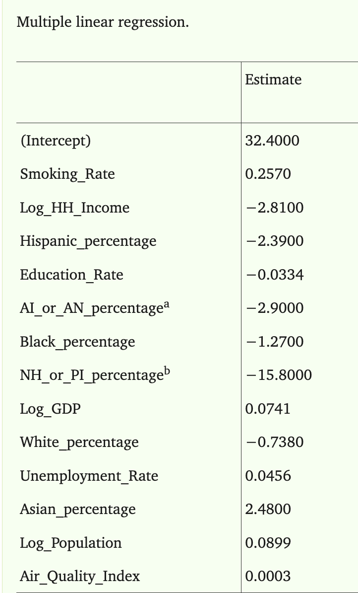
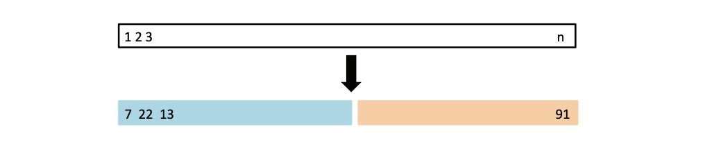
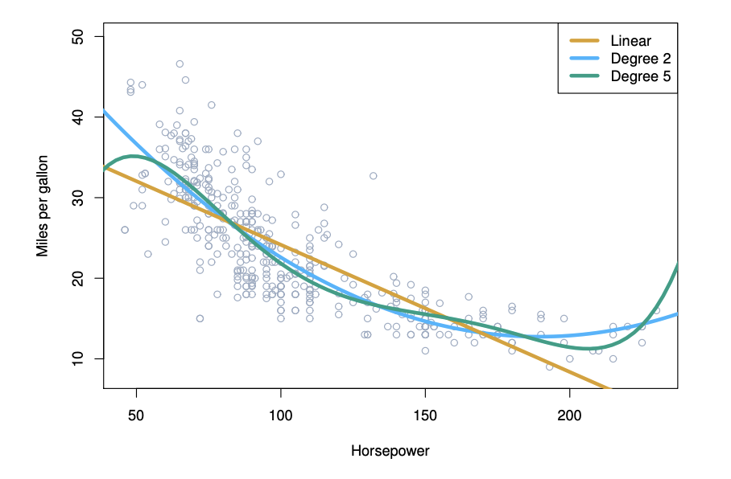
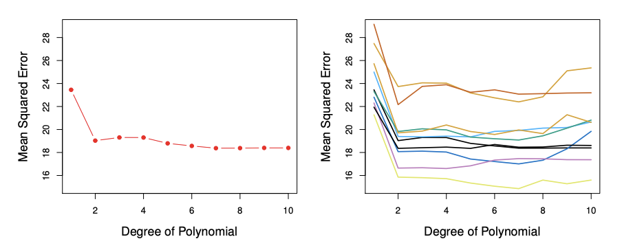
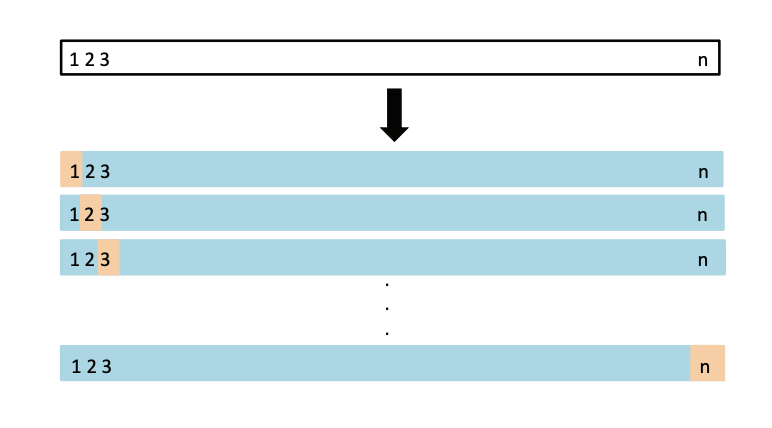
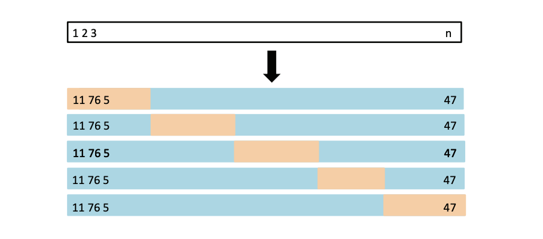
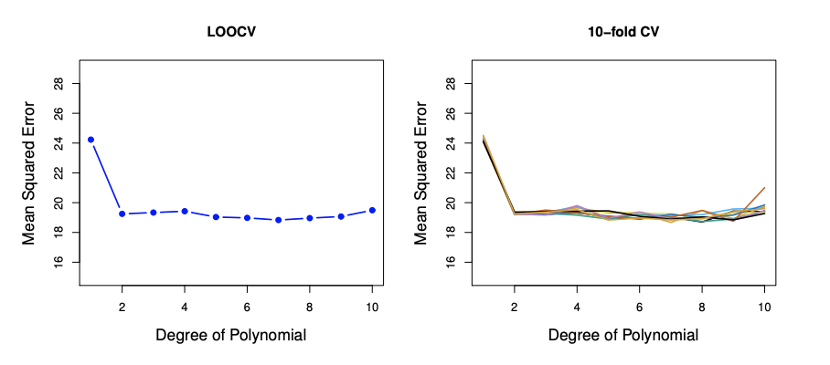
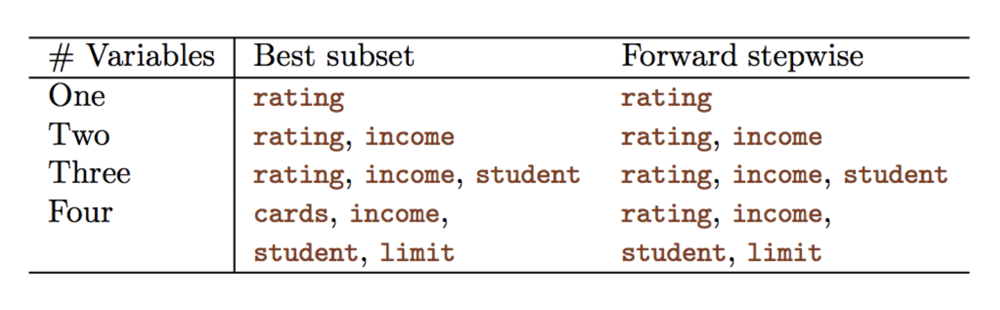
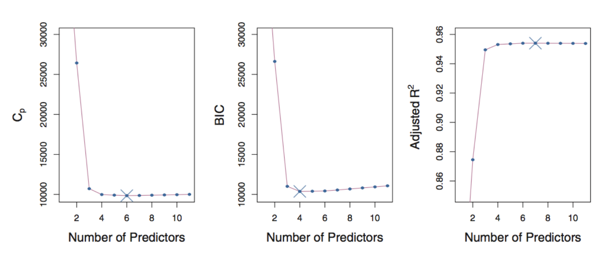
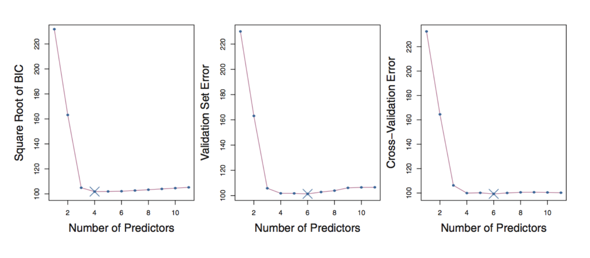



## Review from Last Week

[Machine learning is the science of learning patterns from data.]{style="color: maroon;"}

::: fragment
We introduced three types of machine learning problems:

-   **Supervised Learning**
-   **Unsupervised Learning**
-   Reinforcement Learning
:::

::: fragment
The main focus of this course is supervised learning, where we are given

-   [Training Set]{style="color: maroon;"} ${(x_1, y_1), ..., (x_n, y_n)}$ consisting of $n$ samples of
    -   [features]{style="color: maroon;"} $x_1, ..., x_n \in X$ and corresponding
    -   [outcome]{style="color: maroon;"} $y_1, ..., y_n \in Y$

and the goal is to to estimate (or learn) the function $f: X \rightarrow Y$ based on $D^{train}$.
:::

## Review from Last Week

We discussed two approaches of estimating $f$ based on $D^{train}$:

-   [**Parametric method**]{style="color: maroon;"} (assume a distribution)
    -   *Example*: assuming a linear model
-   [**Non-parametric method**]{style="color: maroon;"} (data-driven)
    -   *Example*: k-nearest neighbours

::: fragment
When choosing a model, $\hat{f}$, we need to keep in mind the **bias-variance tradeoff**

-   the balance between a model being too simple (high bias) and too complex (high variance)
:::

## Review from Last Week

When deciding on the best model, we can use a metric such as the **test MSE** (regression problems) or the **test error rate** (classification problems)

-   it is important to evaluate model performance using the test data, since the training MSE (or error rate) will always prefer a more complex model

:::{.fragment} 
In summary, different $\hat{f}$ are simply different algorithms/methods/predictors 

  - we will spend this course going over many different ways to estimate $f$ 
  - there is no one best method
:::

## Learning Outcomes for This Week

By the end of this week, you will be able to... 

- Explain and apply ordinary least squares (OLS) for fitting a linear regression model and interpret the resulting coefficient estimates.
- Explain the need for model assessment and selection, including the distinction between training error and expected test error.
- Apply validation-set, leave-one-out, and $k$-fold cross-validation to estimate test error and compare competing models.
- Compare common model-selection criteria, including Mallows' $C_p$, adjusted $R^2$, AIC, and BIC.
- Describe and compare subset-selection methods, including best subset, forward stepwise, and backward stepwise selection, and discuss their computational trade-offs.

# Linear Regression: A Review 

## Motivating Example 

Chronic obstructive pulmonary disease (COPD) is a long-term lung condition that makes it progressively harder to breathe. 

Despite the decreasing rates in cigarette smoking, COPD continues to be a problem.

:::{.fragment}
We wish to:

  - (1) better understand the features that are associated with COPD, and 
  - (2) predict COPD in new patients.
::: 

:::{.fragment}
Since we care about the interpretability of the model, a natural choice is a linear model to estimate $f$!

  

:::{.citation} 
Kamis, A., Gadia, N., Luo, Z., Ng, S. X., & Thumbar, M. (2024). Obtaining the Most Accurate, Explainable Model for Predicting Chronic Obstructive Pulmonary Disease: Triangulation of Multiple Linear Regression and Machine Learning Methods. JMIR AI, 3, e58455.
:::
::: 

## Linear Regression 

Although simple, and may seem a bit dull compared to other more sophisticated techniques, linear regression remains to be a very useful and widely used statistical learning method. 

  

It is the foundation of a lot of new approaches as well. 

## Linear Regression 

Let $Y \in \mathbb{R}$ be the outcome and $X \in \mathbb{R}^p$ be the (random) vector of $p$ features. 

The linear model assumes: 

$$
\begin{aligned}
Y &= f(X) + \epsilon \\
  &= \beta_0 + \beta_1X_1 + ... + \beta_pX_p + \epsilon
\end{aligned}
$$
where 

  - $\beta_0, \beta_1, ..., \beta_p$ are unknown constants 
    - $\beta_0$ is called the **intercept** 
    - $\beta_j$, for $1 \leq j \leq p$, are the **coefficients** of the $p$ features 
  - $\epsilon$ is the error term satisfying $\mathbb{E}[\epsilon]=0$
  
## Linear Predictor under the Linear Regression Model 

If we can estimate the unknown coefficients $\beta_0, \ldots, \beta_p$, 
then we can use the fitted model to predict the response for a new observation 
$\mathbf{x}^* = (x_1^*, \ldots, x_p^*)$:

$$
\hat{f}(\mathbf{x}^*) 
= \hat{\beta}_0 
+ \hat{\beta}_1 x_1^* 
+ \cdots 
+ \hat{\beta}_p x_p^*.
$$
  

:::{.fragment}
[Question]{style="color: maroon;"}: How do we estimate
$\hat{\beta}_0, \ldots, \hat{\beta}_p$?
::: 

## Ordinary Least Squares (OLS) Approach 

To approximate $\beta_0, ..., \beta_p$, we can use Ordinary Least Squares (OLS). 

:::{.fragment}
In the [model fitting step]{style="color: maroon;"}, we use the training data, $D^{train}$ to choose $\beta_0, ..., \beta_p$ such that they minimize the mean of the squared residuals: 

$$
\begin{aligned}
(\hat{\beta}_0, \ldots, \hat{\beta}_p)
&= \underset{\alpha_0, \ldots, \alpha_p}{\arg\min}
\frac{1}{n}\sum_{i=1}^n
\left(
y_i - \left[\alpha_0 + \alpha_1x_{i1} + \cdots + \alpha_px_{ip}\right]
\right)^2.
\end{aligned}
$$
::: 

:::{.fragment}
Once we have estimated the coefficients, our fitted model is

$$
\hat{f}(\mathbf{x}) 
= \hat{\beta}_0 
+ \hat{\beta}_1 x_1 
+ \cdots 
+ \hat{\beta}_p x_p.
$$
::: 

## Linear Regression 

[Question]{style="color: maroon;"}: What is the interpretation of $\beta_0$? 

<textarea class="annotation-box"
          placeholder="Type notes here..."></textarea>

[Question]{style="color: maroon;"}: What is the interpretation of one of the coefficients, say, $\beta_1$? 

<textarea class="annotation-box"
          placeholder="Type notes here..."></textarea>

## Motivating Example 

:::::::: columns
::::: {.column width="60%"}
{width="75%" fig-align="center" height="60%"}
:::::

:::: {.column width="40%"}
In the analysis of the paper our motivating example is based on, the **outcome** is the COPD rate in the population for a specific region. 

They used the **features** on the left to define their linear model, and estimated the coefficients using OLS. 

:::{.fragment}
[Question]{style="color: maroon;"}: What is the interpretation of the coefficient associated with the smoking rate of the region? 
::: 

::::
::::::::

## In Matrix Form 

Using matrix notation,

- $\hat{\boldsymbol{\beta}} = [\hat{\beta}_0, \ldots, \hat{\beta}_p]^\intercal \in \mathbb{R}^{p+1}$, 
  $\boldsymbol{\alpha} = [\alpha_0, \ldots, \alpha_p]^\intercal \in \mathbb{R}^{p+1}$,

- $\mathbf{y} = [y_1, \ldots, y_n]^\intercal \in \mathbb{R}^n$, 
  $\mathbf{X} = [\mathbf{x}_1, \ldots, \mathbf{x}_n]^\intercal \in \mathbb{R}^{n \times (p+1)}$, with

  $$
  \mathbf{x}_i = [1, x_{i1}, \ldots, x_{ip}]^\intercal \in \mathbb{R}^{p+1},
  \qquad 1 \leq i \leq n.
  $$

:::{.fragment}
The OLS estimator of $\boldsymbol{\beta}$ is defined as

$$
\begin{aligned}
\hat{\boldsymbol{\beta}}
&=
\underset{\boldsymbol{\alpha} \in \mathbb{R}^{p+1}}{\arg\min}
\frac{1}{n}
\sum_{i=1}^n
\left(y_i - \mathbf{x}_i^\intercal \boldsymbol{\alpha}\right)^2 \\[0.5em]
&=
\underset{\boldsymbol{\alpha} \in \mathbb{R}^{p+1}}{\arg\min}
\frac{1}{n}
\left\|
\mathbf{y} - \mathbf{X}\boldsymbol{\alpha}
\right\|_2^2.
\end{aligned}
$$
:::

## Some Comments

- We use the **test MSE** to evaluate the performance of a model, but the idea of estimating $f$ by **minimizing the training MSE** can be applied to (almost) all supervised learning problems. 

Specifically, 

$$\hat{f} = \underset{g \in \mathcal{F}}{\arg\min} \frac{1}{n} \sum_{i=1}^n L(y_i, g(\mathbf{x_i}))$$
where $L(.)$ is a loss function and $\mathcal{F}$ is a class of choices for the function, $g$. 

:::{.fragment}
- The OLS approach corresponds to $L(a,b) = (a-b)^2$ and 

$$\mathcal{F} = \{\mathbf{x} \mapsto \mathbf{x}^{\intercal}\mathbf{\beta} : \mathbf{\beta} \in \mathbb{R}^{p+1}\}$$
::: 

## Some Comments

- In general, the difficulty of solving 
$$\hat{f} = \underset{g \in \mathcal{F}}{\arg\min} \frac{1}{n} \sum_{i=1}^n L(y_i, g(\mathbf{x_i}))$$
varies across problems, but the OLS approach admits a closed-form solution: 

$$\hat{\mathbf{\beta}} = (\mathbf{X}^{\intercal}\mathbf{X})^{-1}\mathbf{X}^{\intercal}\mathbf{y}$$
whenever $\mathbf{X} \in \mathbb{R}^{n \times (p+1)}$ has full column rank. 

## What is Random?

The true parameters $\boldsymbol{\beta}$ are [**fixed but unknown**]{style="color: maroon;"}.

The training data

$$
(\mathbf{X}_1,Y_1),\ldots,(\mathbf{X}_n,Y_n)
$$

are random observations from the population.

:::{.fragment}
Since $\hat{\boldsymbol{\beta}}$ is calculated from the training data,

$$
\boxed{\hat{\boldsymbol{\beta}} \text{ is also random.}}
$$
:::

:::{.fragment}
If we collected a different training sample, we would generally obtain a
**different** $\hat{\boldsymbol{\beta}}$.
:::

## The Randomness in the Coefficients 

{width="80%" fig-align="center"}

## Properties of the OLS Estimator

Recall that

$$
\hat{\boldsymbol{\beta}}
=
(\mathbf{X}^{\intercal}\mathbf{X})^{-1}
\mathbf{X}^{\intercal}\mathbf{y}.
$$

Assuming the linear model is correctly specified,

- [**Unbiasedness**]{style="color: maroon;"}: $\mathbb{E}[\hat{\boldsymbol{\beta}}]=\boldsymbol{\beta}.$ 

:::{.fragment}
- The [**covariance matrix**]{style="color: maroon;"} of $\hat{\boldsymbol{\beta}}$ is: 
$$
\operatorname{Cov}(\hat{\boldsymbol{\beta}})
=
\sigma^2
(\mathbf{X}^{\intercal}\mathbf{X})^{-1}.
$$
::: 

:::{.fragment}
Together, these determine the [**expected squared estimation error ($\ell_2$)**]{style="color: maroon;"}:

$$
\boxed{
E\left[\|\hat{\beta}-\beta\|_2^2\right]
=
\sigma^2\operatorname{trace}\left[(X^\top X)^{-1}\right].
}
$$
:::

## What Affects Estimation Error?

Consider the simple case where the predictors are orthogonal and standardized:

$$
X^\top X = nI_{p+1}.
$$
In this case, the $\ell_2$ estimation error is:

$$
\boxed{
E\left[\|\hat{\beta}-\beta\|_2^2\right]
=
\frac{\sigma^2(p+1)}{n}.
}
$$

:::{.fragment}
This tells us that estimation error:

- $\uparrow$ as the **noise $\sigma^2$ increases**
- $\uparrow$ as the **number of predictors $p$ increases**
- $\downarrow$ as the **sample size $n$ increases**
:::

:::{.fragment style="text-align: center;"}
[**Even though OLS is unbiased, its estimates can have high variance.**]{style="color: maroon;"}
:::

## Important Considerations 

**Estimation of $\mathbf{\beta}$ **

  - How close is the point estimation $\hat{\mathbf{\beta}}$ to the true $\hat{\mathbf{\beta}}$
  - (Inference) Can we provide confidence intervals and conduct hypothesis testing of $\hat{\mathbf{\beta}}$? 

:::{.fragment}
**Prediction of $Y$ at $X^* = \mathbf{x^*}$ **

  - How accurate is the point prediction $\hat{f}(\mathbf{x^*}) = \mathbf{x^*}^{\intercal}\hat{\mathbf{\beta}}$? 
  - (Inference) Can we further provide prediction intervals of $Y$? 
::: 

:::{.fragment}
**Variable (Model) Selection**

  - Do all predictors help to explain $Y$, or is there only a subset of the predictors that are useful? (we will discuss this later!)
:::

## Summary 

- Linear regression, although simple, remains a very popular model because of its simplicity and interpretability 
- When fitting a linear model to training data, the problem is reduced to estimating the coefficients, $\beta_i$, $i = 0,...,p$ 
- We can use ordinary least squares (OLS) to do this estimation 

    - the OLS approach involves minimizing the **training MSE** to estimate $\hat{f}$
    - OLS estimates of the coefficients are unbiased

- Once we have a linear model, how do we assess the performance? And how can we select models that better fit the data?

# Model Assessment

## How Do We Choose Among Models?

Suppose we are considering two models:

$$
\begin{aligned}
\text{Model 1:} \qquad
Y &= \alpha_0 + \alpha_1X_1 + \epsilon, \\[0.5em]
\text{Model 2:} \qquad
Y &= \beta_0 + \beta_1X_1 + \beta_2X_2 + \epsilon.
\end{aligned}
$$

These lead to different predictors at 
$\mathbf{X} = \mathbf{x} = (x_1,x_2)$:

$$
\hat{f}_1(\mathbf{x})
=
\hat{\alpha}_0 + \hat{\alpha}_1x_1
$$

versus

$$
\hat{f}_2(\mathbf{x})
=
\hat{\beta}_0 + \hat{\beta}_1x_1 + \hat{\beta}_2x_2.
$$

:::{.fragment}
Ideally, we choose the model with the [**smaller expected test MSE**]{style="color: maroon;"}.
:::

## How Do We Compare Expected MSEs?

If we have an independent test set, $D^{test}$, we can compare the test MSEs directly.

For Model 1:

$$
\frac{1}{m}
\sum_{i=1}^m
\left(
y_i^{(T)}
-
\hat{\alpha}_0
-
\hat{\alpha}_1x_{i1}^{(T)}
\right)^2
$$

and for Model 2:

$$
\frac{1}{m}
\sum_{i=1}^m
\left(
y_i^{(T)}
-
\hat{\beta}_0
-
\hat{\beta}_1x_{i1}^{(T)}
-
\hat{\beta}_2x_{i2}^{(T)}
\right)^2.
$$

:::{.fragment}
[Question]{style="color: maroon;"}: What if we don't have an independent test set?
:::

## Model Assessment

When we do not have a test set, there are two common approaches to model assessment.

  

:::{.fragment}
[**Estimate the expected test error**]{style="color: maroon;"}

We can manually create a "test set" using **data-splitting techniques**:
:::

:::{.fragment}
[**Adjust the training error**]{style="color: maroon;"}

Alternatively, we can adjust the training error to account for **model complexity**:
:::

## Direct Estimation of the Expected MSE: Data-Splitting Techniques

One approach is to **randomly split** the available data to create a validation set that functions as a test set.

:::{.fragment}
[Validation set approach]{style="color: maroon;"}:

**One-time** data splitting.
:::

:::{.fragment}
[Cross-validation approach]{style="color: maroon;"}:

**Multiple** data splits.
:::

## Validation Set Approach

*Randomly* divide the available observations into two parts:

- a [**training set**]{style="color: maroon;"}
- a [**validation (hold-out) set**]{style="color: maroon;"}

:::{.fragment}
The proportion assigned to each set depends on the application.
:::

:::{.fragment}
The model is **fitted on the training set** and **evaluated on the validation set**.

The resulting validation-set MSE provides an estimate of the expected test MSE.
:::

## Validation Set Approach

Consider a dataset that has $n$ observations. 

In the figure below, the 7th, 22nd, 13th observation are *randomly* assigned to the training set. 

The 91st observation is *randomly* assigned to the validation set. 

{width="100%" fig-align="center"}

## Example: Auto Data

This example is taken from the [ISL] textbook. 

There is a **non-linear** relationship between mpg and horsepower.

We might therefore consider comparing a linear model to other polynomials of higher degrees.

{width="65%" fig-align="center"}

## Example: Auto Data

We randomly split the **392 observations** into:

- 196 observations in the training set
- 196 observations in the validation set

{width="100%" fig-align="center"}

:::{.fragment}
[Key observation]{style="color: maroon;"}: The estimated validation error can change substantially depending on the random split.

**One-time data splitting is not very stable.**
:::

## Drawbacks of the Validation Set Approach

The validation set approach has two important drawbacks.

:::{.fragment}
[**The estimate can be highly variable.**]{style="color: maroon;"}

The estimated test error depends on which observations happen to be placed in the training set and which are placed in the validation set.
:::

:::{.fragment}
[**We fit the model using only part of the available data.**]{style="color: maroon;"}

Since fewer observations are used for training, the fitted model may perform worse than a model fit using the entire data set.

As a result, the validation-set error may tend to **overestimate** the test error of a model fit using all available observations.
:::

:::{.fragment}
[Question]{style="color: maroon;"}: How can we remedy these drawbacks?
:::

## Leave-One-Out Cross-Validation (LOOCV)

Instead of creating one large validation set, suppose we leave out **only the first observation**.

The validation set is

$$
(\mathbf{x}_1,y_1),
$$

and the training set contains

$$
(\mathbf{x}_2,y_2),\ldots,(\mathbf{x}_n,y_n).
$$

## Leave-One-Out Cross-Validation (LOOCV)

Using the training set, fit the model $\hat{f}_1$ and predict the response for the observation that was left out.

The corresponding squared error is

$$
\text{MSE}_1
=
\left(
y_1-\hat{f}_1(\mathbf{x}_1)
\right)^2.
$$

:::{.fragment}
But using only **one** observation to evaluate our model is not enough!
:::

## Leave-One-Out Cross-Validation

Now repeat the procedure, leaving out the **second observation**.

The validation set is

$$
(\mathbf{x}_2,y_2),
$$

while the remaining $n-1$ observations form the training set.

Fit $\hat{f}_2$ using the training data and calculate

$$
\text{MSE}_2
=
\left(
y_2-\hat{f}_2(\mathbf{x}_2)
\right)^2.
$$

:::{.fragment}
Repeat this procedure $n$ times, leaving out each observation once to obtain $\text{MSE}_1,\text{MSE}_2,\ldots,\text{MSE}_n.$

The LOOCV estimate of the test MSE is the average of these $n$ test MSE estimates:

$$
\boxed{
CV_{(n)}
=
\frac{1}{n}
\sum_{i=1}^n
\text{MSE}_i
}
$$
:::

## Leave-One-Out Cross-Validation

In LOOCV, every observation serves as the validation observation **exactly once**. 

The training set is shown in blue, the validation set in beige.

{width="75%" fig-align="center"}

## LOOCV vs. the Validation Set Approach

LOOCV has several advantages over the validation set approach.

:::{.fragment}
[**More data are used for training.**]{style="color: maroon;"}

Each LOOCV model is trained using $n-1$ observations, so its training set is almost the entire data set.
:::

:::{.fragment}
[**There is no randomness in the split.**]{style="color: maroon;"}

Unlike the validation set approach, repeating LOOCV on the same data produces the same result.
:::

:::{.fragment}
However, LOOCV can be **computationally expensive**, since the model generally needs to be fit $n$ times.
:::

## $k$-Fold Cross-Validation

Instead of leaving out one observation at a time, randomly divide the data into $k$ approximately equal-sized groups called **folds**.

:::{.fragment}
1. Treat the first fold as the validation set.

2. Fit the model using the remaining $k-1$ folds.

3. Calculate the prediction error on the first fold, $\text{MSE}_1$.
:::

:::{.fragment}
Repeat this procedure for folds $2,3,\ldots,k$ to obtain $\text{MSE}_1,\text{MSE}_2,\ldots,\text{MSE}_k.$
:::

:::{.fragment}
The $k$-fold cross-validation estimate is

$$
\boxed{
CV_{(k)}
=
\frac{1}{k}
\sum_{i=1}^k
\text{MSE}_i
}
$$
:::

## $k$-Fold Cross-Validation

{width="75%" fig-align="center"}

## $k$-Fold Cross Validation 

Some common choices are $k=5$ or $k=10$

:::{.fragment}
LOOCV is a special case of $k$-fold cross-validation where

$$
k=n.
$$
:::

## Example: Auto Data 

{width="75%" fig-align="center"}

**Left**: LOOCV error curve 

**Right**: 10-fold cross validation was run nine separate times each with a different random split.

## Cross-Validation for Classification

We have focused on regression problems, but cross-validation can also be used for **classification problems**.

For LOOCV, we split the data in exactly the same way as before.

:::{.fragment}
Instead of squared error, we can calculate whether the validation observation was classified correctly:

$$
\text{Err}_i
=
\mathbb{1}
\left\{
y_i \neq \hat{f}_i(\mathbf{x}_i)
\right\}.
$$

Thus,

$$
\text{Err}_i
=
\begin{cases}
1, & \text{if the observation is misclassified},\\
0, & \text{if the observation is classified correctly}.
\end{cases}
$$
:::

:::{.fragment}
The LOOCV estimate of the classification error is

$$
\boxed{
CV_{(n)}
=
\frac{1}{n}
\sum_{i=1}^n
\text{Err}_i
}
$$
:::

## Cross-Validation Can Be Tricky!

[Key idea]{style="color: maroon;"}: **Independence between the fitted model and the validation set is essential.**

The validation observations should **not be used to fit the model**.

:::{.fragment}
**A Tricky Example**

Suppose we have:

- $n=100$ observations
- $p=5000$ predictors

We use the following two-step procedure:

1. Find the **10 predictors with the largest correlation with the outcome**.
2. Fit OLS using only these 10 predictors.
:::

:::{.fragment}
[Question]{style="color: maroon;"}:

How should we use cross-validation to estimate the expected test MSE of this entire procedure?
:::

## Knowledge Check

**1.** Suppose we use 10-fold cross-validation. How many times is each observation used for **validation**? How many times is it used for **training**?

<textarea class="annotation-box"
          placeholder="Type notes here..."></textarea>

:::{.fragment}
**2.** Suppose two models have training MSEs of 4.2 and 2.1, but their cross-validation MSEs are 5.0 and 7.3, respectively. Which model would you choose? What might explain these results?

<textarea class="annotation-box"
          placeholder="Type notes here..."></textarea>
:::

:::{.fragment}
**3.** Suppose we increase $k$ in $k$-fold cross-validation from $k=5$ to $k=10$. What happens to the size of the training set used in each fit? What happens to the size of each validation set?

<textarea class="annotation-box"
          placeholder="Type notes here..."></textarea>
:::

## Avoid Estimating the Expected MSE: Adjust the Training Error

Instead of directly estimating the expected test MSE using data splitting, we can adjust the **training error** to account for model complexity.

Common approaches include:

- Mallows' $C_p$
- Adjusted $R^2$
- AIC
- BIC

:::{.fragment}
These approaches are generally used for **parametric models**, such as linear regression, and typically rely on assumptions about the model and likelihood.
:::

## Recall: Training Error

For a fitted model $\hat{f}$, let $\hat{f}(\mathbf{x}_i)$ denote the fitted value for observation $i$.

For a linear regression model with $p$ predictors,

$$
\hat{f}(\mathbf{x}_i)
=
\mathbf{x}_i^\intercal \hat{\boldsymbol{\beta}}
=
\hat{\beta}_0
+
\hat{\beta}_1x_{i1}
+
\cdots
+
\hat{\beta}_px_{ip}.
$$

The residual for observation $i$ is $y_i - \hat{f}(\mathbf{x}_i).$

:::{.fragment}
The residual sum of squares is

$$
RSS(\hat{f})
=
\sum_{i=1}^n
\left(
y_i-\hat{f}(\mathbf{x}_i)
\right)^2.
$$

Therefore, $\frac{1}{n}RSS(\hat{f})$

is simply the **training MSE**.
:::

:::{.fragment}
[**Important**]{style="color: maroon;"}: Training error generally **decreases as model complexity increases**.
:::

## Mallows' $C_p$

Let $p$ denote the number of parameters in the model. Then, Mallows' $C_p$ is defined as

$$
C_p(\hat{f})
=
\frac{1}{n}
RSS(\hat{f})
+
\frac{2p\sigma^2}{n}.
$$

When $\sigma^2$ is unknown, we replace it with an estimate $\hat{\sigma}^2$.

:::{.fragment}
The first term rewards **good fit**:

$$
\frac{1}{n}RSS(\hat{f}).
$$

The second term penalizes **model complexity**:

$$
\frac{2p\hat{\sigma}^2}{n}.
$$
:::

:::{.fragment}
We select the model with the **smallest $C_p$**.

$C_p$ is primarily used for selecting among linear regression models.
:::

## $R^2$

Recall that the total sum of squares is

$$
TSS
=
\sum_{i=1}^n
(y_i-\bar{y})^2,
$$

where $\bar{y} = \frac{1}{n} \sum_{i=1}^n y_i.$

Then, recall that

$$
R^2(\hat{f})
=
1-
\frac{RSS(\hat{f})}{TSS}.
$$

:::{.fragment}
Because $RSS$ can only decrease when predictors are added, $R^2$ can only **increase** when predictors are added to the model.
:::

## Adjusted $R^2$

Adjusted $R^2$ accounts for the number of predictors:

$$
R_{\text{adj}}^2(\hat{f})
=
1-
\frac{
RSS(\hat{f})/(n-p-1)
}{
TSS/(n-1)
}.
$$

:::{.fragment}
Unlike ordinary $R^2$, adjusted $R^2$ penalizes the inclusion of unnecessary predictors.

While $RSS(\hat{f})$ always decreases as $p$ increases, $\frac{RSS(\hat{f})}{n-p-1}$ may increase or decrease.
:::

  

:::{.fragment}
We prefer models with **larger adjusted $R^2$**.
:::

:::{.fragment}
Both Mallows' $C_p$ and adjusted $R^2$ are primarily used for selecting among **linear regression models**.
:::

## AIC and BIC

Suppose $\hat{f}$ is obtained by maximum likelihood estimation, and let $L(\hat{f})$ denote the maximized likelihood.

The [**Akaike Information Criterion (AIC)**]{style="color: maroon;"} is

$$
\boxed{
AIC(\hat{f})
=
-2\log L(\hat{f})
+
2p
}
$$

[Note]{style="color: maroon;"}: In the linear model with $\epsilon_i \sim N(0, \sigma^2)$, $AIC(\hat{f})$ is proportional to $C_p(\hat{f})$, selecting the same model.

:::{.fragment}
The [**Bayesian Information Criterion (BIC)**]{style="color: maroon;"} is

$$
\boxed{
BIC(\hat{f})
=
-2\log L(\hat{f})
+
(\log n)p
}
$$

[Note]{style="color: maroon;"}: BIC places a heavier penality on models with many predictors, and hense results in selecting smaller-size models compared to the AIC and $C_p$.
:::

## AIC vs. BIC

Both criteria balance:

$$
\text{model fit}
\qquad \text{vs.} \qquad
\text{model complexity}.
$$

:::{.fragment}
For both AIC and BIC, we select the model with the **smallest value**.
:::

  

:::{.fragment}

To compute AIC and BIC, we need to specify the likelihood, i.e. the distributi9on of $Y|X$, and to compute the maximum likelihood estimator
:::

  

:::{.fragment}

AIC and BIC can also be used for selecting parametric models in classification problems.
:::

## AIC and BIC

To calculate AIC or BIC, we must specify a likelihood, i.e. a probability model for

$$
Y \mid X.
$$

We then fit the model using maximum likelihood.

:::{.fragment}
Unlike $C_p$ and adjusted $R^2$, AIC and BIC can also be used for other parametric models, including **classification models** such as logistic regression.
:::

## Example

Suppose we are comparing

$$
\begin{aligned}
\text{Model 1:}\qquad
Y &= \alpha_0+\alpha_1X_1+\epsilon,\\[0.5em]
\text{Model 2:}\qquad
Y &= \beta_0+\beta_1X_1+\beta_2X_2+\epsilon.
\end{aligned}
$$

Their fitted predictors are

$$
\hat{f}_1(\mathbf{x})
=
\hat{\alpha}_0+\hat{\alpha}_1x_1\quad  \text{and} \quad \hat{f}_2(\mathbf{x})
=
\hat{\beta}_0+\hat{\beta}_1x_1+\hat{\beta}_2x_2.
$$

Their residual sums of squares are

$$
RSS(\hat{f}_1)
=
\sum_{i=1}^n
\left(
y_i-\hat{\alpha}_0-\hat{\alpha}_1x_{i1}
\right)^2
$$

and

$$
RSS(\hat{f}_2)
=
\sum_{i=1}^n
\left(
y_i-\hat{\beta}_0-\hat{\beta}_1x_{i1}-\hat{\beta}_2x_{i2}
\right)^2.
$$

## Example

For Model 1,

$$
C_p(\hat{f}_1)
=
\frac{1}{n}
\left[
RSS(\hat{f}_1)
+
(2\times 1)\sigma^2
\right].
$$

For Model 2,

$$
C_p(\hat{f}_2)
=
\frac{1}{n}
\left[
RSS(\hat{f}_2)
+
(2\times 2)\sigma^2
\right].
$$

:::{.fragment}
Similarly,

$$
R_{\text{adj}}^2(\hat{f}_1)
=
1-
\frac{
RSS(\hat{f}_1)/(n-2)
}{
TSS/(n-1)
}
$$

and

$$
R_{\text{adj}}^2(\hat{f}_2)
=
1-
\frac{
RSS(\hat{f}_2)/(n-3)
}{
TSS/(n-1)
}.
$$
:::

## Data Splitting vs. Complexity Criteria

Data-splitting methods have several advantages over criteria such as $C_p$, adjusted $R^2$, AIC, and BIC.

:::{.fragment}
- They provide a **direct estimate of test error**.
- They can be used for a wide range of models.
- They do not require us to explicitly determine model degrees of freedom.
- They do not always require an estimate of the error variance.
:::

:::{.fragment}
However, data splitting also has drawbacks:

- It can require a relatively large sample size.
- Cross-validation can be computationally expensive.
- Theoretical guarantees for the selected model may be difficult to obtain.
:::

## Knowledge Check

**1.** Suppose we fit five nested linear regression models, where each model adds one additional predictor. The training RSS decreases for every model.

**Should we conclude that the model with the smallest RSS is the best model?**

<textarea class="annotation-box"
          placeholder="Type notes here..."></textarea>
          
 

:::{.fragment}
**2.** Suppose we want to choose between several $k$-Nearest Neighbours models.

**Which of the model-selection approaches we have discussed would you use?**

<textarea class="annotation-box"
          placeholder="Type notes here..."></textarea>
:::

## What's Next?

We now have tools for comparing models:

- Cross-validation
- Mallows' $C_p$
- Adjusted $R^2$
- AIC
- BIC

:::{.fragment}
Next, we apply these tools to **model selection under the linear model**.
:::

# Model Selection 

## Review

To estimate the coefficients related to linear regression (in order to estimate $f$), we covered the OLS approach:

$$
\hat{f}(\mathbf{x}) = \mathbf{x}^{\intercal}\hat{\boldsymbol{\beta}},
$$

where

$$
\hat{\boldsymbol{\beta}}
=
\underset{\boldsymbol{\alpha}}{\arg\min}
\left\|
\mathbf{y} - \mathbf{X}\boldsymbol{\alpha}
\right\|_2^2.
$$

:::{.fragment}
We have also learned some statistical properties of 
$\hat{\boldsymbol{\beta}}$ under the linear model

$$
Y = \beta_0 + X_1\beta_1 + \cdots + X_p\beta_p + \epsilon.
$$

- Unbiasedness
- Estimation error ($\ell_2$-norm)
:::

## Why Consider Alternatives to OLS?

There are two main motivations for considering alternative fitting procedures to OLS.

[Prediction / Estimation]{style="color: maroon;"}

The OLS estimator

$$
\hat{\boldsymbol{\beta}}
=
(\mathbf{X}^{\intercal}\mathbf{X})^{-1}
\mathbf{X}^{\intercal}\mathbf{y}
$$

can have large variance when $p$ is large.

:::{.fragment}
In particular, if $p > n$, the OLS estimator is not unique and its variance is infinite.
:::

:::{.fragment}
[Interpretability]{style="color: maroon;"}

By removing irrelevant features -- that is, by setting some coefficient estimates to zero -- we can obtain a more **parsimonious** and interpretable model.
:::

## What Are the Alternatives?

1. [**Subset Selection**]{style="color: maroon;"}: Identify a subset of the $p$ predictors that we believe are related to the response, and fit a model using OLS on the selected predictors. 
    
    - Best subset selection
    - Stepwise selection

:::{.fragment}
2. [**Shrinkage**]{style="color: maroon;"}:Fit a model involving all $p$ predictors, but shrink the estimated coefficients towards zero relative to the OLS estimates.

   This is also known as **regularization** and can reduce variance. Some shrinkage methods can also perform variable selection. 
   
      - Ridge
      - Lasso
:::

:::{.fragment}
3. [**Dimension Reduction**]{style="color: maroon;"}:Project the $p$ predictors into an $r$-dimensional subspace, where $r < p$, and use the resulting $r$ projections as new predictors in a linear regression model. 
   
      - We will discuss later in the term
:::

# Subset Selection

## Best Subset Selection

Suppose we have three predictors:

$$
\mathbf{X}=(X_1,X_2,X_3).
$$

[Question]{style="color: maroon;"}:

If we want to fit a linear regression model, what are **all possible subsets** of predictors?

<textarea class="annotation-box"
          placeholder="Type notes here..."></textarea>

## Best Subset Selection

::: algorithm-box
**Algorithm: Best Subset Selection**

1. Let $\mathcal{M}_0$ denote the null model containing no predictors.

2. For $k=1,\ldots,p$:

   a. Fit all ${p \choose k}$ models containing exactly $k$ predictors.

   b. Select the best model among these models and call it $\mathcal{M}_k$. Here, "best" can be defined as the model with the smallest RSS, or equivalently the largest $R^2$.

3. Select a single best model from $ \mathcal{M}_0,\mathcal{M}_1,\ldots,\mathcal{M}_p$ using cross-validation, $C_p$, AIC, BIC, or adjusted $R^2$.
:::

:::{.incremental}
- Step 2 identifies the best model for each subset size. Why can we use $R^2$ here? 
- In Step 3, can we use $RSS$ or $R^2$?
::: 

## Computational Cost of Best Subset Selection

Best subset selection requires us to fit

$$
{p \choose 0}
+
{p \choose 1}
+
{p \choose 2}
+
\cdots
+
{p \choose p}.
$$

Using the binomial identity,

$$
\boxed{
\sum_{k=0}^p
{p \choose k}
=
2^p
}
$$

models must be considered.

:::{.fragment}
This becomes computationally expensive very quickly as $p$ increases.
:::

:::{.fragment}
The same general idea can be applied to other models, such as logistic regression, although the criterion used to compare models may differ.
:::

## Forward Stepwise Selection

Suppose again that

$$
\mathbf{X}=(X_1,X_2,X_3).
$$

What sequence of models would we consider using **forward stepwise selection**?

## Forward Stepwise Selection

::: algorithm-box
**Algorithm: Forward Stepwise Selection**

1. Let $\mathcal{M}_0$ denote the null model containing no predictors.

2. For $k=0,\ldots,p-1$:

   a. Consider all $p-k$ models that add one additional predictor to $\mathcal{M}_k$.

   b. Choose the best among these models and call it $\mathcal{M}_{k+1}$. Here, "best" is defined as the model with the smallest RSS or largest $R^2$.

3. Select a single best model from $\mathcal{M}_0,\mathcal{M}_1,\ldots,\mathcal{M}_p$ using cross-validation, $C_p$, AIC, BIC, or adjusted $R^2$.
:::

## Forward Stepwise Selection

[Advantage]{style="color: maroon;"}:

Forward stepwise selection is much more computationally efficient than best subset selection.

At iteration $k$, we compare $p-k$ models.

Therefore, the total number of models considered is

$$
1+
\sum_{k=0}^{p-1}(p-k)
=
1+
\frac{p(p+1)}{2}.
$$

This is much smaller than $2^p.$

:::{.fragment}
[Disadvantage]{style="color: maroon;"}:

Forward stepwise selection is a **greedy procedure**.

Once a variable enters the model, it is not reconsidered.

Therefore, it is not guaranteed to identify the best model among all possible subsets.
:::

## Example: Credit Card Data

{width="100%" fig-align="center"}

## Backward Stepwise Selection

Suppose again that

$$
\mathbf{X}=(X_1,X_2,X_3).
$$

What sequence of models would we consider using **backward stepwise selection**?

## Backward Stepwise Selection

::: algorithm-box
**Algorithm: Backward Stepwise Selection**

1. Let $\mathcal{M}_p$ denote the full model containing all $p$ predictors.

2. For $k=p,p-1,\ldots,1$:

   a. Consider all $k$ models obtained by removing one predictor from $\mathcal{M}_k$.

   b. Choose the best among these models and call it $\mathcal{M}_{k-1}$. Here, "best" is defined as the model with the smallest RSS or largest $R^2$.

3. Select a single best model from $\mathcal{M}_0,\mathcal{M}_1,\ldots,\mathcal{M}_p$ using cross-validation, $C_p$, AIC, BIC, or adjusted $R^2$.
:::

## Backward Stepwise Selection

Backward stepwise selection also considers $1+\frac{p(p+1)}{2}$ models.

This is much smaller than the $2^p$ models required for best subset selection.

  

:::{.fragment}
However, backward stepwise selection is also a **greedy procedure**.

It is therefore not guaranteed to identify the globally best subset of predictors.
:::

## Credit Card Data: Best Subset Selection via Mallow's $C_p$, BIC and adjusted $R^2$

{width="100%" fig-align="center"}

## Credit Card Data: Sample Splitting

{width="100%" fig-align="center"}

## Summary of This Week

- **Linear regression** is a parametric approach to statistical learning and we can fit the model using **ordinary least squares (OLS)**.

- **Data-splitting methods** can help us estimate test error
    - one single split is unstable  
    - can use these methods to compare both parametric and non-parametric models

- **Complexity-adjusted criteria** are tools to help us compare *parametric* models:
    - different criteria optimize different version of the fit-complexity trade-off

- We introduced **subset selection** for choosing which predictors to include in the model
    - best subset selection is computationally expensive, so forward/backward selection, although greedy, are much more realistic

**Next Week**: Shrinkage + Regularization 

**Announcements**: Tutorials will begin on September 21st, check ACORN for location 
