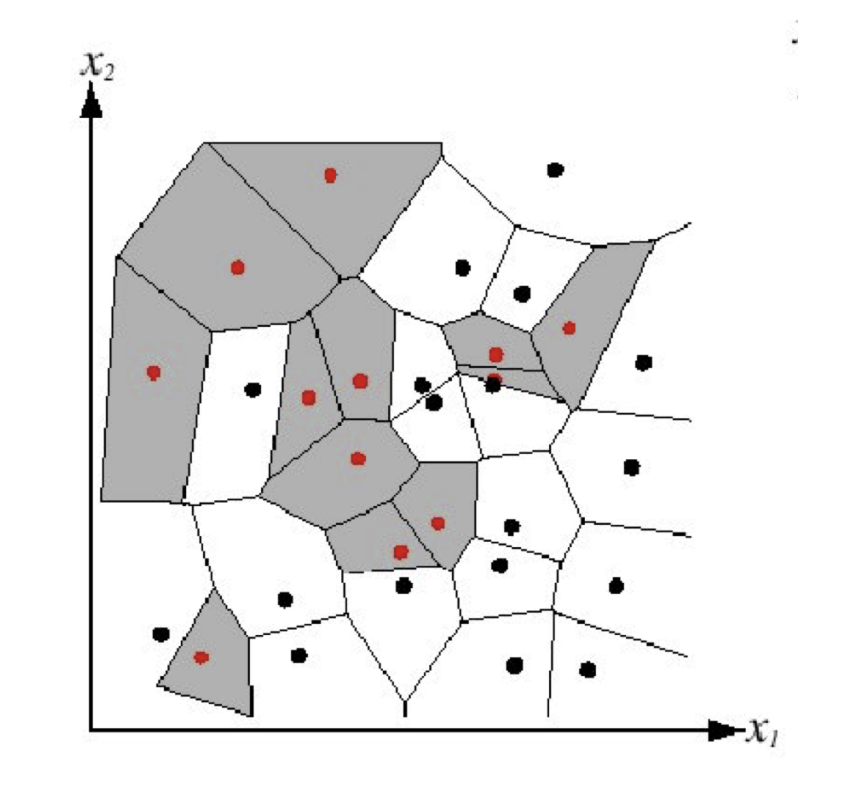
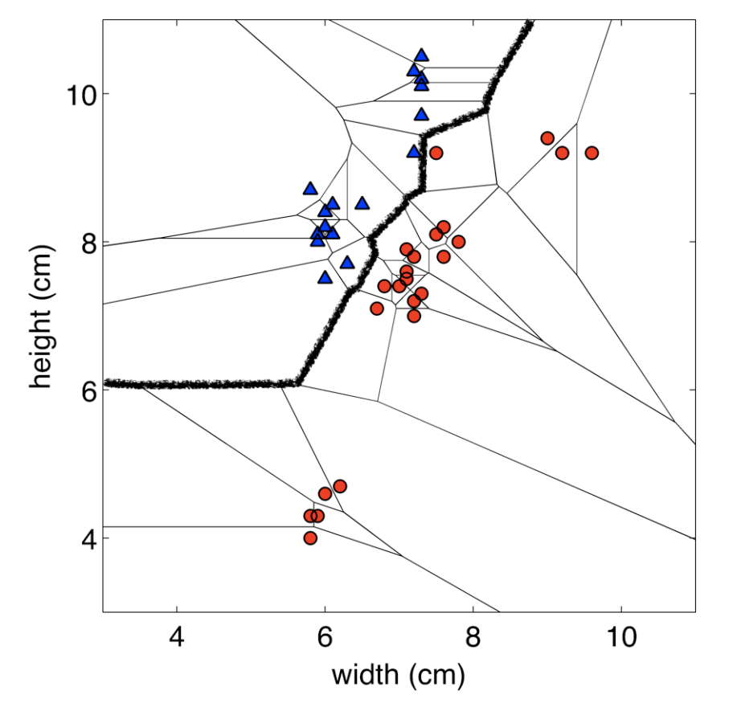
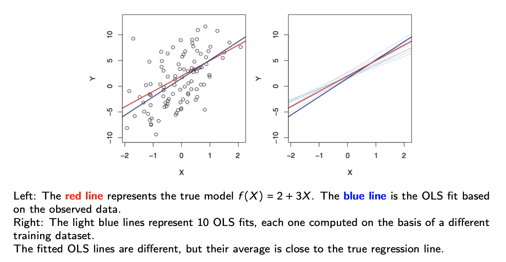



## Review from Last Week

[Machine learning is the science of learning patterns from data.]{style="color: maroon;"}

::: fragment
We introduced three types of machine learning problems:

-   **Supervised Learning**
-   **Unsupervised Learning**
-   Reinforcement Learning
:::

::: fragment
The main focus of this course is supervised learning, where we are given

-   [Training Set]{style="color: maroon;"} ${(x_1, y_1), ..., (x_n, y_n)}$ consisting of $n$ samples of
    -   [features]{style="color: maroon;"} $x_1, ..., x_n \in X$ and corresponding
    -   [outcome]{style="color: maroon;"} $y_1, ..., y_n \in Y$

and the goal is to to estimate (or learn) the function $f: X \rightarrow Y$ based on $D^{train}$.
:::

## Review from Last Week

We discussed two approaches of estimating $f$ based on $D^{train}$:

-   [**Parametric method**]{style="color: maroon;"} (assume a distribution)
    -   *Example*: assuming a linear model
-   [**Non-parametric method**]{style="color: maroon;"} (data-driven)
    -   *Example*: k-nearest neighbours

::: fragment
When choosing a model, $\hat{f}$, we need to keep in mind the **bias-variance tradeoff**

-   the balance between a model being too simple (high bias) and too complex (high variance)
:::

## Review from Last Week

When deciding on the best model, we can use a metric such as the **test MSE** (regression problems) or the **test error rate** (classification problems)

-   it is important to evaluate model performance using the test data, since the training MSE (or error rate) will always prefer a more complex model

:::{.fragment} 
In summary, different $\hat{f}$ are simply different algorithms/methods/predictors 

  - we will spend this course going over many different ways to estimate $f$ 
  - there is no one best method
:::

## Learning Outcomes for This Week

-   kNN
-   linear regression
-   cross validation

# k-Nearest Neighbours (kNN)

## Motivating Example

Machine learning is a great tool to use to help with clinical decision making/health system planning. 

One example would be to use supervised learning to predict which older patients are most likely to benefit from rehabilitation 

  - Doing so would result in more efficient use of health care resources, reduction in costs, and improved quality of life for the patient
  
<br> 

:::{.fragment}
Let $\mathbf{x_i}$ be a set of covariates for patient $i = 1,...,n$. 
Let $y_i$ be the binary outcome, where $y_i=1$ indicates that the patient has rehabilitation potential.
::: 

::: {style="text-align: center;"}
:::{.fragment}
**Motivating Question:** For a new patient that comes into the clinic, how can we predict if they would benefit from at-home rehabilitation?
::: 
:::


:::{.citation} 
Zhu, M., Chen, W., Hirdes, J. P., & Stolee, P. (2007). The K-nearest neighbor algorithm predicted rehabilitation potential better than current Clinical Assessment Protocol. Journal of clinical epidemiology, 60(10), 1015-1021.
:::

## A Classical Local Approach: Nearest Neighbours

-   Consider a **classification problem** (for now)
-   Suppose we are given a new feature vector, $\mathbf{x^*} \in \mathbb{R}^p$
-   The idea here is the find the nearest feature vector to $\mathbf{x}$ in the training set, and use its label to predict $y^*$

::: fragment
There are many ways that we can *define nearest*, but for now we will use the [Euclidean distance]{style="color: maroon;"}, i.e.

$$||\mathbf{x_i}-\mathbf{x_{i'}}||_2 = \sqrt{\sum_{j=1}^p (x_{ij} - x_{i'j})^2}$$
:::

## A Classical Local Approach: Nearest Neighbours
::: algorithm-box
**Algorithm: 1-NN**

1.  Find example $(\mathbf{x}, y)$ (from the training data) closest to $\mathbf{x^*}$. That is: $$\mathbf{x} = \underset{\mathbf{x_i} \in \{\mathbf{x_1}, ..., \mathbf{x_n}\}}{\arg\min} \text{distance}(\mathbf{x_i}, \mathbf{x^*})$$

2.  Output $y$ as the label.
:::

## A Classical Local Approach: Nearest Neighbours

We can visualize the behaviour in the classification setting using a [Voronoi diagram]{style="color: maroon;"}. 

This diagram is a way to divide a space into different regions based on the distance to specific points, thus it's a good way to visualize what the outcome label of a new point, $\mathbf{x^*}$ would be. 

{width="40%" fig-align="center"}

## Nearest Neighbours: Decision Boundaries 

[Decision Boundary]{style="color: maroon;"}: the boundary between regions of the feature space assigned to different categories

{width="45%" fig-align="center"}

## Nearest Neighbours

Going back to our motivating example, what does this algorithm look like? 

:::{.fragment}
What are some issues that arise?

:::


## Let's Generalize: k-Nearest Neighbours

Instead of just using the *nearest* neighbour, we will use the *k-nearest neighbours*. 

::: algorithm-box
**Algorithm: k-NN**

1.  Find $k$ data points $(\mathbf{x_{(1)}}, y_{(1)}), ..., (\mathbf{x_{(k)}}, y_{(k)})$ (from the training data) closest to $\mathbf{x^*}$. These points are ordered by which are closest to $\mathbf{x^*}$. These points form a neighbourhood, $N_k(\mathbf{x})$.

2a.  The prediction for a classification problem is majority class among the $k$ neighbours

 $$
   \hat{y}^*
   =
   \underset{y \in \mathcal{C}}{\arg\max}
   \sum_{i=1}^{k}
   \mathbf{1}\{y = y_{(i)}\},
   $$
where $\mathcal{C}$ is the set of possible classes. 

2b.  The prediction for a regression problem is the average response among the $k$ neighbours

 $$
   \hat{y}^*
   =
   \frac{1}{k}\sum_{i=1}^{k} y_{(i)}.
   $$
:::

## Toy Example: kNN

Suppose we observe a new point, 
$$
\mathbf{x}^* = (0.5, 0)
$$

Let's use $k=5$ to predict its class, $y^*$. 

```{webr-r}
## Generate training data (pretend this is given to us already) 
set.seed(314)

n <- 100

x1 <- c(
  rnorm(n/2, mean = -1, sd = 1),
  rnorm(n/2, mean =  1, sd = 1)
)

x2 <- c(
  rnorm(n/2, mean =  1, sd = 1),
  rnorm(n/2, mean = -1, sd = 1)
)

y <- factor(c(
  rep("0", n/2),
  rep("1", n/2)
))

data <- data.frame(x1, x2)

# Our new observation
new_point <- data.frame(
  x1 = 0.5,
  x2 = 0
)

# Use k-NN to classify the new point

``` 

## Effect of $k$ on the Decision Boundary

```{r}
#| echo: false
#| warning: false
#| message: false
#| fig-width: 12
#| fig-height: 4

library(class)

set.seed(314)

# Generate simple training data
n <- 120

x1 <- c(
  rnorm(n/2, mean = -1, sd = 1),
  rnorm(n/2, mean =  1, sd = 1)
)

x2 <- c(
  rnorm(n/2, mean =  1, sd = 1),
  rnorm(n/2, mean = -1, sd = 1)
)

y <- factor(c(
  rep("Orange", n/2),
  rep("Blue", n/2)
))

train <- data.frame(x1, x2)

# Grid covering the feature space
grid <- expand.grid(
  x1 = seq(min(x1) - 0.5, max(x1) + 0.5, length.out = 150),
  x2 = seq(min(x2) - 0.5, max(x2) + 0.5, length.out = 150)
)

# Plot decision boundary for a given k
plot_knn <- function(k) {

  pred <- knn(
    train = train,
    test = grid,
    cl = y,
    k = k
  )

  z <- matrix(
    as.numeric(pred),
    nrow = 150,
    ncol = 150
  )

  plot(
    x1, x2,
    col = c("darkorange", "blue")[y],
    pch = 19,
    xlab = expression(X[1]),
    ylab = expression(X[2]),
    main = paste("k =", k),
    asp = 1
  )

  contour(
    unique(grid$x1),
    unique(grid$x2),
    z,
    levels = 1.5,
    add = TRUE,
    drawlabels = FALSE,
    lwd = 3
  )
}

par(mfrow = c(1, 3))

plot_knn(1)
plot_knn(15)
plot_knn(75)
```

## Tradeoffs in Choosing $k$

**Small $k$** 

  - More flexible decision boundary, but high variance  
      - [Question]{style="color: maroon;"}: what does high variance mean when we're talking about $\hat{f}$?
  - Overfitting: sensitive to random noise in the training data 
  
**Large $k$** 

  - Less flexible decision boundary and smaller variance
  - Underfitting: fail to capture the true decision boundary 

## Tradeoffs in Choosing $k$

**Balancing $k$** 

  - Optimal choice of $k$ depends on number of data points, $n$ 
  - Nice theoretical properties if 
  
  $$k \rightarrow \infty, \quad \text{and} \quad \frac{k}{n} \rightarrow 0$$
[Rule of Thumb]{style="color: maroon;"}: Choose $k$ from $[1, \sqrt{n}] via cross-validation (next lecture!)

## Pitfalls: The Curse of Dimensionality

As we discussed last week, [kNN suffers from the curse of dimensionality!]{style="color: maroon;"} 

  - In high dimensions, "most" points are approximately the same distance because they are far away from each other
  - e.g. Motivating example

:::{.fragment}
The saving grade is that some datasets (e.g. images) may have low [intrinsic dimension]{style="color: maroon;"} 

  - This means that high dimensional data may rely on a much smaller number of true independent variables than the space may suggest
  - i.e. The true $f$ does not use all features available
::: 

## Pitfalls: Normalization 

kNN can be sensitive to the ranges of different features 

  - e.g. Motivating example: age (50+) vs. indicator variable representing whether the patient can bathe on their own (0 or 1)

<br>
:::{.fragment}
A simple fix: [standardize]{style="color: maroon;"} each dimension to be zero mean and unit variance. 

**Caution**: depending on the problem, the scale might be important!
:::

## Pitfalls: Computational Cost 

- Computational cost for classifying test data, per data point (un-modified algorithm)

  - Calculate p-dimensional Euclidean distances with $n$ data points: O($np$) (computation time increases linearly with n and with p)
  - Sort the distances: O($n \log n$) (computation time between linear and quadratic)

:::{.fragment}
- This must be done for each test data point, which is very expensive by the standards of a learning algorithm!
- Need to store the entire dataset in memory! 
::: 

:::{.fragment}
- Tons of work has gone into algorithms and data structures for efficient nearest neighbors with high dimensions and/or large datasets.
:::

## Note on Other Distance Measures 

Depending on the type of dataset, [different distance measures will perform better than others]{style="color: maroon;"}. 

<br>
These distance measures may differ in: 

  - their sensitivity to large differences in feature values
  - their ability to handle non-continuous features
  - their ability to perform well in sparse feature environments
  - etc. 
  
## Knowledge Check 


# Linear Regression: A Review 

## Linear Regression 

Although simple, and may seem a bit dull compared to other more sophisticated techniques, linear regression remains to be a very useful and widely used statistical learning method. 

<br> 

It is the foundation of a lot of new approaches as well. 

## Linear Regression 

Let $Y \in \mathbb{R}$ be the outcome and $X \in \mathbb{R}^p$ be the (random) vector of $p$ features. 

The linear model assumes: 

$$
\begin{aligned}
Y &= f(X) + \epsilon \\
  &= \beta_0 + \beta_1X_1 + ... + \beta_pX_p + \epsilon
\end{aligned}
$$
where 

  - $\beta_0, \beta_1, ..., \beta_p$ are unknown constants 
    - $\beta_0$ is called the **intercept** 
    - $\beta_j$, for $1 \leq j \leq p$, are the **coefficients** of the $p$ features 
  - $\epsilon$ is the error term satisfying $\mathbb{E}[\epsilon]=0$
  
## Linear Predictor under the Linear Regression Model 

If we can estimate the unknown coefficients $\beta_0, \ldots, \beta_p$, 
then we can use the fitted model to predict the response for a new observation 
$\mathbf{x}^* = (x_1^*, \ldots, x_p^*)$:

$$
\hat{f}(\mathbf{x}^*) 
= \hat{\beta}_0 
+ \hat{\beta}_1 x_1^* 
+ \cdots 
+ \hat{\beta}_p x_p^*.
$$
:::{.fragment}
[Question]{style="color: maroon;"}: How do we estimate
$\hat{\beta}_0, \ldots, \hat{\beta}_p$?
::: 

## Ordinary Least Squares (OLS) Approach 

To approximate $\beta_0, ..., \beta_p$, we can use Ordinary Least Squares (OLS). 

:::{.fragment}
In the [model fitting step]{style="color: maroon;"}, we use the training data, $D^{train}$ to choose $\beta_0, ..., \beta_p$ such that they minimize the mean of the squared residuals: 

$$
\begin{aligned}
(\hat{\beta}_0, \ldots, \hat{\beta}_p)
&= \underset{\alpha_0, \ldots, \alpha_p}{\arg\min}
\frac{1}{n}\sum_{i=1}^n
\left(
y_i - \left[\alpha_0 + \alpha_1x_{i1} + \cdots + \alpha_px_{ip}\right]
\right)^2.
\end{aligned}
$$
::: 

:::{.fragment}
Once we have estimated the coefficients, our fitted model is

$$
\hat{f}(\mathbf{x}) 
= \hat{\beta}_0 
+ \hat{\beta}_1 x_1 
+ \cdots 
+ \hat{\beta}_p x_p.
$$
::: 

## Linear Regression 

[Question]{style="color: maroon;"}: What is the interpretation of $\beta_0$? 

<textarea class="annotation-box"
          placeholder="Type notes here..."></textarea>


[Question]{style="color: maroon;"}: What is the interpretation of one of the coefficients, say, $\beta_1$? 

<textarea class="annotation-box"
          placeholder="Type notes here..."></textarea>

## In Matrix Form 

Using matrix notation,

- $\hat{\boldsymbol{\beta}} = [\hat{\beta}_0, \ldots, \hat{\beta}_p]^\intercal \in \mathbb{R}^{p+1}$, 
  $\boldsymbol{\alpha} = [\alpha_0, \ldots, \alpha_p]^\intercal \in \mathbb{R}^{p+1}$,

- $\mathbf{y} = [y_1, \ldots, y_n]^\intercal \in \mathbb{R}^n$, 
  $\mathbf{X} = [\mathbf{x}_1, \ldots, \mathbf{x}_n]^\intercal \in \mathbb{R}^{n \times (p+1)}$, with

  $$
  \mathbf{x}_i = [1, x_{i1}, \ldots, x_{ip}]^\intercal \in \mathbb{R}^{p+1},
  \qquad 1 \leq i \leq n.
  $$

:::{.fragment}
The OLS estimator of $\boldsymbol{\beta}$ is defined as

$$
\begin{aligned}
\hat{\boldsymbol{\beta}}
&=
\underset{\boldsymbol{\alpha} \in \mathbb{R}^{p+1}}{\arg\min}
\frac{1}{n}
\sum_{i=1}^n
\left(y_i - \mathbf{x}_i^\intercal \boldsymbol{\alpha}\right)^2 \\[0.5em]
&=
\underset{\boldsymbol{\alpha} \in \mathbb{R}^{p+1}}{\arg\min}
\frac{1}{n}
\left\|
\mathbf{y} - \mathbf{X}\boldsymbol{\alpha}
\right\|_2^2.
\end{aligned}
$$
:::

## Some Comments

- We use the test MSE to evaluate the performance of a model, but the idea of estimating $f$ by minimizing the training MSE can be applied to (almost) all supervised learning problems. 

Specifically, 

$$\hat{f} = \underset{g \in \mathcal{F}}{\arg\min} \frac{1}{n} \sum_{i=1}^n L(y_i, g(\mathbf{x_i}))$$
where $L(.)$ is a loss function and $\mathcal{F}$ is a class of choices for the function, $g$. 

:::{.fragment}
- The OLS approach corresponds to $L(a,b) = (a-b)^2$ and 

$$\mathcal{F} = \{\mathbf{x} \mapsto \mathbf{x}^{\intercal}\mathbf{\beta} : \mathbf{\beta} \in \mathbb{R}^{p+1}\}$$
::: 

## Some Comments

- In general, the difficulty of solving 
$$\hat{f} = \underset{g \in \mathcal{F}}{\arg\min} \frac{1}{n} \sum_{i=1}^n L(y_i, g(\mathbf{x_i}))$$
varies across problems, but the OLS approach admits a closed-form solution: 

$$\hat{\mathbf{\beta}} = (\mathbf{X}^{\intercal}\mathbf{X})^{-1}\mathbf{X}^{\intercal}\mathbf{y}$$
whenever $\mathbf{X} \in \mathbb{R}^{n \times (p+1)}$ has full column rank. 

## What is Random?

The true parameters $\boldsymbol{\beta}$ are **fixed but unknown**.

The training data

$$
(\mathbf{X}_1,Y_1),\ldots,(\mathbf{X}_n,Y_n)
$$

are random observations from the population.

:::{.fragment}
Since $\hat{\boldsymbol{\beta}}$ is calculated from the training data,

$$
\boxed{\hat{\boldsymbol{\beta}} \text{ is also random.}}
$$
:::

:::{.fragment}
If we collected a different training sample, we would generally obtain a
**different** $\hat{\boldsymbol{\beta}}$.
:::

## The Randomness in the Coefficients 

{width="80%" fig-align="center"}

## Properties of the OLS Estimator

Recall that

$$
\hat{\boldsymbol{\beta}}
=
(\mathbf{X}^{\intercal}\mathbf{X})^{-1}
\mathbf{X}^{\intercal}\mathbf{y}.
$$

Assuming the linear model is correctly specified,

[**Unbiasedness**]{style="color: maroon;"}

$$
\mathbb{E}[\hat{\boldsymbol{\beta}}]
=
\boldsymbol{\beta}.
$$

On average, OLS estimates the true coefficients correctly.

:::{.fragment}
[**Variance**]{style="color: maroon;"}

$$
\operatorname{Cov}(\hat{\boldsymbol{\beta}})
=
\sigma^2
(\mathbf{X}^{\intercal}\mathbf{X})^{-1}.
$$

Different training samples produce different estimates of
$\boldsymbol{\beta}$.
:::

## Important Considerations 

Estimation of $\mathbf{\beta}$ 

  - How close is the point estimation $\hat{\mathbf{\beta}}$ to the true $\hat{\mathbf{\beta}}$
  - (Inference) Can we provide confidence intervals and conduct hypothesis testing of $\hat{\mathbf{\beta}}$? 

:::{.fragment}
Prediction of $Y$ at $X^* = \mathbf{x^*}$ 

  - How accurate is the point prediction $\hat{f}(\mathbf{x^*}) = \mathbf{x^*}^{\intercal}\hat{\mathbf{\beta}}$? 
  - (Inference) Can we further provide prediction intervals of $Y$? 
::: 

:::{.fragment}
Variable (Model) Selection 

  - Do all predictors help to explain $Y$, or is there only a subset of the predictors that are useful? (we will discuss this later!)
:::