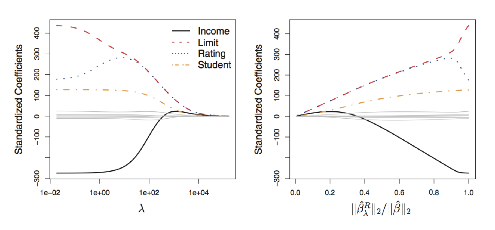
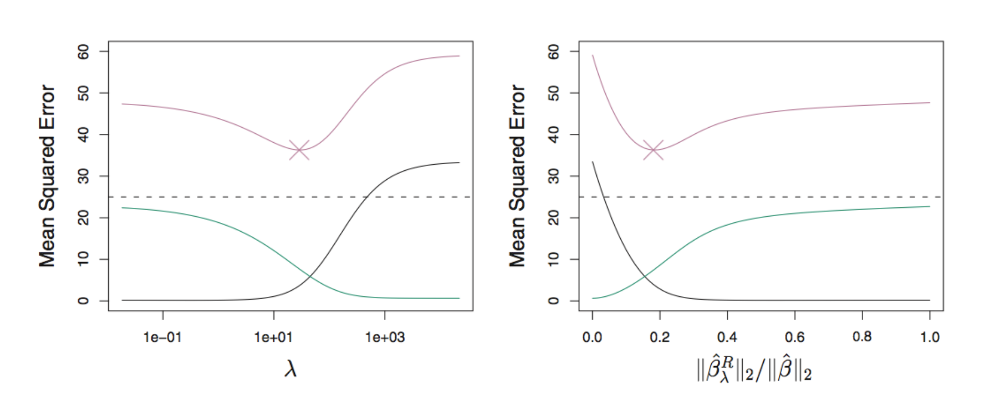
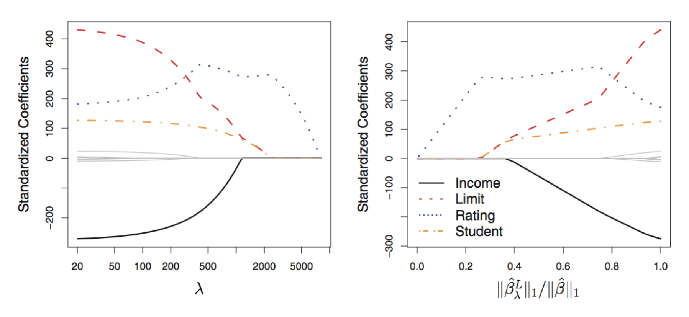
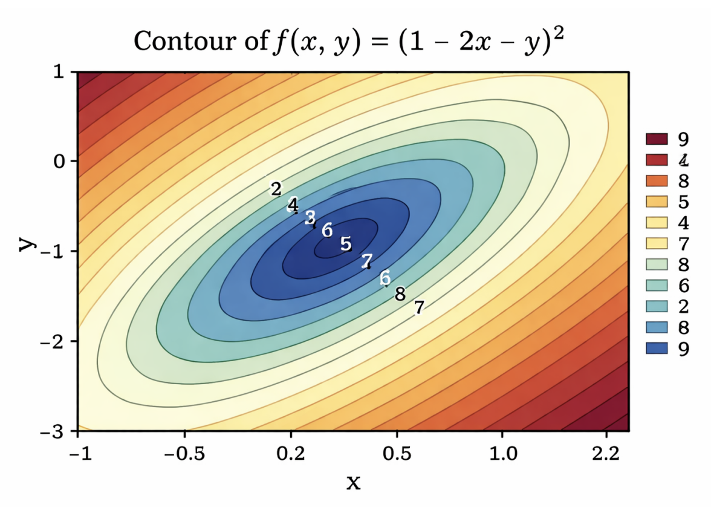
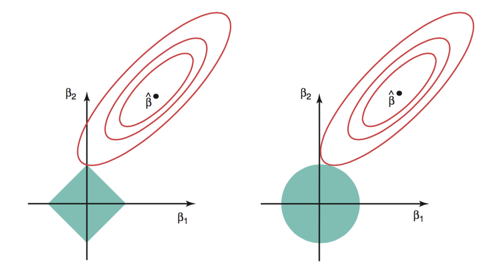
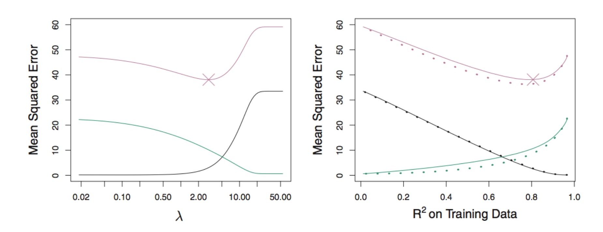
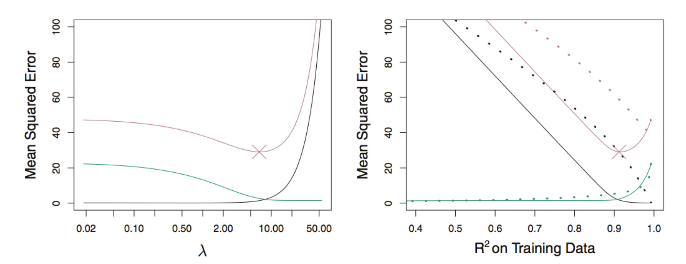
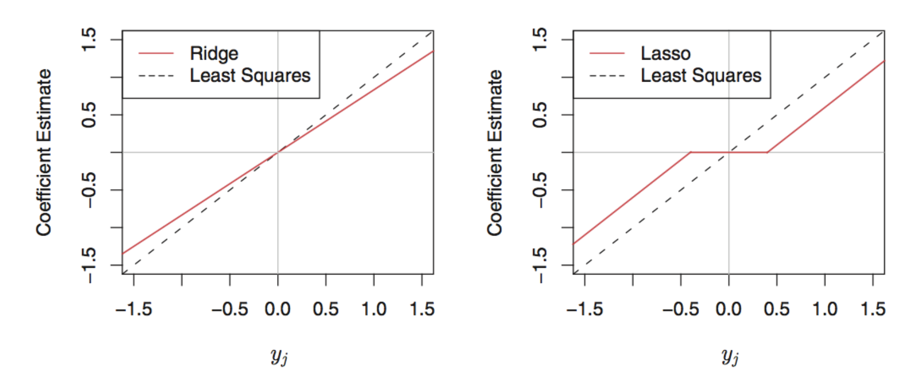
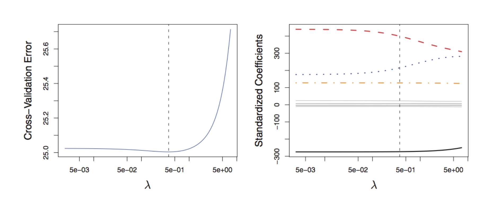



## Review from Last Week

To assess models and aid with model selection, we can use the following approaches: 

**Data Splitting** 

  - one-time split (unstable) 
  - multiple splits (much better, but can be computationally expensive depending on the problem) 
    - $k$-Fold cross validation! 

**Training Error Adjustment** 

  - we discussed four different criterion 
  - we need distributional information so we are limited to only using parametric methods 

## Review from Last Week 

**Best subset selection**

-   Searches across all $2^p$ possible models.
-   Can find the best model of each size, but quickly becomes computationally expensive.

**Stepwise subset selection**

-   Forward or backward stepwise selection is more computationally affordable.
-   These are greedy procedures, so they may miss a better model.

<br> 


::: fragment
Can we obtain a simpler, more stable model without searching over subsets?

[**Yes: shrinkage methods.**]{style="color: maroon;"}
:::

## Learning Outcomes

By the end of this week, you should be able to:

-   Explain how shrinkage trades a small increase in bias for a reduction in variance.
-   Formulate ridge and lasso regression as penalized least-squares problems.
-   Compare the effects of the $\ell_1$ and $\ell_2$ penalties on coefficient estimates.
-   Explain why the lasso can perform variable selection while ridge regression cannot.
-   Use cross-validation to select a regularization parameter. 

# Shrinkage Methods {.center .text-center}

## Shrinkage Methods

We can fit a model containing all $p$ predictors while [**constraining**]{style="color: maroon;"} or [**regularizing**]{style="color: maroon;"} the coefficient estimates by shrinking the coefficient estimates towards zero.

<br> 

Shrinkage can substantially reduce the variance of the fitted model.

<br> 

:::{.fragment}
The two best known techniques for shrinking the regression coefficients towards zero are the [**ridge regression**]{style="color: maroon;"} and the [**lasso**]{style="color: maroon;"}
::: 

## Ridge Regression

Recall that the OLS fitting procedure estimates $\beta_0,\ldots,\beta_p$ using the values that minimize

$$
\frac{1}{n}\sum_{i=1}^{n}
\left(y_i-\beta_0-\sum_{j=1}^{p}\beta_jx_{ij}\right)^2.
$$

:::{.fragment}
[**Ridge regression**]{style="color: maroon;"} instead estimates $\beta_0,\ldots,\beta_p$ using that values that minimize

$$
\frac{1}{n}\sum_{i=1}^{n}
\left(y_i-\beta_0-\sum_{j=1}^{p}\beta_jx_{ij}\right)^2
+\lambda\sum_{j=1}^{p}\beta_j^2,
$$

where $\lambda\geq 0$ is a tuning (regularization) parameter, to be determined later.
::: 

## Comments

$$
\widehat{\boldsymbol\beta}^{\,R}_{\lambda}
=\underset{\beta_0,\ldots,\beta_p}{\operatorname{argmin}}
\left\{
\underbrace{\frac{1}{n}\sum_{i=1}^{n}
\left(y_i-\beta_0-\sum_{j=1}^{p}\beta_jx_{ij}\right)^2}_{\text{RSS}}
+
\underbrace{\lambda\sum_{j=1}^{p}\beta_j^2}_{\text{shrinkage penalty}}
\right\}.
$$

-   We usually denote the ridge regression estimator by $\widehat{\boldsymbol\beta}^{\,R}_{\lambda}$ because different $\lambda$s produce different coefficient estimates
-   We usually do not penalize the intercept $\beta_0$.
-   Ridge accepts a slightly larger RSS in exchange for smaller coefficient magnitudes.

:::{.fragment}
[$\lambda$ controls the balance between fitting the training data and shrinking the coefficients.]{style="color: maroon;"}
::: 

## What Does $\lambda$ Do?

$$
\widehat{\boldsymbol\beta}^{\,R}_{\lambda}
=\underset{\beta_0,\ldots,\beta_p}{\operatorname{argmin}}
\left\{
\underbrace{\frac{1}{n}\sum_{i=1}^{n}
\left(y_i-\beta_0-\sum_{j=1}^{p}\beta_jx_{ij}\right)^2}_{\text{RSS}}
+
\underbrace{\lambda\sum_{j=1}^{p}\beta_j^2}_{\text{shrinkage penalty}}
\right\}.
$$

What happens when $\lambda=0$? 

<textarea class="annotation-box"
          placeholder="Type notes here..."></textarea> 
          
What happens as $\lambda$ increases? 

<textarea class="annotation-box"
          placeholder="Type notes here..."></textarea> 
          

## Comments 

Selecting a good value for $\lambda$ is critical 

Cross-validation could be used to select $\lambda$ 

<br> 

:::{.fragment} 
In practice, we recommend the [standardized predictors]{style="color: maroon;"} for ridge regression since the penalty depends on the scale of each predictor. 

We can use the formula 

$$\tilde{x}_{ij} = \frac{x_{ij}}{\sqrt{\frac{1}{n}\sum_{i=1}^n (x_{ij}-\bar{x}_j)^2}}$$

All standardized predictors have standard deviation equal to one.
:::


## Credit Card Data Example

{width="80%" fig-align="center"}

***Left Panel**: each curve corresponds to the ridge regression coefficient estimate for one of the 10 variables, plotted as a function of $\lambda$ 

**Right Panel**: same ridge coefficient estimates, but we now display $||\widehat{\beta}_{\lambda}^R||_2/||\widehat{\beta}||_2$, where $\widehat{\beta}$ denotes the OLS estimator.

## Credit Card Data Example

{width="80%" fig-align="center"}

Squared bias (black), variance (green), and the test MSE (purple) for the ridge regression. The dashed lines indicate the smallest possible MSE. 

:::{.fragment}
**Ridge regression improves over OLS in terms of MSE**
::: 

## Advantages of Ridge Regression

Ridge can predict better than OLS when OLS estimates have high variance.
   
  - It reduces variance by accepting some bias.

<br> 

For a fixed value of $\lambda$, ridge regression is computationally efficient.
    
  - It is much faster than best subset selection when $p$ is large.

## A Limitation of Ridge Regression

Can ridge regression perform variable selection by setting unimportant coefficients exactly equal to zero?

<br> 

::: fragment
**No.** Ridge shrinks coefficients towards zero, but typically retains all $p$ predictors with nonzero coefficients.
:::

<br> 

::: {.fragment}
Ridge can improve prediction, but it does not automatically produce a sparse, easily interpreted model.
:::

## The Lasso

The lasso penalizes the [**absolute values**]{style="color: maroon;"} of the coefficients. 

<br> 

:::{.fragment}
Specifically, the lasso coefficients, $\widehat{\mathbf{\beta}}_{\lambda}^L$, minimize the quantity:

$$
\widehat{\boldsymbol\beta}^{\,L}_{\lambda}
=\underset{\beta_0,\ldots,\beta_p}{\operatorname{argmin}}
\left\{
\frac{1}{n}\sum_{i=1}^{n}
\left(y_i-\beta_0-\sum_{j=1}^{p}\beta_jx_{ij}\right)^2
+\lambda\sum_{j=1}^{p}|\beta_j|
\right\}.
$$

where $\lambda \geq 0$ is a tuning parameter, to be determined later.

-   Ridge uses the $\ell_2$ penalty: $\|\boldsymbol\beta\|_2^2=\sum_{j=1}^{p}\beta_j^2$.
-   The lasso uses the $\ell_1$ penalty: $\|\boldsymbol\beta\|_1=\sum_{j=1}^{p}|\beta_j|$.
::: 

## What Makes the Lasso Different?

Like ridge regression, the lasso shrinks coefficient estimates towards zero.

<br> 

Unlike ridge regression, the lasso can force some coefficients to be [**exactly zero**]{style="color: maroon;"} when $\lambda$ is sufficiently large.

:::{.fragment}
-   It performs automatic variable selection.
-   It produces a **sparse model** when only a subset of predictors receive nonzero coefficients.
-   The value of $\lambda$ is usually chosen using cross-validation.
:::
## Credit Card Data Example

{width="80%" fig-align="center"}

As the penalty increases, lasso coefficient paths reach exactly zero. This is what enables variable selection.

## The Magic of the Lasso

Why does the lasso produce exact zero estimates, while ridge regression generally does not?

<br> 

::: {.fragment}
[The answer comes from the geometry of the $\ell_1$ and $\ell_2$ constraint regions.]{style="color: maroon;"}
:::

## Another Formulation for Ridge Regression and Lasso

The lasso solves

$$
\underset{\beta_0,\ldots,\beta_p}{\operatorname{minimize}}
\quad
\sum_{i=1}^{n}\left(y_i-\beta_0-\sum_{j=1}^{p}\beta_jx_{ij}\right)^2
\quad\text{subject to}\quad
\sum_{j=1}^{p}|\beta_j|\leq s.
$$

Ridge regression solves

$$
\underset{\beta_0,\ldots,\beta_p}{\operatorname{minimize}}
\quad
\sum_{i=1}^{n}\left(y_i-\beta_0-\sum_{j=1}^{p}\beta_jx_{ij}\right)^2
\quad\text{subject to}\quad
\sum_{j=1}^{p}\beta_j^2\leq s.
$$

Here, $s\geq 0$ is related to the penalty parameter $\lambda$.

## Least-Squares Loss Functions

Consider the loss function $L(\beta_1,\beta_2)=\sum_{i=1}^{n}(y_i-x_{i1}\beta_1-x_{i2}\beta_2)^2.$

{width="55%" fig-align="center"}

::: {.centered}
Each contour contains coefficient pairs with the same RSS. The centre is the OLS solution.
:::

## Why Does the Lasso Yield Zero Estimates?

{width="65%" fig-align="center"}

::: {.centered}
The lasso constraint has corners on the axes. An RSS contour often first touches the diamond at a corner, making one coefficient exactly zero. The ridge constraint is smooth, so its solution rarely lies exactly on an axis.
:::

## Lasso versus Ridge

The lasso's ability to produce a **sparse model** is a major advantage when interpretability matters.

<br> 
But which method predicts better?

<br> 

::: fragment
That depends on the structure of the true signal.
:::

## When the True Model Is Not Sparse

{width="80%" fig-align="center"}

**Left**: Plots of squared bias (black), variance (green), and test MSE (purple) for the lasso on a simulated data set. 
**Right**: Comparison of squared bias, variance, and test MSE between lasso (solid) and ridge (dotted). 

The crosses in both plots indicate the lasso model for which the MSE is smallest. 

When many true coefficients are nonzero, ridge and lasso can have similar bias, while ridge may achieve lower variance and lower test MSE.

## When the True Model Is Sparse

{width="80%" fig-align="center"}

When only a small number of predictors truly matter, the lasso can outperform ridge by attaining both lower bias and lower variance.

## Conclusions on Lasso versus Ridge

-   Neither ridge regression nor the lasso universally dominates the other.
-   The lasso often performs well when the response is related to a relatively small number of predictors.
-   Both methods can reduce variance at the expense of some bias.
-   Unlike ridge regression, the lasso performs variable selection and may yield a more interpretable model.

## A Simple Example

Assume that $n=p$, $\mathbf X=\mathbf I_n$, and the intercept is fixed at $\beta_0=0$.

:::{.fragment}
Then

$$
\begin{bmatrix}
y_1\\ \vdots\\ y_p
\end{bmatrix}
=
\begin{bmatrix}
\beta_1\\ \vdots\\ \beta_p
\end{bmatrix}
+
\begin{bmatrix}
\varepsilon_1\\ \vdots\\ \varepsilon_p
\end{bmatrix},
$$

where

$$
\mathbb E(\varepsilon_j)=0,
\qquad
\operatorname{Var}(\varepsilon_j)=\sigma^2,
\qquad j=1,\ldots,p.
$$
::: 

## A Simple Example

OLS minimizes

$$
\sum_{j=1}^{p}(y_j-\beta_j)^2.
$$

:::{.fragment}
Therefore,

$$
\widehat\beta_j=y_j,
\qquad j=1,\ldots,p.
$$
::: 


## A Simple Example

Ridge regression minimizes

$$
\sum_{j=1}^{p}(y_j-\beta_j)^2
+\lambda\sum_{j=1}^{p}\beta_j^2.
$$

This leads to the ridge estimator

$$
\widehat\beta_j^{\,R}=\frac{y_j}{1+\lambda},
\qquad j=1,\ldots,p.
$$

Since $\lambda\geq 0$, every estimated coefficient is shrunk towards zero.

##  A Simple Example

The lasso minimizes

$$
\sum_{j=1}^{p}(y_j-\beta_j)^2
+\lambda\sum_{j=1}^{p}|\beta_j|.
$$

This gives estimator

$$
\widehat\beta_j^{\,L}
=
\begin{cases}
y_j-\lambda/2, & y_j>\lambda/2,\\
0, & |y_j|\leq\lambda/2,\\
y_j+\lambda/2, & y_j<-\lambda/2.
\end{cases}
$$

:::{.fragment} 
The estimated coefficients from Lasso are also shrunk. The above shrinkage is known as the [**soft-thresholding**]{style="color: maroon;"}
:::

## A Simple Example

{width="80%" fig-align="center"}

Ridge shrinks continuously. The lasso applies a threshold and creates an interval of exact zeros.

## A Simple Example

Recall that $y_j=\beta_j+\varepsilon_j$ and $\widehat\beta_j=y_j$.

**Bias:**

$$
\mathbb E(\widehat\beta_j)
=\mathbb E(y_j)
=\beta_j.
$$

**Variance:**

$$
\operatorname{Var}(\widehat\beta_j)
=\operatorname{Var}(\varepsilon_j)
=\sigma^2.
$$

Thus, the OLS estimator is unbiased in this example.

## A Simple Example

For the $j$th coefficient,

$$
\begin{aligned}
\mathbb E\left[(\widehat\beta_j-\beta_j)^2\right]
&=\left\{\mathbb E(\widehat\beta_j)-\beta_j\right\}^2
+\operatorname{Var}(\widehat\beta_j)\\
&=\sigma^2.
\end{aligned}
$$

Across all $p$ coefficients,

$$
\mathbb E\left[\sum_{j=1}^{p}(\widehat\beta_j-\beta_j)^2\right]
=p\sigma^2.
$$

## A Simple Example

Recall that

$$
\widehat\beta_j^{\,R}=\frac{y_j}{1+\lambda}
=\frac{\beta_j+\varepsilon_j}{1+\lambda}.
$$

**Expected value and bias:**

$$
\mathbb E(\widehat\beta_j^{\,R})=\frac{\beta_j}{1+\lambda},
\qquad
\operatorname{Bias}(\widehat\beta_j^{\,R})
=-\frac{\lambda\beta_j}{1+\lambda}.
$$

**Variance:**

$$
\operatorname{Var}(\widehat\beta_j^{\,R})
=\frac{\sigma^2}{(1+\lambda)^2}.
$$

## A Simple Example

For the $j$th coefficient,

$$
\begin{aligned}
\mathbb E\left[(\widehat\beta_j^{\,R}-\beta_j)^2\right]
&=\operatorname{Bias}(\widehat\beta_j^{\,R})^2
+\operatorname{Var}(\widehat\beta_j^{\,R})\\
&=\frac{\lambda^2\beta_j^2}{(1+\lambda)^2}
+\frac{\sigma^2}{(1+\lambda)^2}.
\end{aligned}
$$

:::{.fragment}
Across all $p$ coefficients,

$$
\mathbb E\left[\sum_{j=1}^{p}(\widehat\beta_j^{\,R}-\beta_j)^2\right]
=\frac{\lambda^2}{(1+\lambda)^2}\sum_{j=1}^{p}\beta_j^2
+\frac{p\sigma^2}{(1+\lambda)^2}.
$$
::: 

:::{.fragment}
Ridge adds bias but reduces variance. The best $\lambda$ balances these two effects.
::: 

## Selecting $\lambda$ by Cross-Validation
  
::: algorithm-box
**Algorithm: Choosing the regularization parameter, $\lambda$**

1.  Choose a grid of candidate values for $\lambda$.
2.  Compute the cross-validation error for each value.
3.  Select $\lambda^*$ with the smallest cross-validation error.
4.  Refit the model using all training observations and $\lambda^*$.
:::

## Credit Card Data Example

{width="80%" fig-align="center"}

Cross-validation estimates predictive performance across a sequence of candidate values for $\lambda$. 

Vertical line indicates the chosen $\lambda$

## Beyond Ridge and Lasso

The [**elastic net**]{style="color: maroon;"} combines $\ell_1$ and squared $\ell_2$ penalties:

$$
\underset{\boldsymbol\beta}{\operatorname{minimize}}
\quad
\|\mathbf y-\mathbf X\boldsymbol\beta\|_2^2
+\lambda\left[(1-\alpha)\|\boldsymbol\beta\|_1
+\alpha\|\boldsymbol\beta\|_2^2\right],
$$

where $\lambda\geq 0$ and $\alpha\in[0,1]$.

<br> 

:::{.fragment}
-   $\alpha=1$ gives ridge regression under this parameterization.
-   $\alpha=0$ gives the lasso.
-   Intermediate values combine both types of shrinkage.
::: 

## Beyond Ridge and Lasso

Suppose we model nonlinear effects using

$$
Y=\beta_0+\beta_1X_1+\beta_2X_1^2
+\beta_3X_2+\beta_4X_2^2+\varepsilon.
$$
<br> 

:::{.fragment}
The [**group lasso**]{style="color: maroon;"} may minimize

$$
\|\mathbf y-\mathbf X\boldsymbol\beta\|_2^2
+\lambda\left(
\sqrt{\beta_1^2+\beta_2^2}
+\sqrt{\beta_3^2+\beta_4^2}
\right).
$$

Here, the linear and quadratic terms for each predictor form a group. A whole group can be set to zero simultaneously.
::: 

<br> 

:::{.fragment}
There are many more penalties out there!!!
::: 

## Regularization in General Settings {.smaller}

Ridge and lasso are not restricted to linear regression. More generally,

$$
\widehat{\boldsymbol\beta}_{\lambda}
=\underset{\boldsymbol\beta}{\operatorname{argmin}}
\left\{
L(\boldsymbol\beta;D^{\mathrm{train}})
+\lambda\,\operatorname{Pen}(\boldsymbol\beta)
\right\}.
$$

-   **OLS:** $L=\|\mathbf y-\mathbf X\boldsymbol\beta\|_2^2$ and $\operatorname{Pen}=0$.
-   **Ridge:** $L=\|\mathbf y-\mathbf X\boldsymbol\beta\|_2^2$ and $\operatorname{Pen}=\|\boldsymbol\beta\|_2^2$.
-   **Lasso:** $L=\|\mathbf y-\mathbf X\boldsymbol\beta\|_2^2$ and $\operatorname{Pen}=\|\boldsymbol\beta\|_1$.

The loss and penalty can be adapted to many other modelling settings.

## Model Selection Summary 

- we covered model selection for a **linear model**, these are alternatives to OLS 

- subset selection  

    - best, forward, backwards 
    - best can become VERY computationally intensive 
    - forward/backwards are greedy procedures that may not select the best model
    
- shrinkage/regularization 

    - lasso and ridge (there are many others!) 
    - ridge regression shrinks the coefficients towards 0, but it is not a variable selection technique 
    - lasso acts as both a shrinkage and variable selection method

# Model Selection Cumulative Example 

## Example 

We gave a simple motivating example last week where we compared two linear models 

  - one of which included one feature 
  - the other included two features 

Now, what we want to do is fit a model but [**decide which features should be included for the best fit**]{style="color: maroon;"}. 

<br> 

We will be using the Hitters dataset from the ISLR2 package (the package corresponding to our textbook). 

We want to answer the following question: 

**Which variables should we include in the model to predict a baseball player's salary?**

## Example 

```{webr} 

data(Hitters) # from the ISLR2 package 

# Remove observations with missing Salary 
Hitters <- na.omit(Hitters) 

dim(Hitters)
names(Hitters)

```

**Before we start the example, just be looking at the dataset what model selection techniques might you consider? Subset selection vs. Shrinkage? Then which methods between those might be better than others? What other questions would you have before you made a decision on a technique to use?**

## Example 

We are going to try two methods and see what happens. 

We start with **Subset Selection**, and here, we will do **forward stepwise selection**

```{webr}
forward_fit <- regsubsets(
  Salary ~ ., # by just putting a ., I am specifying that I want to consider all features
  data = Hitters,
  nvmax = 19,
  method = "forward"
) # regsubsets is the function to do subset selection from the `leaps` package
  # we specify that we want to do forward selection by putting "forward"

forward_summary <- summary(forward_fit) 

which.min(forward_summary$bic) # which model has the lowest BIC
```

## Example 

We used the BIC as our training error adjustment, what are some other methods we could have used? When does it make sense to use BIC?

```{=html}
<textarea class="annotation-box"
          placeholder="Type notes here..."></textarea>
```

:::{.fragment}
Our optimal model via best subset selection has the following coefficient estimates: 

```{webr} 
coef(forward_fit, which.min(forward_summary$bic))
```
::: 

## Example 

What do we know about forward stepwise selection? 

```{=html}
<textarea class="annotation-box"
          placeholder="Type notes here..."></textarea>
```

## Example 

The **Lasso** is another way to do variable selection. 

We can use the glmnet package to apply the Lasso and answer our question. 

```{webr}
# we use the function glmnet() from the glmnet package 
# However, this function/package requires a specific form of the data

x <- model.matrix(Salary ~ ., Hitters)[, -1]
y <- Hitters$Salary

lasso_fit <- glmnet(
  x,
  y,
  alpha = 1 # recall elastic net
)

plot(lasso_fit)
```

## Example 

So.. how do we choose $\lambda$?  

We will use cross validation to compare error across the lasso using a grid of $\lambda$ values. 

We can specify this grid ourselves, or use the default in the cv.glmnet() function (which we will do).

```{webr}
set.seed(314) 

cv_lasso <- cv.glmnet(
  x,
  y,
  alpha = 1
)

cv_lasso$lambda.min # value of lambda which minimizes the CV error
```

## Example 

The resulting coefficients are: 

```{webr} 
coef(cv_lasso, s = "lambda.min")
```

## Example 

Now, we have two different models. They chose a different number of predictors to include, with different coefficients.

<br> 

Can we compare these directly? Which one is better? What steps can I take to determine the better model? 

```{=html}
<textarea class="annotation-box"
          placeholder="Type notes here..."></textarea>
```


## Summary

-   Regularization shrinks coefficient estimates to reduce variance and may improve test error.
-   Ridge uses an $\ell_2$ penalty and usually retains every predictor.
-   The lasso uses an $\ell_1$ penalty and can set coefficients exactly to zero.
-   Neither method always predicts better; performance depends on the underlying signal.
-   Cross-validation is used to select the tuning parameter $\lambda$.
-   Penalized optimization extends far beyond linear regression.

**Next Week:** Moving Beyond Linearity
**Assignment:** Available on course website, due October 7th
