## Learning Outcomes

By the end of this week, you should be able to:

- Explain how gradient descent minimizes an objective function and describe the role of the learning rate.
- Explain why convexity is useful for optimization.
- Describe how polynomial regression, step functions, and splines can model nonlinear relationships.
- Compare kNN, weighted kNN, and local regression as local modelling approaches.
- Explain how generalized additive models extend nonlinear modelling to multiple predictors.

## Review: Regularized Linear Regression

-   Ordinary least squares can perform poorly when $p$ is large relative to $n$.  
  - i.e. estimates can have high variance

<br> 

-   Ridge and the lasso can improve test performance by:
    -   reducing variance;
    -   accepting some additional bias.
    
<br> 
    
-   The benefit can be substantial when the true coefficients are **small** or **sparse**.

::: {.fragment}
If only $s \ll p$ features are predictive, we would ideally fit the model using only those $s$ features.
:::

## Objective Functions

So far, we have defined our regression estimates by asking them to **minimize an objective function**.

:::{.fragment}
For ordinary least squares:

$$
\min_{\boldsymbol{\beta}}
\sum_{i=1}^n
\left(y_i-\beta_0-\sum_{j=1}^p x_{ij}\beta_j\right)^2
$$
:::

:::{.fragment}
For ridge regression:

$$
\min_{\boldsymbol{\beta}}
\left\{
\sum_{i=1}^n
\left(y_i-\beta_0-\sum_{j=1}^p x_{ij}\beta_j\right)^2
+
\lambda\sum_{j=1}^p \beta_j^2
\right\}
$$
:::

:::{.fragment}
For the Lasso:

$$
\min_{\boldsymbol{\beta}}
\left\{
\sum_{i=1}^n
\left(y_i-\beta_0-\sum_{j=1}^p x_{ij}\beta_j\right)^2
+
\lambda\sum_{j=1}^p |\beta_j|
\right\}
$$
:::

## A General Minimization Problem

Suppose we want to solve

$$
\widehat{\mathbf w}
=
\arg\min_{\mathbf w\in\Theta}
\mathcal J(\mathbf w;\mathcal D^{\text{train}})
:=
\arg\min_{\mathbf w\in\Theta}
\mathcal J(\mathbf w).
$$


where

- $\mathcal J(\mathbf w)$ is a differentiable function in $\mathbf w=(w_1,\ldots,w_p)$;
- $\Theta$ is the parameter space for $\mathbf w$, typically a subset of $\mathbb R^p$.

:::{.fragment}
The optimal solution, if it exists in the interior, must occur at a **critical point** i.e. point to which the derivative is zero (partial derivatives to zero for multi-dimensional parameter) 
:::

## Finding the Optimal Solution

A **partial derivative** measures how a multivariable function changes with respect to one argument while holding the others fixed.

For example,

$$
\frac{\partial}{\partial w_1}\mathcal J(w_1,w_2)
=
\lim_{h\to 0}
\frac{
\mathcal J(w_1+h,w_2)-\mathcal J(w_1,w_2)
}{h}.
$$

:::{.fragment}
The minimum must occur at a point where the partial derivatives are zero

$$
\nabla \mathcal J(\mathbf w)
=
\begin{bmatrix}
\frac{\partial \mathcal J}{\partial w_1}\\
\vdots\\
\frac{\partial \mathcal J}{\partial w_p}
\end{bmatrix}
=
\mathbf 0.
$$

:::

:::{.fragment}
This implies a system of equations, which we can solve analytically in some scenarios. 

We may also use optimization techniques that iteratively get us closer to the solution.
:::

## Direct Solution: OLS

For ordinary least squares,

$$
\widehat{\mathbf w}
=
\arg\min_{\mathbf w\in\mathbb R^p}
\mathcal J(\mathbf w)
=
\arg\min_{\mathbf w\in\mathbb R^p}
\|\mathbf y-\mathbf X\mathbf w\|_2^2.
$$

The partial derivatives w.r.t $\mathbf{w}$ are

$$
\frac{\partial \mathcal J}{\partial \mathbf w}
=
-2\mathbf X^\top(\mathbf y-\mathbf X\mathbf w).
$$

(If not familiar with multi-dimensional derivatives, calculate $\frac{\partial \mathcal{J}}{\partial w_j}$ and stack them together) 


:::{.fragment}
Setting this equal to zero gives

$$
\mathbf X^\top\mathbf X\widehat{\mathbf w}
=
\mathbf X^\top\mathbf y,
$$

so, when the inverse exists:

$$
\boxed{
\widehat{\mathbf w}
=
(\mathbf X^\top\mathbf X)^{-1}\mathbf X^\top\mathbf y
}
$$
::: 

## Direct Solution: Ridge

For ridge regression,

$$
\widehat{\mathbf w}^{\,R}_\lambda
=
\arg\min_{\mathbf w\in\mathbb R^p}
\left\{
\|\mathbf y-\mathbf X\mathbf w\|_2^2
+
\lambda\|\mathbf w\|_2^2
\right\}.
$$

The partial derivatives w.r.t $\mathbf{w}$ are

$$
\frac{\partial \mathcal J}{\partial \mathbf w}
=
-2\mathbf X^\top(\mathbf y-\mathbf X\mathbf w)
+
2\lambda\mathbf w.
$$

:::{.fragment}
Setting this equal to zero gives

$$
(\mathbf X^\top\mathbf X+\lambda\mathbf I_p)
\widehat{\mathbf w}^{\,R}_\lambda
=
\mathbf X^\top\mathbf y,
$$

and therefore

$$
\boxed{
\widehat{\mathbf w}^{\,R}_\lambda
=
(\mathbf X^\top\mathbf X+\lambda\mathbf I_p)^{-1}
\mathbf X^\top\mathbf y
}
$$
::: 

## Gradient Descent

Now consider a second way to solve

$$
\widehat{\mathbf w}
=
\arg\min_{\mathbf w}\mathcal J(\mathbf w).
$$

which is more broadly applicable: [**gradient descent**]{style="color: maroon;"}.

<br> 

:::{.fragment}
Many times, we do **not** have a convenient direct solution to

$$
\frac{\partial \mathcal{J}}{\partial \mathbf{w}} = 0.
$$

Gradient descent is an **iterative algorithm**.

Rather than solving directly for the optimum, we repeatedly update the parameters so that we move toward a smaller value of the objective.
:::

## Gradient Descent

We initialize $\mathbf w$ at some reasonable starting value, (e.g. all zeros)  and repeatedly adjust it in the direction of **steepest descent** of the loss function $\mathcal J$.

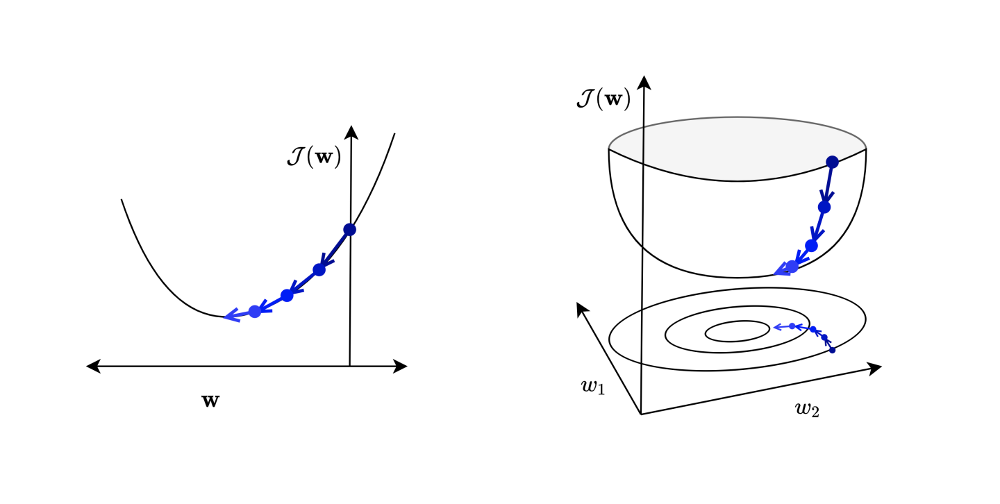{width="80%" fig-align="center"}

:::{.fragment}

> What is the direction of the steepest descent of $\mathcal{J}(\mathbf{w})$ at $\mathbf{w}$?

:::

## Gradient Descent

By definition, the direction of the greatest increase in $\mathcal{J}(\mathbf{w})$ at $\mathbf{w}^{(0)}$ is its [gradient]{style="color: maroon;"}:

$$
\frac{\partial \mathcal{J}(\mathbf{w})}{\partial \mathbf{w}}\bigg|_{\mathbf{w}=\mathbf{w}^{(0)}} \in \mathbb{R}^p
$$

:::{.fragment}
So, we update $\mathbf{w}$ in the **opposite** direction of the gradient at $\mathbf{w}^{(0)}$: 

$$
\boxed{
\mathbf w^{(1)}
=
\mathbf w^{(0)}
-
\alpha
\frac{\partial \mathcal{J}(\mathbf{w})}{\partial \mathbf{w}}\bigg|_{\mathbf{w}=\mathbf{w}^{(0)}}
}
$$
for some $\alpha > 0$.
::: 

:::{.fragment} 
If $\alpha$ is chosen small, then 
$$
\mathcal{J}(\mathbf{w}^{(1)}) < \mathcal{J}(\mathbf{w}^{(0)})
$$
unless $\frac{\partial \mathcal{J}(\mathbf{w})}{\partial \mathbf{w}}$ at $\mathbf{w}^{(0)}$ is zero.
:::

## Gradient Descent: Coordinatewise View

For iterations $k=0,1,2,\ldots$, and for each $j\in\{1,\ldots,p\}$,

$$
\boxed{
w_j^{(k+1)}
\leftarrow
w_j^{(k)}
-
\alpha
\left.
\frac{\partial \mathcal J}{\partial w_j}
\right|_{\mathbf w=\mathbf w^{(k)}}
}
$$

<br>

:::{.fragment}
The [**learning rate**]{style="color: maroon;"} (or step size), $\alpha$, controls the size of each update.

  - larger $\alpha$: parameters change more quickly;
  - smaller $\alpha$: parameters change more slowly.
::: 

:::{.fragment}
Typical values may be small, such as $0.01$ or $0.0001$, although the
appropriate scale depends on the problem.
:::

## Gradient Descent for OLS

For OLS,

$$
\mathcal J(\mathbf w)
=
\|\mathbf y-\mathbf X\mathbf w\|_2^2.
$$
:::{.fragment}
Update rule in vector form at the $(k+1)$th iteration:

$$
\begin{aligned}
\mathbf{w}^{(k+1)}
&\leftarrow
\mathbf{w}^{(k)}
-
\alpha
\left.
\frac{\partial \mathcal{J}}{\partial \mathbf{w}}
\right|_{\mathbf{w}=\mathbf{w}^{(k)}} \\
&=
\mathbf{w}^{(k)}
+
2\alpha \mathbf{X}^{\top}
\left(
\mathbf{y}
-
\mathbf{X}\mathbf{w}^{(k)}
\right).
\end{aligned}
$$

Initialization: $\mathbf{w}^{(0)}=0$
::: 

## Gradient Descent for Ridge

For ridge regression,

$$
\mathcal J(\mathbf w)
=
\|\mathbf y-\mathbf X\mathbf w\|_2^2
+
\lambda\|\mathbf w\|_2^2.
$$
<br> 

:::{.fragment}
Update rule in vector form at the $(k+1)$th iteration:
$$
\begin{aligned}
\mathbf{w}^{(k+1)}
&\leftarrow
\mathbf{w}^{(k)}
-
\alpha
\left.
\frac{\partial \mathcal{J}}{\partial \mathbf{w}}
\right|_{\mathbf{w}=\mathbf{w}^{(k)}} \\
&=
\mathbf{w}^{(k)}
+
2\alpha \mathbf{X}^{\top}
\left(
\mathbf{y}
-
\mathbf{X}\mathbf{w}^{(k)}
\right)
-
2\alpha\lambda\mathbf{w}^{(k)}.
\end{aligned}
$$

Initialization: $\mathbf{w}^{(0)}=0$ 
::: 

:::{.fragment}
The final term is the contribution from the ridge penalty and pulls the
coefficients toward zero.
:::

## What About the Lasso?

For the lasso,

$$
\mathcal J(\mathbf w)
=
\|\mathbf y-\mathbf X\mathbf w\|_2^2
+
\lambda\|\mathbf w\|_1.
$$

The difficulty is that

$$
\|\mathbf w\|_1
=
\sum_{j=1}^p |w_j|
$$

is **not differentiable at $w_j=0$**.

:::{.fragment}
So ordinary gradient descent cannot be applied in exactly the same way at those points.
:::

## Subgradients

For convex functions that are not differentiable everywhere, we can use a **subgradient** at $\mathbf{x}$, defined as: 

$$
\partial \mathcal{J}(\mathbf{x})
:=
\left\{
v :
\mathcal{J}(\mathbf{y})
\geq
\mathcal{J}(\mathbf{x})
+
(\mathbf{y}-\mathbf{x})^{\top}v,
\quad
\forall \mathbf{y}\in\Theta
\right\}.
$$

For $f(x)=|x|$,

$$
\partial f(x)
=
\begin{cases}
1, & x>0,\\
-1, & x<0,\\
(-1,1), & x=0.
\end{cases}
$$

For $f(\mathbf{x})=\|\mathbf x\|_1$,

$$
[\partial f(\mathbf{x})]_j
=
\begin{cases}
1, & x_j>0,\\
-1, & x_j<0,\\
(-1,1), & x_j=0.
\end{cases}
$$

:::{.fragment}
This gives us a generalized notion of "slope" even at the kink at zero.
:::

## Subgradient Descent for the Lasso

For the Lasso, 

$$
\mathcal J(\mathbf w)
=
\|\mathbf y-\mathbf X\mathbf w\|_2^2
+
\lambda\|\mathbf w\|_1.
$$

Update rule in vector form at the ($k+1$)th iteration: 

$$
\begin{aligned}
\mathbf{w}^{(k+1)}
&\leftarrow
\mathbf{w}^{(k)}
-
\alpha
\left.
\frac{\partial \mathcal{J}}{\partial \mathbf{w}}
\right|_{\mathbf{w}=\mathbf{w}^{(k)}} \\
&=
\mathbf{w}^{(k)}
+
2\alpha \mathbf{X}^{\top}
\left(
\mathbf{y}
-
\mathbf{X}\mathbf{w}^{(k)}
\right)
-
\left.
\alpha \lambda \,
\partial\left(\lVert \mathbf{w}\rVert_1\right)
\right|_{\mathbf{w}^{(k)}}.
\end{aligned}
$$
Initialization: $\mathbf{w}^{(0)}=0$ 

## Stopping Criteria

Because gradient descent is iterative, we need a **stopping criterion**.

We might stop when:

1. the objective value barely changes,

$$
\left|
\mathcal J(\mathbf w^{(k+1)})
-
\mathcal J(\mathbf w^{(k)})
\right|
\le \varepsilon;
$$
:::{.fragment}
2. the parameters barely change,

$$
\|\mathbf w^{(k+1)}-\mathbf w^{(k)}\|_2
\le \varepsilon;
$$
::: 

:::{.fragment}
3. or we reach a maximum number of iterations, such as $M=1000$.
::: 

## When Do We Expect Gradient Descent to Work?

Recall that we are trying to solve

$$
\widehat{\mathbf w}
=
\arg\min_{\mathbf w\in\Theta}
\mathcal J(\mathbf w).
$$

:::{.fragment} 
- Obviously, $\mathcal J$ should be differentiable.  
- If $\mathcal J$ is also **convex**, and $\Theta$ is a convex set, then gradient descent with a suitable choice of step size guarantees to find the optimal solution.
- In many cases, $\Theta=\mathbb R^p$, which is convex.
:::


## Convex Sets

A set $S$ is **convex** if for any $\mathbf x_0,\mathbf x_1\in S$,

$$
(1-\lambda)\mathbf x_0+\lambda\mathbf x_1\in S
\qquad
\text{for every } 0\le\lambda\le 1.
$$

:::{.fragment}
In words:

> If you draw a straight line between any two points in the set, the
> entire line segment stays inside the set.
:::

:::{.fragment}
The Euclidean space $\mathbb R^p$ is convex.
:::


## Convex Functions

A function $f$ is **convex** if for any $x_0,x_1$ in its domain,

$$
f\left((1-\lambda)x_0+\lambda x_1\right)
\le
(1-\lambda)f(x_0)+\lambda f(x_1)
$$

for every $\lambda\in[0,1]$.

<br> 

:::{.fragment}
Intuitively, a convex function is **bowl-shaped**.
:::

<br> 

:::{.fragment }
**Why do we care?**

For a convex objective, every local minimum is also a global minimum.
:::


## How Can We Tell if a Loss is Convex?

1. We can verify the definition directly.

<br>

:::{.fragment}
2. If $f$ is twice differentiable and

$$
f''(x)\ge 0
$$

for all $x$, then $f$ is convex.
::: 

:::{.fragment}
For example, the least squares loss function  $(y-t)^2$ is convex as a function of $t$
:::

:::{.fragment}
Likewise, the loss function in logistic regression

$$
-yt+\log(1+e^t)
$$

is convex in $t$.
:::

## How Can We Tell if a Loss is Convex?

3. **Linear transformations preserve convexity** in many of the forms we use in statistical learning. 

<br> 

:::{.fragment}
If $f$ is a convex function and $g$ is a linear function, then both $f \circ g$ and $g \circ f$ are convex.

For example, the least squares loss $(y-\mathbf x^\top\mathbf w)^2$ is convex as a function of $\mathbf w$.
::: 

:::{.fragment}
Likewise, the negative log-likelihood under logistic regression,

$$
-y\mathbf x^\top\mathbf w
+
\log\left(1+e^{\mathbf x^\top\mathbf w}\right),
$$

is convex in $\mathbf w$.
::: 

:::{.fragment}
Therefore sums of these losses over observations are also convex.
:::

## Why Gradient Descent for Linear Regression?

The linear regression objective

$$
\sum_{i=1}^n
(y_i-\mathbf x_i^\top\mathbf w)^2
$$

is convex.

So why use gradient descent when a closed-form solution exists?

:::{.fragment}
When $p$ is large, directly computing

$$
(\mathbf X^\top\mathbf X)^{-1}\mathbf X^\top\mathbf y
$$

may be expensive.
:::

:::{.fragment}
A gradient descent update can be computationally attractive because it
avoids explicitly inverting a large matrix.
:::

## The Learning Rate Matters

The learning rate $\alpha$ is a **hyperparameter** that we need to tune. Its value can dramatically affect optimization.

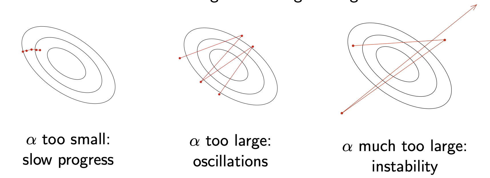{width="80%" fig-align="center"}

:::{.fragment}
We often try several candidate learning rates and examine their optimization behaviour.
:::

## Training Curves

A useful diagnostic is to look at the [**training cost**]{style="color: maroon;"}: plot the training cost as a function of iteration.

:::::::: columns
::::: {.column width="60%"}
:::{.fragment}
Training curves can help identify:

- very slow convergence;
- unstable updates;
- a learning rate that may be too small or too large.
:::

:::{.fragment}
**Important**: the training cost could be used to check whether the optimization problem reaches certain convergence. But: 

  - It does not tell whether we reach the global minimum or not 
  - It does not tell us anything on the performance of the fitted model
:::

:::::

:::: {.column width="40%"}
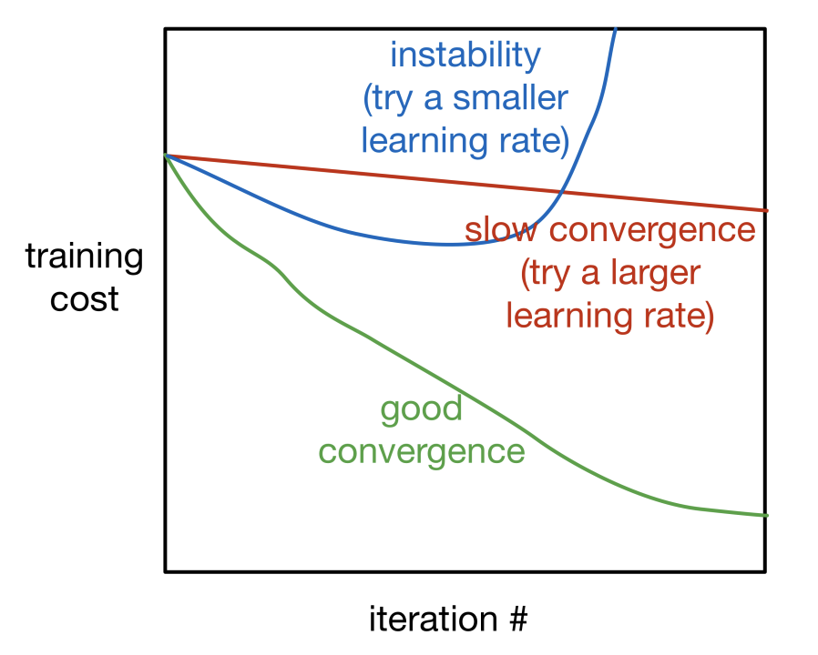{width="100%" fig-align="center"}

::::
::::::::

## Batch Gradient Descent

Recall for OLS that:

$$
\widehat{\mathbf w}^{(k+1)}
=
\widehat{\mathbf w}^{(k)}
+
\alpha
\sum_{i=1}^n
\left[
y_i-\mathbf x_i^\top\widehat{\mathbf w}^{(k)}
\right]\mathbf x_i.
$$
<br> 

:::{.fragment}
Computing the gradient requires summing over **all** of the training examples, which can be done via matrix / vector operations.

<br> 

The fact that it uses all training samples is known as [**batch training**]{style="color: maroon;"}.
::: 

## Stochastic Gradient Descent

Batch gradient descent can be expensive when $n$ is extremely large.

[**Stochastic gradient descent (SGD)**]{style="color: maroon;"} uses only one randomly selected training example for each update.

<br> 

:::{.fragment}
At iteration $k$:

1. choose $i\in\{1,\ldots,n\}$ at random;
2. update using only observation $i$.
::: 

:::{.fragment}
For OLS,

$$
\boxed{
\widehat{\mathbf w}^{(k+1)}
=
\widehat{\mathbf w}^{(k)}
+
\alpha
\left[
y_i-\mathbf x_i^\top\widehat{\mathbf w}^{(k)}
\right]\mathbf x_i
}
$$
::: 

## Why Use SGD?

**Pros**

- Computational cost of each SGD update is independent of $n$!
- SGD can make significant progress before even seeing all the data!
- Mathematical justification: the gradients between SGD and GD have the same expectation for i.i.d. data.

:::{.fragment}
**Cons** 

- We are using only a single training example to estimate the gradient, so the variance in the estimate may be high.
::: 

:::{.fragment}
**Compromise Approach** 

- compute the gradients on a randomly chosen medium-sized set of training examples $\mathcal{M} \subset \{1, ..., n\}$, called a [**mini-batch**]{style="color: maroon;"}
- Stochastic gradients computed on larger mini-batches have smaller variance. 
- The mini-batch size $|\mathcal{M}|$ is a hyperparameter that needs to be set
::: 

## Stochastic Gradient Descent

- Batch gradient descent moves directly downhill 
- SGD takes steps in a noisy direction, but moves downhill on average 

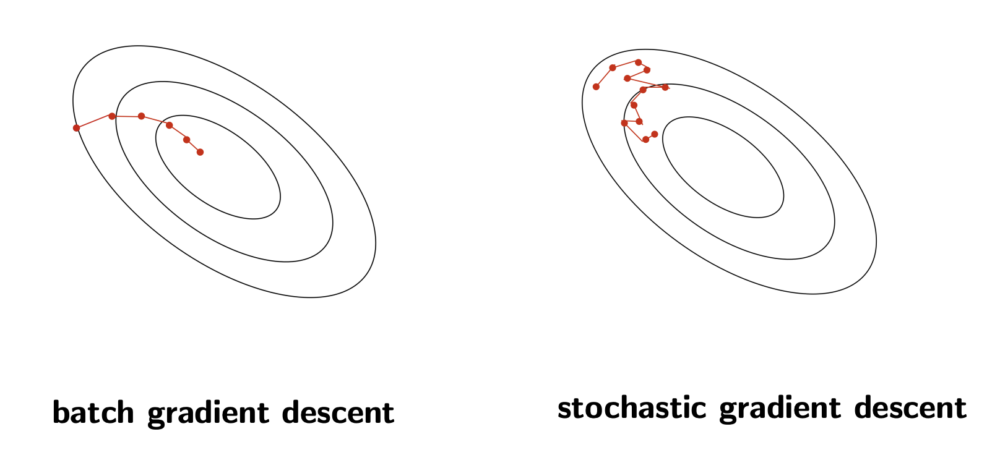{width="70%" fig-align="center"}

## Learning Rates in SGD

With stochastic optimization, the learning rate also controls the size of
the **fluctuations** caused by noisy gradient estimates.

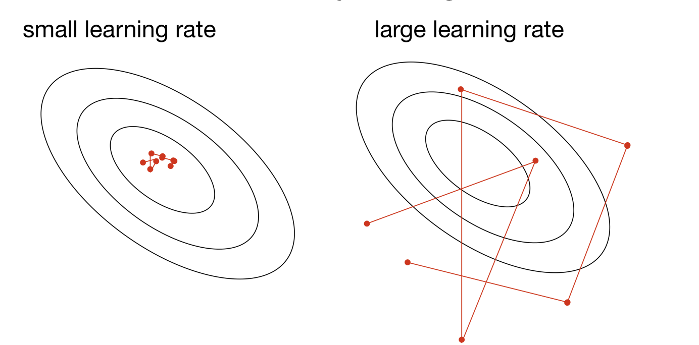{width="70%" fig-align="center"}

:::{.fragment}
Typical strategy

- Use a large learning rate early in training so you can get close to the optimum
-  Gradually decay the learning rate to reduce the fluctuations
::: 

## Summary

Gradient descent gives us a general way to solve optimization problems of
the form

$$
\widehat{\mathbf w}
=
\arg\min_{\mathbf w}
\mathcal J(\mathbf w).
$$

The basic recipe is:

$$
\boxed{
\text{initialize}
\;\longrightarrow\;
\text{compute gradient}
\;\longrightarrow\;
\text{step downhill}
\;\longrightarrow\;
\text{repeat}
}
$$

Key ideas:

- the **gradient** tells us the direction of steepest increase;
- the **negative gradient** points downhill;
- the **learning rate** determines the step size;
- convexity helps guarantee that we are moving toward a global optimum;
- batch, stochastic, and mini-batch gradient descent trade off computation
  and noise.

# Moving Beyond Linearity

## Linear Models 

So far, we've mainly focused on linear models. 

<br> 

They are simply to describe and implement, and have advantages over other approaches in terms of interpretation and inference. 

<br> 

:::{.fragment}
However, because the linearity assumption is almost always an approximation, linear regression can have significant limitations in terms of predictive power.
::: 

<br> 

:::{.fragment}
We can improve upon least squares using ridge regression and the lasso by reducing the complexity of the model (i.e. the variance of the estimates), but we are still using a linear model which can only be improved so much! 
::: 

## Linearity in Features vs. Parameters

Suppose $X=(X_1,X_2)$. A standard linear model is

$$
Y=\beta_0+\beta_1X_1+\beta_2X_2+\varepsilon.
$$

What about

$$
Y=\beta_0+\beta_1X_1+\beta_2X_2+\beta_3X_1^2+\beta_4X_2^2+\beta_5X_1X_2+\varepsilon?
$$

::: {.fragment}
This model is **nonlinear in the features**, but still **linear in the parameters** $\boldsymbol\beta=(\beta_0,\ldots,\beta_5)^\top$.
:::

## Why Does That Distinction Matter?

Because the model remains linear in $\boldsymbol\beta$, we can still use familiar tools:

**Estimation**

-   Ordinary least squares
-   Maximum likelihood for a GLM

**Model building**

-   Subset selection
-   Ridge regression
-   The lasso

::: {.fragment}
The **linear model framework** is more flexible than a straight-line relationship.
:::

## Moving Beyond Linearity

We consider the following extensions to relax the linearity assumption in the feature space:

**For one predictor $(p=1)$:**

-   polynomial regression;
-   step functions; and
-   regression splines.

**For several predictors $(p>1)$:**

-   nearest-neighbor and local regression; and
-   generalized additive models.

## Polynomial Regression

[**Polynomial regression**]{style="color: maroon;"} extends the linear model 

$$y_i = \beta_0 + \beta_1x_i + \epsilon_i$$
to settings where the relationship between the predictors and the response is non linear by adding extra predictors, obtained by raising each of the original predictors to a power:

$$
y_i=\beta_0+\beta_1x_i+\beta_2x_i^2+\cdots+\beta_dx_i^d+\varepsilon_i.
$$

:::{.fragment}
-   It is nonlinear in $x$, but linear in the coefficients.
-   It can be fit using OLS, ridge, or the lasso.  
::: 

:::{.fragment}
-   The coefficients themselves are [not interpretable]{style="color: maroon;"}; we are more interested in the trend of the fitted function
$$
\widehat f(x)=\widehat\beta_0+\widehat\beta_1x+\cdots+\widehat\beta_dx^d.
$$
:::

## Polynomial Regression

-   In practice, the degree $d$ is usually small, often no greater than 3 or 4.
-   We can choose $d$ using cross-validation.

<br> 

:::{.fragment}
-   Polynomial terms can also be used for classification
    - For instance, in the logistic regression below (we will come back to this later), this can be fit by maximizing the likelihood
$$
\operatorname{logit}\{P(Y_i=1\mid X_i=x_i)\}
=\beta_0+\beta_1x_i+\cdots+\beta_dx_i^d.
$$

::: 

<br> 

:::{.fragment}
**Note**: High-degree polynomials can behave erratically near the boundaries and are [particularly unreliable for extrapolation]{style="color: maroon;"}.
::: 


## Polynomial Regression: Wage Data

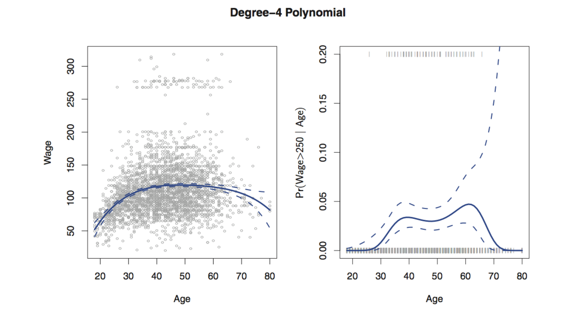{width="80%" fig-align="center"}

-   **Left:** The solid blue curve is a degree-4 polynomial of wage as a function of age, fit by the OLS. The dotted curves are estimated 95/% confidence intervals
-   **Right:** Model the binary event $1\{\text{wage}>250\}$ by logistic regression, with a degree-4 polynomial.

## Step Functions

Polynomial regression imposes a **global** shape. A [**step function**]{style="color: maroon;"} instead divides the range of $X$ into regions.

<br> 

:::{.fragment}
For pre-specified $K$ cut points $c_1<\cdots<c_K$, define

$$
\begin{aligned}
C_0(X)&=I(X<c_1),\\
C_1(X)&=I(c_1\le X<c_2),\\
&\ \vdots\\
C_K(X)&=I(c_K\le X).
\end{aligned}
$$

These $K+1$ dummy variables sum to 1.
::: 

## Step-Functions

Using the first interval as the reference category,

$$
y_i=\beta_0+\beta_1C_1(x_i)+\cdots+\beta_KC_K(x_i)+\varepsilon_i.
$$

<br> 

:::{.fragment}
-   The model can be fit by OLS or a shrinkage method.
-   For a given value $X$, at most one of $C_1, C_2, ..., C_K$ can be non-zero.
-   $\beta_0$ is the mean response in the reference interval $X<c_1$.
-   $\beta_j$ is the mean difference in the response $Y$ for $c_j \leq X \leq c_{j+1}$ relative to $X < c_1$.
::: 


## Step Functions: Wage Data

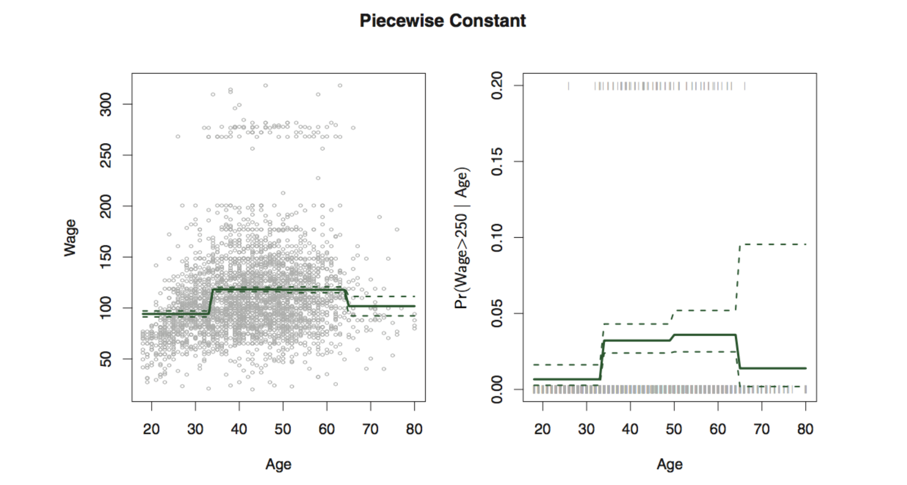{width="80%" fig-align="center"}

-   **Left:** The solid blue curve is a step function of wage as a function of age, fit by least squares. The dotted curves indicate an estimated 95/% confidence interval.
-   **Right:** Model the binary event $1\{\text{wage}>250\}$ by logistic regression, with a step function.

## Step Functions: Strengths and Limitations

::::: columns
::: {.column width="48%"}
**Strengths**

-   Easy to fit
-   Easy to explain
-   Coefficients compare interpretable groups
-   Common in biostatistics and epidemiology
:::

::: {.column width="48%"}
**Limitations**

-   The fitted relationship is discontinuous
-   Important trends can be hidden
-   Results can depend strongly on the cut points
:::
:::::

## Basis Functions

The models we have just discussed are all special cases of a [**basis function**]{style="color: maroon;"} approach. 

The idea is to have a family of functions/transformations that can be applied to a variable, $X$, and instead of fitting a linear model in $X$, we fit

$$
y_i=\beta_0+\sum_{k=1}^{M}\beta_k b_k(x_i)+\varepsilon_i,
$$

where the $b_k(\cdot)$ are the *known* functions/transformations (we specify them ahead of time).

:::{.fragment}
| Model         | Example basis functions              |
|---------------|--------------------------------------|
| Polynomial    | $b_k(x)=x^k$                         |
| Step function | $b_k(x)=C_k(x)$                      |
| Linear spline | $b_1(x)=x$, $b_{k+1}(x)=(x-\xi_k)_+$ |
::: 

::: {.fragment}
Once the basis is constructed, fitting the model is just linear regression.
::: 

:::{.fragment} 
A very common choice for a basis function is a [**regression spline**]{style="color: maroon;"}, which we discuss next.
:::

## Piecewise Polynomials

Instead of fitting one polynomial over the full range of $X$, fit different polynomials in different regions.

$$
y_i =
\begin{cases}
\beta_{01} + \beta_{11}x_i + \beta_{21}x_i^2 + \beta_{31}x_i^3 + \epsilon_i,
& \text{if } x_i < c, \\[6pt]
\beta_{02} + \beta_{12}x_i + \beta_{22}x_i^2 + \beta_{32}x_i^3 + \epsilon_i,
& \text{if } x_i \geq c.
\end{cases}
$$

<br> 

:::{.fragment}
-   The cut point $c$, i.e. where the coefficients change, is called a [**knot**]{style="color: maroon;"}.
-   With $K$ knots, there are $K+1$ regions.
-   More knots allow greater local flexibility.
::: 

## Piecewise Polynomials: Wage Data

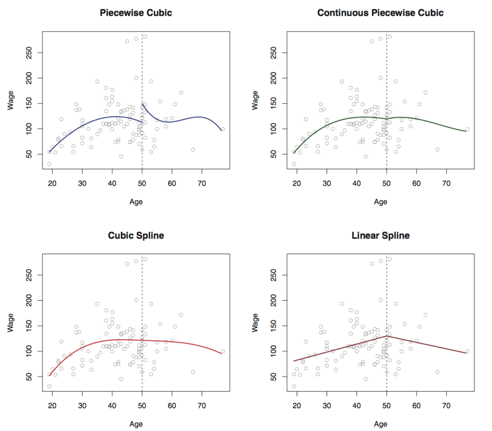{width="100%" fig-align="center"}

Without *constraints* at the knots, adjacent polynomial pieces may fail to meet, or may meet with sharp corners.

## Constraints and Splines

At each knot, we can impose constraints:

1.  **Continuity:** the adjacent pieces have the same function value.
2.  **Smoothness:** their first derivatives agree.
3.  **More smoothness:** higher-order derivatives also agree.

<br> 

::: {.fragment}
The constrained polynomials are called [**splines**]{style="color: maroon;"}. 

<br> 

A degree-$d$ spline is a piecewise degree-$d$ polynomial, with continuity in derivatives up to degree $d-1$ at each knot.
:::

<br> 

:::{.fragment}
How can we construct the degree-$d$ spline?
:::

## Linear Splines

A [linear spline]{style="color: maroon;"} has piecewise linear functions continuous at each knot. That is, with knots at $\xi_1<\cdots<\xi_K$, 

$$
y_i=\beta_0+\beta_1x_i+\sum_{k=1}^{K}\beta_{k+1}(x_i-\xi_k)_+ +\varepsilon_i,
$$

where

$$
(x_i-\xi_k)_+=
\begin{cases}
x_i-\xi_k, & x_i>\xi_k,\\
0, & x_i\le \xi_k.
\end{cases}
$$
is called the [**truncated power basis function**]{style="color: maroon;"}, and $\xi_k$ is the knot.

<br> 

::: {.fragment}
**Interpretation of $\beta_1$**: the averaged increase of $Y$ associated with one unit of $X$ for $X < \xi_1$.
:::

## Linear Splines

For example, with three knots, we start off with a basis for a linear polynomial, then add one truncated power basis function per knot:

$$
y
=
\beta_0+\beta_1x
+\beta_2(x-\xi_1)_+
+\beta_3(x-\xi_2)_+
+\beta_4(x-\xi_3)_+.
$$

:::{.fragment}
Therefore, the slope in each region is

$$
\begin{aligned}
x \leq \xi_1 
&: \quad \beta_1, \\[4pt]
\xi_1 < x \leq \xi_2 
&: \quad \beta_1+\beta_2, \\[4pt]
\xi_2 < x \leq \xi_3 
&: \quad \beta_1+\beta_2+\beta_3, \\[4pt]
x > \xi_3 
&: \quad \beta_1+\beta_2+\beta_3+\beta_4.
\end{aligned}
$$

::: 

:::{.fragment}
Because each new term $(x-\xi_k)_+$ is zero at the knot $\xi_k$, the pieces meet at each knot. Thus, the fitted function is **continuous**, making it a **spline**.
::: 

## How a Linear Spline Is Built

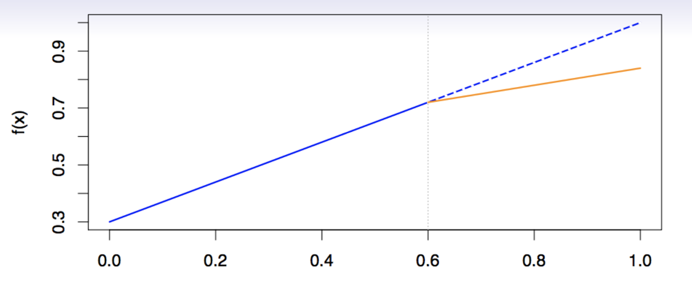{width="70%" fig-align="center"}

The truncated linear term is zero before the knot and grows linearly afterward. Adding it to the original line changes the slope without creating a jump.

## Cubic Splines

A [cubic spline]{style="color: maroon;"} uses piecewise cubic polynomials with continuous first and second derivatives at each knot. Again, we start off with a basis for a cubic polynomial, then add one truncated power basis function per knot.

:::{.fragment}
That is, with $K$ knots at $\xi_1 < \xi_2 < ... <\xi_k$, 

$$y_i = \beta_0 + \beta_1b_1(x_i) + \beta_2b_2(x_i) + ... + \beta_{K+3}b_{K+3}(x_i) + \epsilon_i$$
where $b_k(.)$ are basis functions 

$$
b_1(x)=x,\quad b_2(x)=x^2,\quad b_3(x)=x^3,
$$

$$
b_{k+3}(x)=(x-\xi_k)_+^3,\qquad k=1,\ldots,K.
$$
::: 

## Cubic Splines 

But wait.. we know a spline must have continuity in derivatives up to degree $d-1$ at each knot. 

How can we check this condition? 

```{=html}
<textarea class="annotation-box"
          placeholder="Type notes here..."></textarea>
```

## How a Cubic Spline Is Built

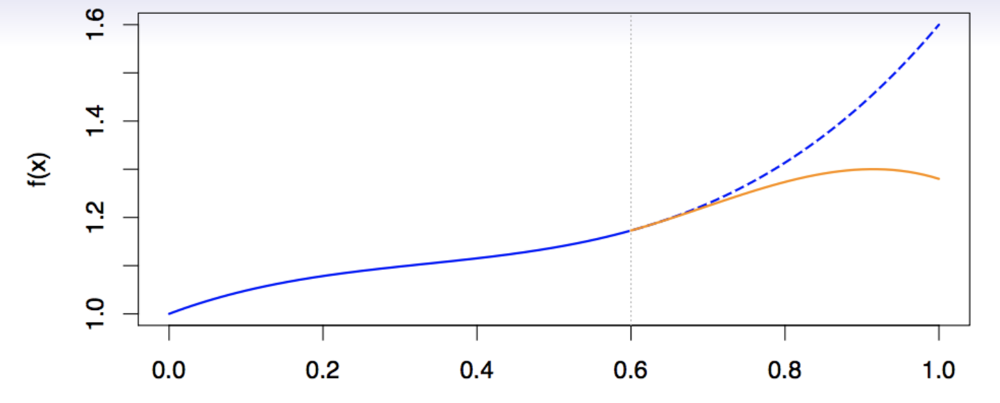{width="80%" fig-align="center"}

The truncated cubic term changes the curve only after the knot. The pieces join smoothly in value, slope, and curvature.

## Natural Splines

A [natural spline]{style="color: maroon;"} is a regression spline with additional boundary constraints: the function is required to be linear at the boundary.

This reduces instability near the boundaries, where there are fewer observations and ordinary cubic splines can have high variance.

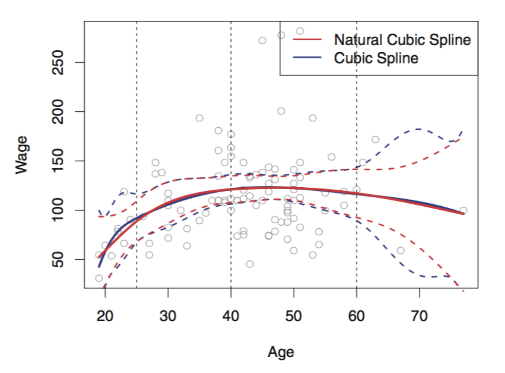{width="80%" fig-align="center"}

## More on Splines

**Choosing the number and locations of the knots**

-   Place knots at selected quantiles of the data or place on the range of $X$ with equal space. Oftentimes, the placement of knots is not very crucial.
-   We use cross validation to choose $K$

<br> 

Polynomial regressions and step functions are special cases of splines

<br> 

Another variant: Smoothing spline (ISLR 7.5)

## What Changes When $p>1$?

- Splines can be used for $p < 4$ (number of basis functions grows exponentially in $p$)

<br> 

:::{.fragment}
- Local approach for $p < 4$ 
  - nearest neighbour approach
  - local regression 
  
::: 

<br> 

:::{.fragment}
- Generalized Additive Models (GAM) for large $p$
::: 


## $k$-Nearest-Neighbor

::: algorithm-box
**To predict at** $X=x_0$:

1.  Choose $k\in\{1,\ldots,n\}$.
2.  Find the $k$ training points closest to $x_0$; call their index set $N_k(x_0)$.
3.  Average their responses:

$$
\widehat f(x_0)=\frac{1}{k}\sum_{i\in N_k(x_0)}y_i.
$$
:::

## $k$-Nearest-Neighbor: The Role of $k$

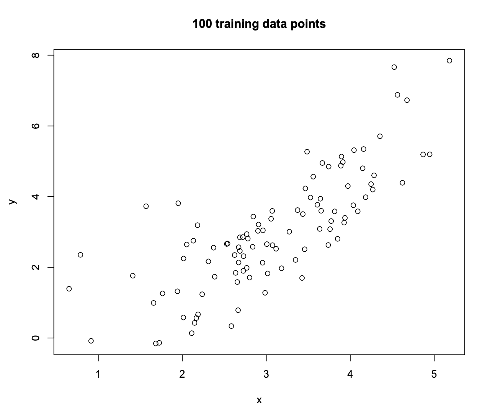{width="80%" fig-align="center"}

## $k=1$ Nearest Neighbour

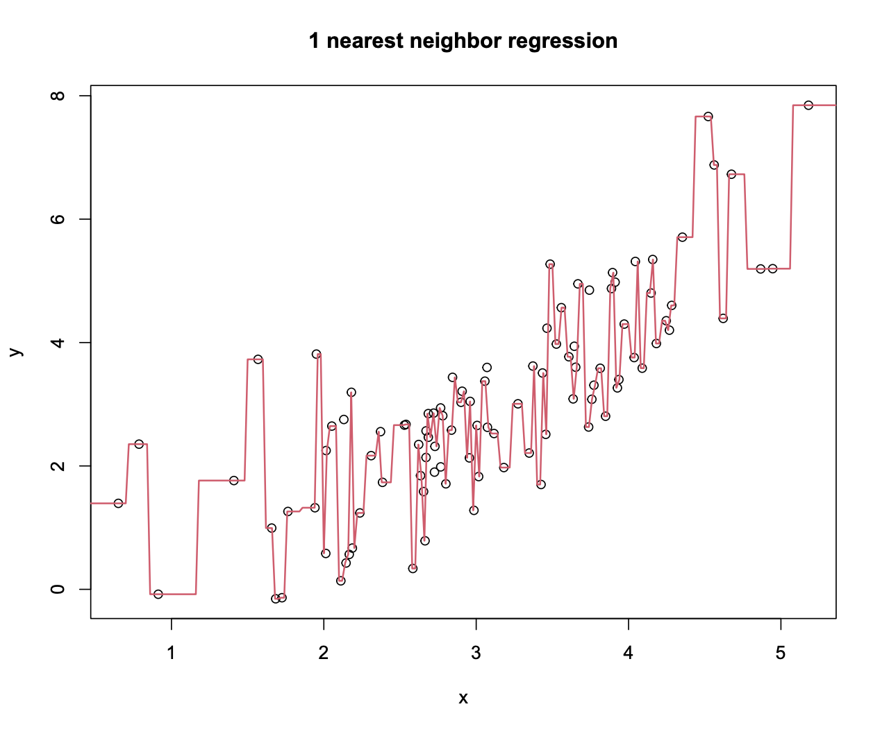{width="80%" fig-align="center"}

## $k=3$ Nearest Neighbour

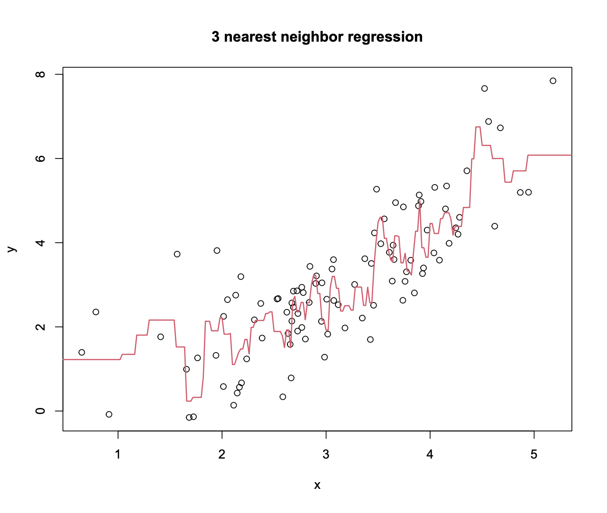{width="80%" fig-align="center"}

## $k=10$ Nearest Neighbour

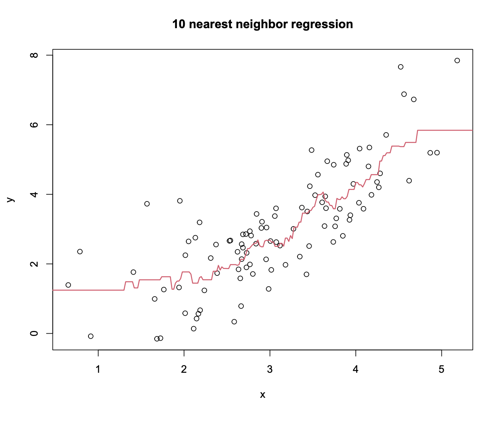{width="80%" fig-align="center"}

## Role of $k$

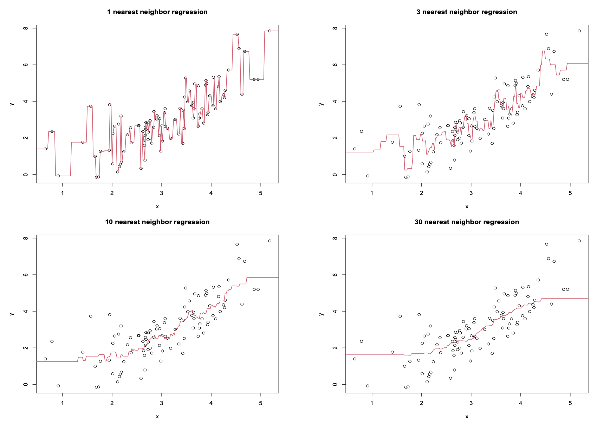{width="80%" fig-align="center"}

## Role of $k$

<br> 
<br> 

| Smaller $k$     | Larger $k$     |
|-----------------|----------------|
| More flexible   | Smoother       |
| Lower bias      | Higher bias    |
| Higher variance | Lower variance |

<br> 

::: {.fragment}
Choose $k$ using [cross-validation]{style="color: maroon;"}. 

The best $k$ is the one that gives the lowest estimated test error (not necessarily the smoothest-looking curve).
:::

## Weighted $k$-Nearest Neighbors

Ordinary $k$-NN assigns equal weight $1/k$ to every neighbor. 

<br> 

More generally, we can choose a weight such that

$$
\widehat f(x_0)=\sum_{i\in N_k(x_0)}K(x_i,x_0)y_i,
$$

with

$$
K(x_i,x_0)\ge 0,\qquad \sum_{i\in N_k(x_0)}K(x_i,x_0)=1.
$$

<br> 

::: {.fragment}
Nearby observations can be given more influence than observations near the edge of the neighborhood.
:::

## Choice of the Weight

One popular choice is the so-called [inverse distance weighting]{style="color: maroon;"} (IDW). 

Of course there are other more sophisticated weighting schemes.

<br> 

:::{.fragment}
For $x_i\in N_k(x_0)$, define

$$
d_i=\lVert x_i-x_0\rVert_2,
\qquad
\operatorname{ID}_i=\frac{1}{d_i}.
$$

Normalize the inverse distances:

$$
K(x_i,x_0)=\frac{\operatorname{ID}_i}
{\sum_{j\in N_k(x_0)}\operatorname{ID}_j}.
$$
::: 

::: {.fragment}
In implementation, handle $d_i=0$ separately: if the target matches a training point exactly, that response can receive all the weight.
:::

## Weighted $k$NN vs $k$NN ($k=3$)

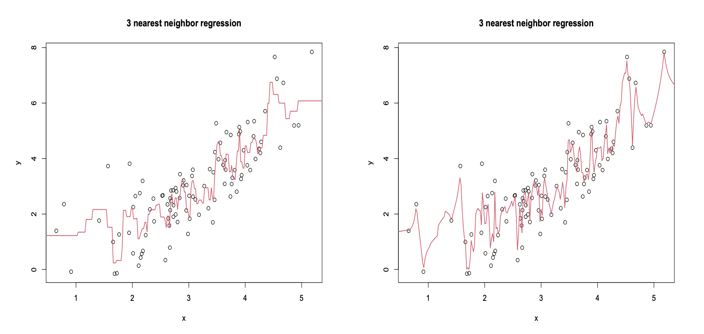{width="80%" fig-align="center"}


## Generalization of $k$NN: Local Regression

Recall that $k$NN predicts by using the local average of the [responses]{style="color: maroon;"}

$$
\widehat f(x_0)=\frac{1}{k}\sum_{i\in N_k(x_0)}y_i.
$$

:::{.fragment}
Local linear regression instead fits a line near $x_0$:

$$
\widehat f(x_0)=\widehat\beta_0+\widehat\beta_1x_0,
$$

where

$$
(\widehat\beta_0,\widehat\beta_1)
=\arg\min_{\beta_0,\beta_1}
\sum_{i\in N_k(x_0)}(y_i-\beta_0-\beta_1x_i)^2.
$$
::: 

## $k$-NN vs. Local Linear Regression ($k = 10$)

{width="80%" fig-align="center"}


## Local Regression Algorithm

::: algorithm-box
1.  Gather the fraction of $s=k/n$ of training points whose $x_i$ are closest to $x_0$
3.  Assign a weight $K_{i0}=K(x_i, x_0)$ to each point in this neighbourhood, so that the point furthest away from $x_0$ has weight zero, and the closest has the highest weight. All but these $k$ nearest neighbours get weight zero.
4.  Fit a *weighted least-squares regression* of the $y_i$ on the $x_i$ using the aforementioned weights, by finding $\widehat{\beta}_0$ and $\widehat{\beta}_1$ that minimize 
$$\sum_{i=1}^n K_{i0}(y_i-\beta_0-\beta_1x_i)^2$$
5.  The fitted value at $x_0$ is given by $\widehat{f}(x_0)=\widehat{\beta}_0 + \widehat{\beta}_1x_0$
:::

## Simulated Example 

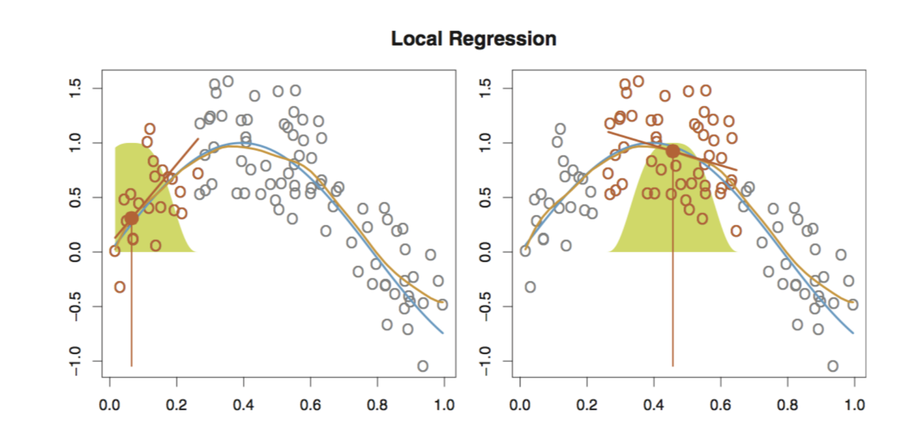{width="80%" fig-align="center"}

The blue curve is true $f(x)$, and the light orange curve is the local regression $\widehat{f}(x)$. The orange points are local to the target point $x_0$, represented by the orange vertical line. The yellow bell-shape indicates weights assigned to each point. The fit $\widehat{f}(x_0)$ at $x_0$ is obtained by fitting a weighted linear regression (orange line segment), and using the fitted value at $x_0$ (orange solid dot) as the estimate $\widehat{f}(x_0)$.

## Local Regression

- The size of the neighbourhood (fraction $s$ of training data) is a tuning parameter, which can be chosen by cross validation  

<br>

- The weight of each point in the neighbourhood needs to be specified 

<br> 

- When we have two dimensional predictors $X_1$ and $X_2$, we can simply use 2-dimensional neighborhoods, and fit bivariate linear regression models using the observations that are near each target point in 2-dimensional space.

<br> 

- However, local regression can perform poorly if $p \geq 4$ (the curse of dimensionality) 

## Generalized Additive Models

A [generalized additive model]{style="color: maroon;"} (GAM) allows a separate nonlinear function for each predictor while preserving additivity:

$$
y_i=\beta_0+f_1(x_{i1})+\cdots+f_p(x_{ip})+\varepsilon_i.
$$

:::{.fragment}
Each $f_j$ could be:

-   linear;
-   polynomial;
-   a step function;
-   a spline; or
-   a local regression.
::: 

:::{.fragment}
Can be applied to classification problems.
::: 

## GAM: Wage Data

Consider the wage data

$$
\text{wage}=\beta_0+f_1(\text{year})+f_2(\text{age})+f_3(\text{education})+\varepsilon.
$$

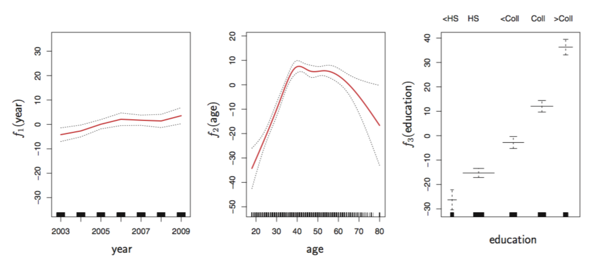{width="80%" fig-align="center"}

$f_1$ and $f_2$ are natural splines; $f_3$ is a step function for the qualitative predictor education.

## GAMs: Strengths and Limitations

- GAMs allow us to fit a non-linear function $f_j$ to each $X_j$: model complicated relationship between the response and the original feature space

<br> 

- The non-linear fit can potentially improve prediction accuracy 

<br> 

- Because the model is additive, we can still examine the effect of each $X_j$ on $Y$ individually while holding all of the other variables fixed. 

<br>

- It avoids the curse of dimensionality by assuming additivity 

<br> 

- However, GAMs fail to incorporate the interaction of variables.


## Summary

- **Gradient descent** provides a general iterative approach for minimizing an objective function
  - The **learning rate** controls the size of each update, while convexity helps ensure that optimization leads to a global minimum.

- Linear models can represent **nonlinear relationships in the predictors** by transforming the original features.
  - **Polynomial regression, step functions, and splines** are different ways of constructing flexible nonlinear relationships.
  - **kNN and local regression** take a local approach:

- **GAMs** combine separate nonlinear functions of multiple predictors while retaining an additive and interpretable structure.

- The amount of flexibility in these methods is typically controlled by a **tuning parameter**, which can be selected using cross-validation.

**Next Week:** Classification!

**Announcements:** Assignment 1 due Oct. 7
