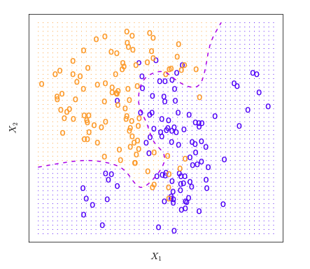
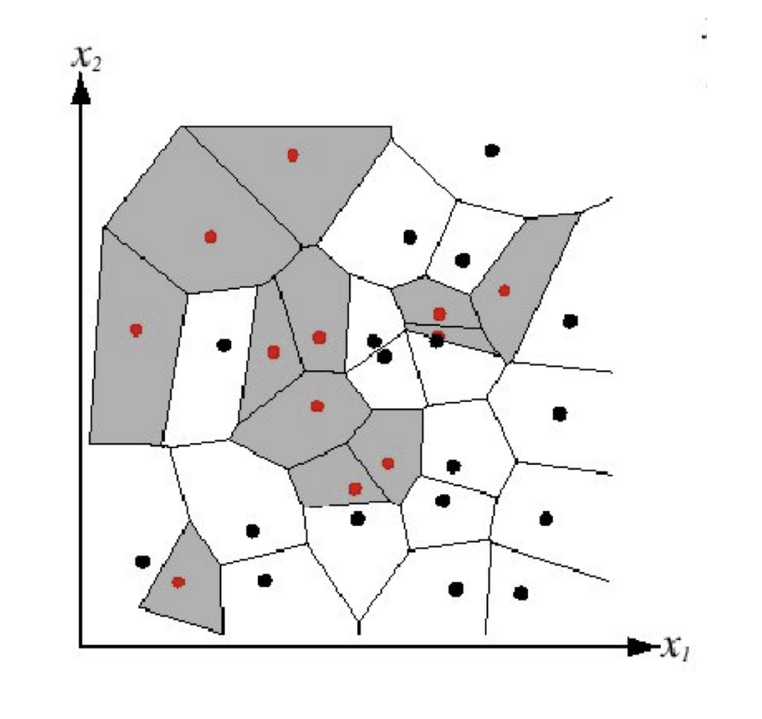
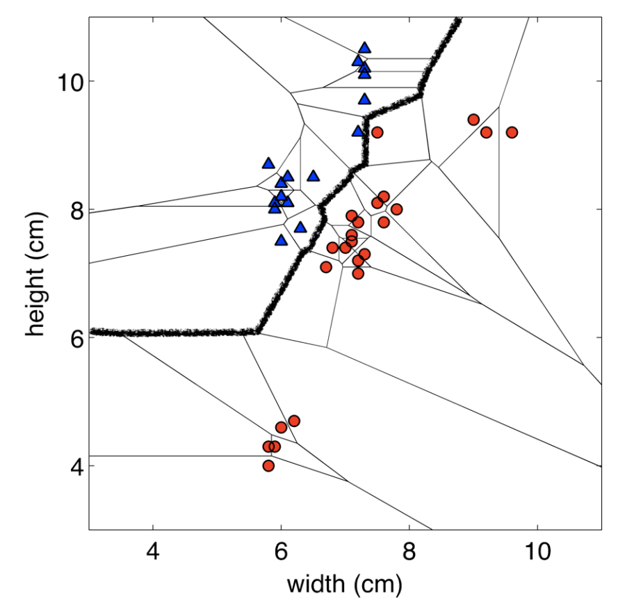
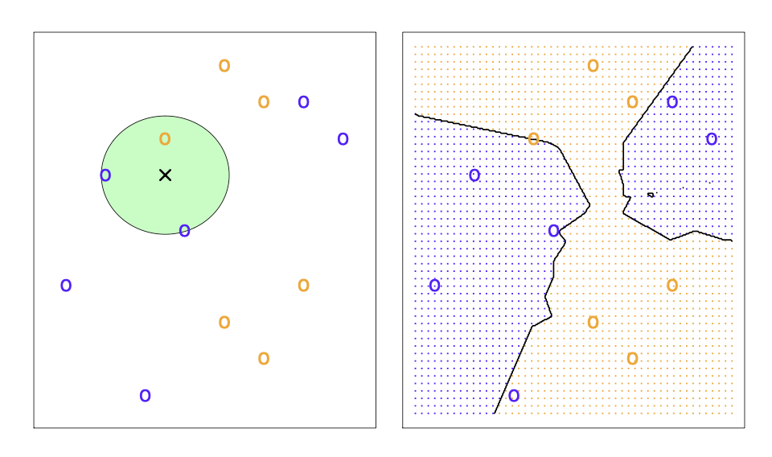
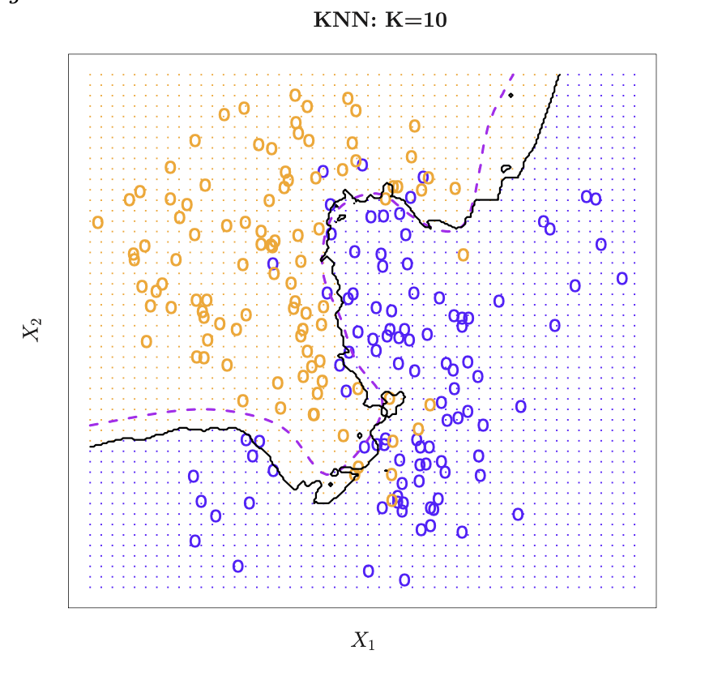
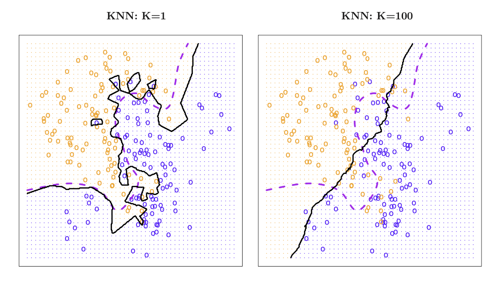
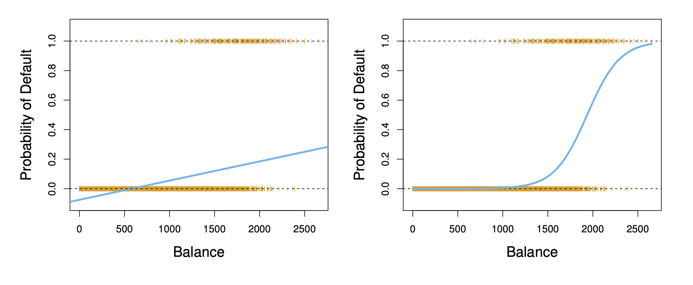
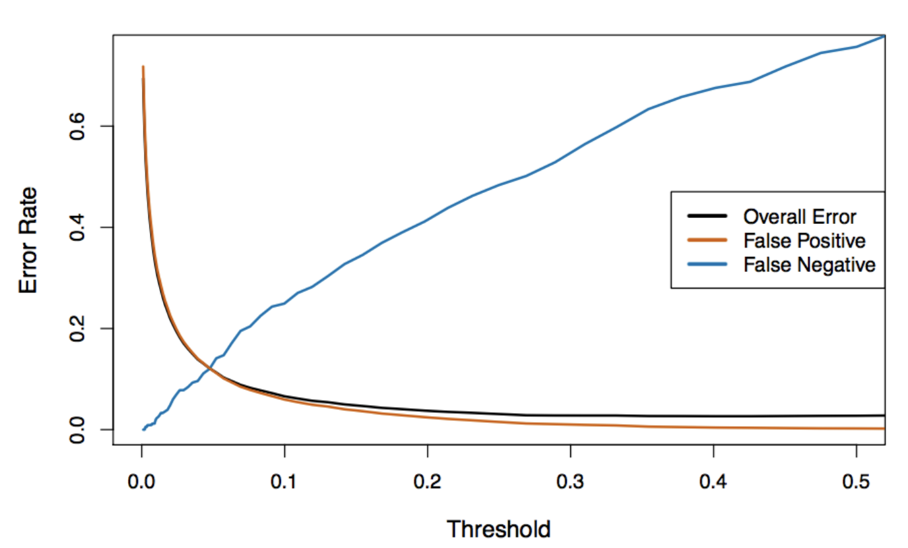
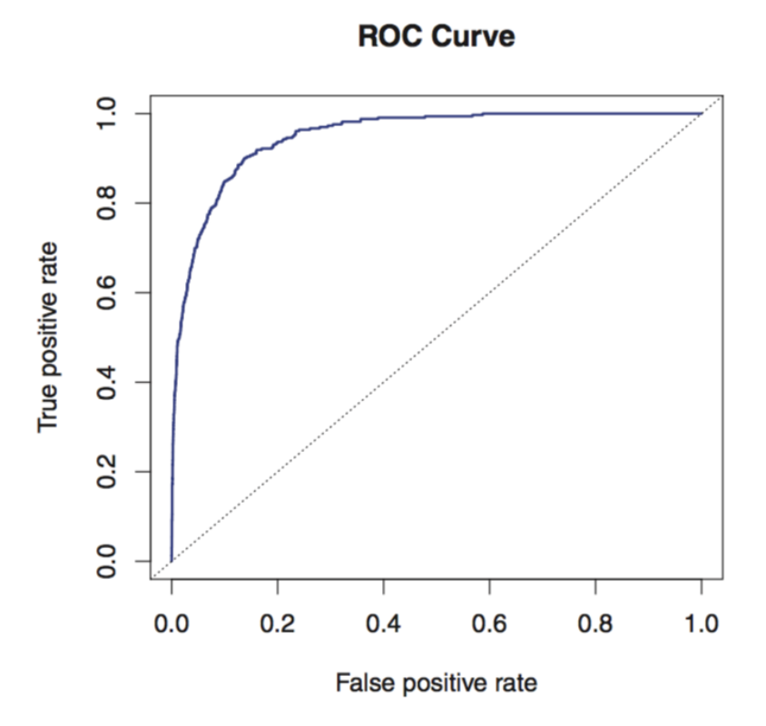

## Review: Case Study 

A hospital wants to build a model to predict a patient's **recovery time after surgery**, measured in days. They have data from **2,000 previous patients** and 22 predictors, including:

- age; BMI; length of surgery; blood loss during surgery; several pre-operative blood test measurements; physical activity level; sleep duration; 15 additional clinical measurements

:::{.fragment}
Exploratory analysis suggests that:

- recovery time tends to increase with **age**, but the relationship does not appear linear;
- the effect of **BMI** may also be nonlinear;
- several of the blood-test measurements are **strongly correlated**;
- some of the clinical measurements may have little or no relationship with recovery time.
::: 

::: {.fragment}
Come up with a **modelling plan** 

1. What model or models would you consider and why?
2. How would you compare models, and how would you estimate how well your final model will perform on new patients?
:::

## Learning Outcomes

By the end of this lecture, you should be able to:

1. Explain the Bayes classifier and why the Bayes error rate represents the smallest achievable expected classification error.

2. Describe how kNN performs classification, explain how $k$ affects model flexibility, and use cross-validation to select $k$.

3. Interpret logistic regressioncoefficients and predicted probabilities, and explain how maximum likelihood and gradient descent estimate the model parameters.

4. Evaluate binary classifiers using a confusion matrix and appropriate performance metrics, and explain how changing the classification threshold affects false positives and false negatives.

# Bayes Classifier 

## Introduction to Classification Problems

The response variable $Y$ is <span style="color: maroon;">qualitative</span>: it takes values in a set of class labels $\mathcal{C}$.

- <span style="color: maroon;">Binary classification:</span> $|\mathcal{C}|=2$
  - Email: $\{\text{spam},\text{not spam}\}$
  - Patient status: $\{\text{cancer},\text{no cancer}\}$ 
  
  <br> 
  
- <span style="color: maroon;">Multiclass classification:</span> $|\mathcal{C}|>2$
  - Handwritten digit: $\{0,1,\ldots,9\}$
  - Eye colour: $\{\text{brown},\text{blue},\text{green}\}$

## Classification

Given training data $\mathcal{D}_{\mathrm{train}}=\{(x_1,y_1),\ldots,(x_n,y_n)\}$, with $x_i\in\mathbb{R}^p$ and $y_i\in\mathcal{C}$, we want to:

- Build a <span style="color: maroon;">classifier</span> $\hat f:\mathbb{R}^p\to\mathcal{C}$ that assigns a class label $\hat f(x)$ to a new observation $x$.
- Assess its <span style="color: maroon;">classification accuracy</span>.
- Understand how the predictors affect its classifications.

## Regression or Classification? 

Determine whether each scenario is a classification or regressi0on problem. 

1. We collect a set of data on the top 500 firms in the US. For each firm we record profit, number of employees, industry and the CEO salary. We are interested in understanding which factors affect CEO salary.

```{=html}
<textarea class="annotation-box"
          placeholder="Type notes here..."></textarea>
```

2. We are considering launching a new product and wish to know whether it will be a success or a failure. We collect data on 20 similar products that were previously launched. For each product we have recorded whether it was a success or failure, price charged for the product, marketing budget, competition price, and ten other variables.

```{=html}
<textarea class="annotation-box"
          placeholder="Type notes here..."></textarea>
```

3. We are interested in predicting the \% change in the USD/Euro exchange rate in relation to the weekly changes in the world stock markets. Hence we collect weekly data for all of 2012. For each week we record the \% change in the USD/Euro, the \% change in the US market, the \% change in the British market, and the % change in the German market.

```{=html}
<textarea class="annotation-box"
          placeholder="Type notes here..."></textarea>
```


## Measuring Classification Error

Let $(X,Y)$ be a new observation independent of the training data. Let us encode the labels as 

$$
C = \{0,1,2,...,K-1\}.
$$

For any classifier $\hat f$, we evaluate it based on the <span style="color: maroon;">expected error rate</span>

$$
\mathbb{E}\!\left[\mathbf{1}\{Y\ne\hat f(X)\}\right].
$$

<br> 

**Question**: Which classifier has the smallest expected error?

## An Analogy with Regression

In regression, under $Y=f^*(X)+\varepsilon$, the regression function is the best predictor: for any $x \in \mathbb{R}^p$, 

$$
f^*(x)=\mathbb{E}(Y\mid X=x)
=\underset{\widehat{f}(x)}{\arg\min}\;\mathbb{E}\!\left[(Y-\widehat{f}(X))^2\mid X=x\right].
$$

Its MSE is the smallest (i.e. the irreducible error),

$$
\mathbb{E}[(Y - f^*(X))^2] = Var(\epsilon) = \sigma^2
$$ 

## The Bayes Classifier

The <span style="color: maroon;">Bayes classifier</span> (sometimes called Bayes rule) is a function: $f^*: \mathbb{R}^p \rightarrow C$ that minimizes the expected error rate as 

$$
f^*(x)=\underset{\widehat{f}(x)\in C}{\arg\min}\;\mathbb{E}[1\{Y \neq \widehat{f}(X)\}|X=x] \quad \forall x \in \mathbb{R}^p.
$$
Correspondingly, its expected error rate 

$$
\mathbb{E}[1\{Y \neq f^*(X)\}]
$$

is called the <span style="color: maroon;">Bayes error rate</span> which is the smallest.

## Deriving the Bayes Classifier

For any $x \in \mathbb{R}^p$,

$$
\begin{aligned}
f^*(x) 
&= \underset{\widehat{f}(x)\in C}{\arg\min}\;\mathbb{E}[1\{Y \neq \widehat{f}(X)\}|X=x] \\
&= \underset{\widehat{f}(x)\in C}{\arg\min}\; \mathbb{P}\{Y \neq \widehat{f}(X)|X=x\} \\ 
&= \underset{\widehat{f}(x)\in C}{\arg\max}\; \mathbb{P}\{Y = \widehat{f}(X)|X=x\}
\end{aligned}
$$

It is easy to see that 

$$
\underset{k\in C}{\arg\max}\; \mathbb{P}\{Y = k|X=x\}
$$
The Bayes classifier, $f^*$, is our target to estimate/learn in classification problems.

## Bayes Error Rate

The Bayes error rate at $X=x$ is 

$$
\begin{aligned}
\mathbb{E}[\mathbf{1}\{Y\ne f^*(x)\}\mid X=x]
&=\mathbb{P}(Y\ne f^*(x)\mid X=x)\\
&=1-\mathbb{P}(Y=f^*(x)\mid X=x) \\ 
&=1-\underset{j\in C}{\max}\; \mathbb{P}\{Y = j \mid X=x\}
\end{aligned}
$$

:::{.fragment}
The Bayes error rate is: 

- between 0 and 1 
- typically $\neq$ 0
::: 

:::{.fragment}
In general, the overall Bayes error rate is given by 

$$
1 - \mathbb{E}\left(\underset{j\in C}{\max}\; \mathbb{P}(y=j \mid X=x) \right)
$$
where the expectation averages the probability over all possible values of $X$.
::: 

## Binary Classification

For $\mathcal{C}=\{0,1\}$, define the <span style="color: maroon;">conditional probability</span>:

$$p(x)=\mathbb{P}(Y=1\mid X=x),\qquad p:\mathbb{R}^p\to\{0,1\}.$$

The Bayes rule is

$$
f^*(x)=
\begin{cases}
1,&p(x)\geq 0.5,\\
0,&p(x)<0.5.
\end{cases}
$$

The choice at exactly $0.5$ is arbitrary: both labels have the same conditional error.

## Example: The Binary Case 

{width="50%" fig-align="center"}

A simulated data set consisting of 100 observations in each of two groups, indicated in blue and in orange. The purple dashed line represents the **Bayes decision boundary**. The orange background grid indicates the region in which a test observation will be assigned to the orange class, and the blue background grid indicates the region in which a test observation will be assigned to the blue class.

## K-Nearest Neighbours for Classification 

For real data, we do not know the conditional distribution of $Y$ given $X$, so computing the Bayes classifier is impossible.

<br> 

However, we can use the *k-Nearest Neighbours* approach, which estimates the conditional distribution of $Y$ given $X$, and then classifies a given observation to the class with the highest *estimated* probability.

## A Classical Local Approach: Nearest Neighbours

-   Consider a **classification problem**
-   Suppose we are given a new feature vector, $\mathbf{x^*} \in \mathbb{R}^p$
-   The idea here is the find the nearest feature vector to $\mathbf{x}$ in the training set, and use its label to predict $y^*$

::: fragment
There are many ways that we can *define nearest*, but for now we will use the [Euclidean distance]{style="color: maroon;"}, i.e.

$$||\mathbf{x_i}-\mathbf{x_{i'}}||_2 = \sqrt{\sum_{j=1}^p (x_{ij} - x_{i'j})^2}$$
:::

## A Classical Local Approach: Nearest Neighbours

::: algorithm-box
**Algorithm: 1-NN**

1.  Find example $(\mathbf{x}, y)$ (from the training data) closest to $\mathbf{x^*}$. That is: $$\mathbf{x} = \underset{\mathbf{x_i} \in \{\mathbf{x_1}, ..., \mathbf{x_n}\}}{\arg\min} \text{distance}(\mathbf{x_i}, \mathbf{x^*})$$

2.  Output $y$ as the label.
:::

## A Classical Local Approach: Nearest Neighbours

We can visualize the behaviour in the classification setting using a [Voronoi diagram]{style="color: maroon;"}.

This diagram is a way to divide a space into different regions based on the distance to specific points, thus it's a good way to visualize what the outcome label of a new point, $\mathbf{x^*}$ would be.

{width="40%" fig-align="center"}

## Nearest Neighbours: Decision Boundaries

[Decision Boundary]{style="color: maroon;"}: the boundary between regions of the feature space assigned to different categories

{width="45%" fig-align="center"}

## Let's Generalize: k-Nearest Neighbours

Instead of just using the *nearest* neighbour, we will use the *k-nearest neighbours*.

::: algorithm-box
**Algorithm: k-NN for Classification**

1.  Find $k$ data points $(\mathbf{x_{(1)}}, y_{(1)}), ..., (\mathbf{x_{(k)}}, y_{(k)})$ (from the training data) closest to $\mathbf{x^*}$. These points are ordered by which are closest to $\mathbf{x^*}$. These points form a neighbourhood, $N_k(\mathbf{x})$.

2. The prediction for a classification problem is majority class among the $k$ neighbours

$$
   \hat{y}^*
   =
   \underset{y \in \mathcal{C}}{\arg\max}
   \sum_{i=1}^{k}
   \mathbf{1}\{y = y_{(i)}\},
$$ 
   
where $\mathcal{C}$ is the set of possible classes.
:::

## kNN

Below, the $k$NN approach, using $k=3$, is shown in a simple situation of six blue and six orange observations. 

{width="50%" fig-align="center"}

**Left**: Test observation is the black cross. The three closest points are shown within the green circle. The prediction will be that the test observation belongs to the blue class, since that is the most commonly-occuring class. 

**Right**: $k$NN decision boundary is shown in black.

## kNN 

{width="50%" fig-align="center"}

The black curve indicates the $k$NN decision boundary on simulated data using K = 10. The Bayes decision boundary is shown as a purple dashed line. 

## Tradeoffs in Choosing $k$

**Small** $k$

-   More flexible decision boundary, but high variance
    -   [Question]{style="color: maroon;"}: what does high variance mean when we're talking about $\hat{f}$?
-   Overfitting: sensitive to random noise in the training data

**Large** $k$

-   Less flexible decision boundary and smaller variance
-   Underfitting: fail to capture the true decision boundary

## Example: Tradeoffs in Choosing $k$ 

{width="50%" fig-align="center"}

## Tradeoffs in Choosing $k$

**Balancing** $k$

-   Optimal choice of $k$ depends on number of data points, $n$

<br> 

[Rule of Thumb]{style="color: maroon;"}: Choose $k$ from $[1, \sqrt{n}]$ via cross-validation. 

## Pitfalls: The Curse of Dimensionality

As we have discussed many times, [kNN suffers from the curse of dimensionality!]{style="color: maroon;"}

-   In high dimensions, "most" points are approximately the same distance because they are far away from each other

::: fragment
The saving grade is that some datasets (e.g. images) may have low [intrinsic dimension]{style="color: maroon;"}

-   This means that high dimensional data may rely on a much smaller number of true independent variables than the space may suggest
-   i.e. The true $f$ does not use all features available
:::

## Pitfalls: Normalization

$k$NN can be sensitive to the ranges of different features

-   e.g. Motivating example: age (50+) vs. indicator variable representing whether the patient can bathe on their own (0 or 1)

<br> 

:::{.fragment} 
A simple fix: [standardize]{style="color: maroon;"} each dimension to be zero mean and unit variance.

**Caution**: depending on the problem, the scale might be important! 
:::

## Pitfalls: Computational Cost

-   Computational cost for classifying test data, per data point (un-modified algorithm)

    -   Calculate p-dimensional Euclidean distances with $n$ data points: O($np$) (computation time increases linearly with n and with p)
    -   Sort the distances: O($n \log n$) (computation time between linear and quadratic)

::: fragment
-   This must be done for each test data point, which is very expensive by the standards of a learning algorithm!
-   Need to store the entire dataset in memory!
:::

::: fragment
-   Tons of work has gone into algorithms and data structures for efficient nearest neighbors with high dimensions and/or large datasets.
:::

## Note on Other Distance Measures

Depending on the type of dataset, [different distance measures will perform better than others]{style="color: maroon;"}.

<br> These distance measures may differ in:

-   their sensitivity to large differences in feature values
-   their ability to handle non-continuous features
-   their ability to perform well in sparse feature environments
-   etc.

## Knowledge Check 

Which of the following statements are true: 

1) kNN is a parametric method. 
2) Increasing $k$ reduces the variance of the $k$NN prediction.
3) Cross-validation cannot be used to select the value of $k$. 
4) $k$NN assigns more weights for prediction to closer neighbours.

## Knowledge Check 

Which of the following statements are true: 

1) The Bayes classifier usually has the smallest training error rate among all possible classifiers .
2) The Bayes classifier usually has the smallest expected test error rate among all possible classifiers.  
3) When $Y$ has three categories (e.g, $Y \in \{1,2,3\}$), the Bayes error rate can be greater than 0.5. 
4) The training error rate of the Bayes classifier is always greater than 0.

## Why Not Use Linear Regression?

Consider the following problem. We are trying to predict the medical condition of a patient in the emergency room on the basis of her symptoms. 

There are three possible diagnoses: stroke, drug overdose, and epileptic seizure. 

We define $Y$ as follows: 

$$ 
Y = \begin{cases} 
  1 \quad \text{if stroke}; \\ 
  2 \quad \text{if drug overdose}; \\ 
  3 \quad \text{if epileptic seizure}.
\end{cases}
$$
Could we use OLS to fit a linear regressions model to predict $Y$ on the basis of a set of predictors $X_1, X_2, ..., X_p$? 

```{=html}
<textarea class="annotation-box"
          placeholder="Type notes here..."></textarea>
```

## Why Not Use Linear Regression?

For a binary qualtitative response, the situation is better. Consider that there are only two possibilities for the patient's medical condition: 

$$ 
Y = \begin{cases} 
  0 \quad \text{if stroke}; \\ 
  1 \quad \text{if drug overdose}.
\end{cases}
$$
We could fit a linear regression to this binary response, and predict drug overdose if $\hat{p}(x) = \hat{Y} > 0.5$ and stroke otherwise

:::{.fragment}
OLS gives fitted values of the form

$$\hat p(x)=\hat\beta_0+\hat\beta_1x_1+\cdots+\hat\beta_px_p.$$

This expression can be less than 0 or greater than 1, even though probabilities must lie in $[0,1]$.

A more tailored approach is needed.
::: 

## Linear Versus Logistic Regression

{width="75%" fig-align="center"}

Linear regression can predict probabilities below zero; logistic regression produces predictions in $[0,1]$. The plotted points show the observed 0/1 default outcomes.

## Classification Approaches

How can we estimate 
$$
p(x) = \mathbb{P}\{Y=1|X=x\}
$$

or, more generally,

$$
\mathbb{P}\{Y=k\mid X=x\} \quad \forall k \in C
$$
for any $x \in \mathbb{R}^p$? 

<br> 

:::{.fragment}
- <span style="color: maroon;">Parametric methods:</span> logistic regression; discriminant analysis.
- <span style="color: maroon;">Nonparametric methods:</span> $k$-nearest neighbours; classification trees; support vector machines.

These methods make different assumptions about the relationship between predictors and class labels.
::: 

## How to Select Among a Set of Classifiers 

For a given classifier $\hat{f}: \mathbb{R}^p \rightarrow C$, we have 

<br> 

[**Training 0-1 Error Rate**]{style="color: maroon;"}

$$
\frac{1}{n}\sum_{i=1}^n 1\{y_i \neq \hat{f}(x_i)\}
$$

[**Test 0-1 Error Rate**]{style="color: maroon;"} when we have the test data $\{(x_{T_1}, y_{T_1}), ..., (x_{T_m}, y_{T_m})\}$, 

$$
\frac{1}{m}\sum_{i=1}^m 1\{y_i \neq \hat{f}(x_{T_i})\}
$$

## How to Select Among a Set of Classifiers 

- [Data splitting based on 0-1 error rate]{style="color: maroon;"} when we don't have the test data 

  - Validation-set approach
  - Cross-validation 

<br> 

- More metrics on binary classification

# Logistic Regression

## Logistic Regression

[Logistic regression]{style="color: maroon;"} is a parametric approach that postulates parametric structure on the function $p: \mathcal{X} \rightarrow [0,1]$. 

It is assumed that

$$
p(\boldsymbol{x}) :=p(\boldsymbol{x};\boldsymbol\beta)=
\frac{e^{\beta_0+\beta_1x_1+\cdots+\beta_px_p}}
{1+e^{\beta_0+\beta_1x_1+\cdots+\beta_px_p}} \quad \forall \boldsymbol{x} \in \mathcal{X}
$$

:::{.fragment}
- The function $f(t)=e^t/(1+e^t)$ is the [logistic function]{style="color: maroon;"}.

- $\beta_0,\ldots,\beta_p$ are the model parameters.

- For finite coefficients and predictor values, $0<p(\boldsymbol{x})<1$.

- $p(\boldsymbol{x};\boldsymbol\beta)$ is [nonlinear]{style="color: maroon;"} in both $\boldsymbol{x}$ and $\boldsymbol\beta$.
::: 

## Logistic Regression

Rearranging the logistic model gives

$$
\underbrace{\frac{p(x)}{1-p(x)}}_{\text{odds}}
=e^{\beta_0+\beta_1x_1+\cdots+\beta_px_p}.
$$

$$
\underbrace{\log\left(\frac{p(x)}{1-p(x)}\right)}_{\text{log-odds (logit)}}
=\beta_0+\beta_1x_1+\cdots+\beta_px_p.
$$

- Odds lie in $(0,\infty)$ and log-odds lie in $(-\infty,\infty)$.
- Holding other predictors fixed, a one-unit increase in $X_j$ changes the [log-odds]{style="color: maroon;"} by $\beta_j$ and multiplies the odds by $e^{\beta_j}$.

## Logistic Regression

Our interests:

- [Prediction]{style="color: maroon;"}: for a new predictor vector $\boldsymbol{x}_0 \in \mathcal{X}$, estimate the probability of class 1 and classify its corresponding label $y_0$. 

<br> 

- [Estimation]{style="color: maroon;"}: estimate $\boldsymbol\beta$ using the training data.

## Predictions Under Logistic Regression

Given estimates $\widehat{\boldsymbol\beta}=(\widehat\beta_0,\ldots,\widehat\beta_p)$:

1. Predict the [logit]{style="color: maroon;"} at $\boldsymbol{x} \in \mathcal{X}$:

$$
\widehat{\text{logit}}(\boldsymbol{x})=\widehat\beta_0+\widehat\beta_1x_1+\cdots+\widehat\beta_px_p.
$$

2. Predict the [conditional probability]{style="color: maroon;"} $p(\boldsymbol{x}) = \mathbb{P}(Y=1 \mid X=\boldsymbol{x})$:

$$
\widehat p(x)=\frac{e^{\widehat\beta_0+\widehat\beta_1x_1+\cdots+\widehat\beta_px_p}}{1+e^{\widehat\beta_0+\widehat\beta_1x_1+\cdots+\widehat\beta_px_p.}}.
$$

3. Classify the [label]{style="color: maroon;"} $Y$ at $X = \boldsymbol{x}$:

$$
\widehat y=\begin{cases}1,&\widehat p(x)\geq 0.5,\\0,&\widehat p(x)<0.5.\end{cases}
$$

## Maximum Likelihood Estimator (MLE)

Given training data $\mathcal D^{\text{train}}=\{(x_i,y_i):i=1,\ldots,n\}$ with $y_i\in\{0,1\}$, we estimate the parameters by [maximizing the likelihood]{style="color: maroon;"} of $\mathcal D^{\mathrm{train}}$.

<br> 

::: {.fragment}
**The maximum likelihood principle**:  We seek the estimates of parameters such that the fitted probability are the closest to the individual’s observed outcome.
:::

## Computing the MLE

The general steps are:

<br> 

1. Write down the [likelihood]{style="color: maroon;"}.
2. Solve the [optimization problem]{style="color: maroon;"}.

## The Bernoulli Model

For the derivation, let us set $\beta_0 = 0$ such that

$$
p(\mathbf x_i;\boldsymbol\beta)=\frac{e^{\mathbf x_i^\top\boldsymbol\beta}}{1+e^{\mathbf x_i^\top\boldsymbol\beta}},
\qquad 1-p(\mathbf x_i;\boldsymbol\beta)=\frac{1}{1+e^{\mathbf x_i^\top\boldsymbol\beta}}.
$$

The data consists of $(\boldsymbol{x_1}, y_1), ..., (\boldsymbol{x}_n, y_n)$, with

$$
y_i \sim \text{Bernoulli}(p(\boldsymbol{x}_i; \boldsymbol{\beta})), \quad 1 \leq i \leq n.
$$

## Likelihood Under Logistic Regression

The likelihood of each data point $(\boldsymbol{x}_i, y_i)$ at any $\boldsymbol{\beta}$ is

$$
L(\boldsymbol\beta; \boldsymbol{x}_i, y_i) \propto [p(\mathbf x_i;\boldsymbol\beta)]^{y_i}(1-p(\mathbf x_i;\boldsymbol\beta))^{1-y_i}.
$$

with 

$$
p(\mathbf x_i;\boldsymbol\beta)=\frac{e^{\mathbf x_i^\top\boldsymbol\beta}}{1+e^{\mathbf x_i^\top\boldsymbol\beta}}
$$
The $\propto$ sign means "proportional to", up to some multiplicative term that does not involve the parameter $\boldsymbol{\beta}$. 

:::{.fragment}
The joint likelihood of all data points is

$$
L(\boldsymbol\beta)=\prod_{i=1}^n [p(\mathbf x_i;\boldsymbol\beta)]^{y_i}(1-p(\mathbf x_i;\boldsymbol\beta))^{1-y_i}
$$
::: 

## Log-Likelihood Under Logistic Regression

Taking logs gives

$$
\begin{aligned}
\ell(\boldsymbol\beta)
&=\sum_{i=1}^n\left[y_i\log(p(\mathbf x_i;\boldsymbol\beta))+(1-y_i)\log(1-p(\mathbf x_i;\boldsymbol\beta))\right]\\[0.4em]
&=\sum_{i=1}^n\left[y_i\log\left(\frac{p(\mathbf x_i;\boldsymbol\beta)}{1-p(\mathbf x_i;\boldsymbol\beta)}\right)+\log(1-p(\mathbf x_i;\boldsymbol\beta))\right]\\[0.4em]
&=\sum_{i=1}^n\left[y_i\mathbf x_i^\top\boldsymbol\beta-\log\left(1+e^{\mathbf x_i^\top\boldsymbol\beta}\right)\right].
\end{aligned}
$$

## Maximizing the Log-Likelihood

How do we maximize the log likelihood

$$
\ell(\boldsymbol\beta)=\sum_{i=1}^n\left[y_i\mathbf x_i^\top\boldsymbol\beta-\log\left(1+e^{\mathbf x_i^\top\boldsymbol\beta}\right)\right]?
$$

- Equivalently, minimize $-\ell(\boldsymbol\beta)$ over $\boldsymbol{\beta}$.
- Setting the derivatives equal to zero generally gives no closed-form solution.
- We use an [iterative optimization algorithm]{style="color: maroon;"}.

## Gradient Descent

Recall we would like to solve

$$
\min_{\boldsymbol{\beta}\in\mathbb{R}^p}
-\ell(\boldsymbol{\beta})
$$

where

$$
-\ell(\boldsymbol{\beta})
=
\sum_{i=1}^{n}
\left[
-y_i\mathbf{x}_i^\top\boldsymbol{\beta}
+
\log\left(1+e^{\mathbf{x}_i^\top\boldsymbol{\beta}}\right)
\right].
$$

:::{.fragment}
The gradient at any $\boldsymbol{\beta}$ is that, for any $j\in\{1,\ldots,p\}$,

$$
-\frac{\partial\ell(\boldsymbol{\beta})}{\partial\beta_j}
=
\sum_{i=1}^{n}
\left[
-y_i
+
\frac{e^{\mathbf{x}_i^\top\boldsymbol{\beta}}}
{1+e^{\mathbf{x}_i^\top\boldsymbol{\beta}}}
\right]x_{ij}
\qquad \text{(verify this!)}
$$
::: 

## Gradient Descent: Updates and Stopping

Therefore, at the $(k+1)$th iteration, with the learning rate $\alpha$,

$$
\widehat{\boldsymbol{\beta}}^{(k+1)}
=
\widehat{\boldsymbol{\beta}}^{(k)}
-
\alpha\sum_{i=1}^{n}
\left[
-y_i
+
\frac{
e^{\mathbf{x}_i^\top\widehat{\boldsymbol{\beta}}^{(k)}}
}{
1+e^{\mathbf{x}_i^\top\widehat{\boldsymbol{\beta}}^{(k)}}
}
\right]\mathbf{x}_i.
$$

Initialization $\boldsymbol{\beta}^{(0)}=\mathbf{0}$.

<br> 

:::{.fragment}
- The objective value stops changing:
  $\left|\ell(\widehat{\boldsymbol{\beta}}^{(k+1)})-\ell(\widehat{\boldsymbol{\beta}}^{(k)})\right|$
  is small, say, $\leq 10^{-6}$.

- The parameter stops changing:
  $\left\|\widehat{\boldsymbol{\beta}}^{(k+1)}-\widehat{\boldsymbol{\beta}}^{(k)}\right\|_2$
  is small or
  $\left\|\widehat{\boldsymbol{\beta}}^{(k+1)}-\widehat{\boldsymbol{\beta}}^{(k)}\right\|_2/\left\|\widehat{\boldsymbol{\beta}}^{(k)}\right\|_2$
  is small.

- Stop after $M$ iterations for some specified $M$, e.g. $M=1000$.
::: 

## Gradient Descent

The negative log-likelihood

$$
J(\boldsymbol\beta)=\sum_{i=1}^n\left[-y_i\mathbf x_i^\top\boldsymbol\beta+\log\left(1+e^{\mathbf x_i^\top\boldsymbol\beta}\right)\right]
$$

is [convex]{style="color: maroon;"} in $\boldsymbol\beta$ (check this!).

- With an appropriate learning rate, gradient descent can find a global minimum when a finite minimizer exists.

## Why Maximum Likelihood?

The MLE, whenever it can be computed, has many nice properties!

- [Asymptotically consistent]{style="color: maroon;"}:

$$
\widehat{\boldsymbol\beta}\xrightarrow{P}\boldsymbol\beta\quad\text{as }n\to\infty.
$$

- [Asymptotically normal]{style="color: maroon;"}:

$$
\sqrt n(\widehat{\boldsymbol\beta}-\boldsymbol\beta)\xrightarrow{d}N(\mathbf 0,\boldsymbol\Sigma).
$$

- [Asymptotically efficient]{style="color: maroon;"}: $\Sigma$ is the "smallest" among all asymptotic unbiased estimators

Limitations include computation, model misspecification, etc.

## Inference Under Logistic Regression

Let $\widehat{\boldsymbol{\beta}}$ be the MLE of $\boldsymbol{\beta}$.

- The Z-statistic is similar to the t-statistic in regression, and is defined as

  $$
  \frac{\widehat{\beta}_j}
  {\operatorname{SE}(\widehat{\beta}_j)},
  \qquad \forall j\in\{0,1,\ldots,p\},
  $$

  where $\operatorname{SE}(\widehat{\beta}_j)$ is the estimated asymptotic standard error of $\widehat{\beta}_j$, equal to $\sqrt{\widehat{\Sigma}_{jj}/n}$ using the notation in the previous slide.

:::{.fragment}
- It produces a p-value for testing the null hypothesis

  $$
  H_0:\beta_j=0
  \qquad \text{vs.} \qquad
  H_1:\beta_j\neq0.
  $$

  A large absolute value of the z-statistic or a small p-value indicates evidence against $H_0$.
::: 

## Example: Default Data

We want to predict a customer's [probability of default]{style="color: maroon;"} using student status.

Define

$$
x_i=\begin{cases}1,&\text{customer }i\text{ is a student},\\0,&\text{otherwise},\end{cases}
\qquad
y_i=\begin{cases}1,&\text{customer }i\text{ defaults},\\0,&\text{otherwise}.\end{cases}
$$

Fit the logistic model

$$
Y_i\mid x_i\sim\operatorname{Bernoulli}(p_i),\qquad
p_i=\frac{e^{\beta_0+\beta_1x_i}}{1+e^{\beta_0+\beta_1x_i}}.
$$

## Example: Default Data

$$
\log\left(\frac{p_i}{1-p_i}\right)=\beta_0+\beta_1x_{i1}.
$$

The fitted maximum likelihood estimates of $\beta_0$ and $\beta_1$ satisfy:

| Term | Coefficient | Std. error | Z-statistic | P-value |
|:--|--:|--:|--:|--:|
| Intercept | -3.5 | 0.071 | -49.55 | <0.0001 |
| Student (Yes) | 0.405 | 0.115 | 3.52 | 0.0004 |

:::{.fragment}
Using the rounded coefficients:

$$
\widehat p(x=1)=\hat{\mathbb{P}}(\text{default}\mid\text{student})=\frac{e^{-3.5+0.405}}{1+e^{-3.5+0.405}}\approx0.043,
$$

$$
\widehat p(x=0)=\hat{\mathbb{P}}(\text{default}\mid\text{non-student})=\frac{e^{-3.5}}{1+e^{-3.5}}\approx0.029.
$$
::: 

## Example: Default Data

Now include balance ($X_1$), income in thousands of dollars ($X_2$), and student status ($X_3$):

$$
\log\left(\frac{p_i}{1-p_i}\right)=\beta_0+\beta_1x_{i1}+\beta_2x_{i2}+\beta_3x_{i3}.
$$

| Term | Coefficient | Std. error | Z-statistic | P-value |
|:--|--:|--:|--:|--:|
| Intercept | -10.87 | 0.492 | -22.08 | <0.0001 |
| Balance | 0.006 | 0.0002 | 24.74 | <0.0001 |
| Income (thousands) | 0.003 | 0.0082 | 0.37 | 0.712 |
| Student (Yes) | -0.647 | 0.2362 | -2.74 | 0.0062 |

**Question:** How does the student coefficient change?

## Evaluating Classifiers

Several metrics can evaluate a classifier.

The most common is [classification accuracy]{style="color: maroon;"}:

$$
\operatorname{Accuracy}=\frac{\text{number of correct predictions}}{\text{number of observations}}.
$$

<br> 

For binary classification, there are a few more we can use.

## Continued Example: Default Data

Classify default using credit card balance and student status.

The [confusion matrix]{style="color: maroon;"} of fitted logistic regression: 

| Predicted default | Actual No | Actual Yes | Total |
|:--|--:|--:|--:|
| No | 9,644 | 252 | 9,896 |
| Yes | 23 | 81 | 104 |
| Total | 9,667 | 333 | 10,000 |

<br> 

The [training error rate]{style="color: maroon;"} is

$$
\frac{23+252}{10000}=2.75\%.
$$


## Types of Classification Errors

The positive class is **default**.

| Predicted default | Actual No | Actual Yes | Total |
|:--|--:|--:|--:|
| No | 9,644 | 252 | 9,896 |
| Yes | 23 | 81 | 104 |
| Total | 9,667 | 333 | 10,000 |

- [False positive rate (FPR)]{style="color: maroon;"}: the fraction of actual negatives classified as positive.

$$
\operatorname{FPR}=\frac{\operatorname{FP}}{\operatorname{TN}+\operatorname{FP}}=\frac{23}{9667}\approx0.24\%.
$$

- [False negative rate (FNR)]{style="color: maroon;"}: the fraction of actual positives classified as negative.

$$
\operatorname{FNR}=\frac{\operatorname{FN}}{\operatorname{TP}+\operatorname{FN}}=\frac{252}{333}\approx75.7\%.
$$

A credit card company trying to identify high-risk customers misses most customers who default.

## Controlling the False Negative Rate

**Question:** How could we modify the classifier to lower its false negative rate?

<br> 

:::{.fragment}
The current rule uses a [threshold]{style="color: maroon;"} of $0.5$:

$$
\widehat y_i=\begin{cases}
1\;\text{(default)},&\widehat p(x_i)\geq0.5,\\
0\;\text{(non-default)},&\widehat p(x_i)<0.5.
\end{cases}
$$

We want fewer actual defaults to receive a non-default prediction.
::: 

## Changing the Threshold

To lower FNR, classify an observation as positive when

$$
\widehat p(x)\geq t
$$

for a [lower threshold]{style="color: maroon;"} $0\leq t<0.5$.

- Why is $t=0.5$ a natural starting point?
- What happens when $t=0$?
- What happens when $t=1$?

## Trade-Off Between FPR and FNR

Varying the threshold changes the balance between [false positives]{style="color: maroon;"} and [false negatives]{style="color: maroon;"}.

{width="50%" fig-align="center"}

## ROC Curve

The [ROC curve]{style="color: maroon;"} plots FPR against TPR $=1-\operatorname{FNR}$ across thresholds.

{width="50%" fig-align="center"}

The overall performance of a classifier, summarized over all threshholds, is given by the [area under the curve (AUC)]{style="color: maroon;"}. High AUC is good.

## More Binary Classification Metrics

| Actual class | Predicted negative | Predicted positive | Total |
|:--|--:|--:|--:|
| Negative | TN | FP | $N$ |
| Positive | FN | TP | $P$ |

| Metric | Definition | Other name |
|:--|:--|:--|
| False positive rate | $\operatorname{FP}/N$ | $1-\text{specificity}$ |
| True positive rate | $\operatorname{TP}/P$ | Sensitivity, recall |
| Specificity | $\operatorname{TN}/N$ | True negative rate |
| Positive predictive value | $\operatorname{TP}/(\operatorname{TP}+\operatorname{FP})$ | Precision |
| Negative predictive value | $\operatorname{TN}/(\operatorname{TN}+\operatorname{FN})$ | NPV |

The denominators distinguish metrics that condition on the **actual class** from those that condition on the **predicted class**.

## Summary 

- The Bayes classifier assigns each observation to the most probable class. Its expected error rate is the smallest possible, but the true conditional probabilities are usually unknown.

- kNN estimates class probabilities using nearby training observations. Choosing $k$ balances flexibility and stability; scaling and dimensionality also affect performance.

- Logistic regression models the log-odds as a linear function of predictors. We estimate its coefficients by maximum likelihood using iterative optimization, then convert fitted probabilities into class labels.

- Classifier evaluation requires more than overall accuracy. Confusion-matrix metrics reveal different errors, changing the threshold trades false positives against false negatives, and ROC curves summarize this trade-off across thresholds. 

**Announcements:**

  - Assignment due October 7th 
  - No class, tutorial or office hour on Monday, October 12 (Thanksgiving)

**Next Class:** Multiclass logistic regression + Linear discriminant analysis